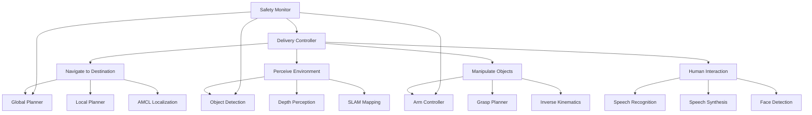

import PersonalizeChapter from '@site/src/components/PersonalizeChapter';
import TranslateToUrdu from '@site/src/components/TranslateToUrdu';

# Capstone Project: Autonomous Delivery Robot

## Project Overview

The capstone project involves creating an autonomous delivery robot that integrates all concepts learned throughout the Physical AI & Humanoid Robotics curriculum. This comprehensive project combines ROS 2 architecture, perception systems, navigation, manipulation, and human-robot interaction into a functional autonomous system.

## Learning Objectives

After completing this capstone project, you will be able to:
- Integrate all components from previous modules into a cohesive autonomous system
- Implement a complete Physical AI application with perception, planning, and control
- Validate system performance in both simulation and real hardware
- Apply debugging and optimization techniques to complex multi-component systems
- Demonstrate proficiency in the entire Physical AI development lifecycle
- Design and implement human-robot interaction interfaces

## Prerequisites

- Completion of all previous modules (Weeks 1-12)
- Access to Jetson Orin NX platform with sensors (or simulation environment)
- Basic understanding of all topics covered in the course
- Completed exercises from all 12 weeks of curriculum

## Project Architecture

### System Components

The autonomous delivery robot consists of several integrated subsystems:

1. **Navigation System**: Global and local planners for path planning and obstacle avoidance
2. **Perception System**: Computer vision for object detection, recognition, and environment mapping
3. **Manipulation System**: Arm control for picking and placing delivery items
4. **Human-Robot Interaction**: Voice commands and speech output for user interaction
5. **Safety System**: Emergency stop, collision avoidance, and system monitoring

### ROS 2 Node Architecture



## Implementation Phase 1: System Design and Simulation (Week 13, Days 1-2)

### Task 1: System Architecture Design
- Design the complete ROS 2 node architecture
- Define message types and communication patterns between subsystems
- Create UML diagrams for the system components
- Plan integration points and data flow

### Task 2: Gazebo Simulation Environment
- Create a realistic indoor environment with obstacles
- Implement delivery locations and waypoints
- Set up sensor configurations (camera, LiDAR, IMU)
- Validate robot model and physics parameters

### Task 3: Basic Navigation Setup
- Configure Navigation2 stack with costmaps
- Set up global and local planners
- Implement basic obstacle avoidance
- Test navigation in simulation environment

## Implementation Phase 2: Perception and Planning (Week 13, Days 3-4)

### Task 4: Object Detection and Recognition
- Implement YOLO-based object detection for delivery items
- Train custom detection model for specific delivery objects
- Integrate detection with ROS 2 using vision_msgs
- Implement 3D object pose estimation

### Task 5: Path Planning and Localization
- Implement dynamic path planning for changing environments
- Set up AMCL localization with map building
- Create recovery behaviors for navigation failures
- Implement exploration and mapping capabilities

### Task 6: Manipulation Planning
- Implement inverse kinematics for arm control
- Create grasp planning algorithms
- Integrate MoveIt2 for motion planning
- Test manipulation in simulation

## Implementation Phase 3: Integration and Control (Week 13, Days 5-6)

### Task 7: High-Level Task Planning
- Implement a behavior tree for task execution
- Create state machine for delivery workflow
- Integrate all subsystems with proper coordination
- Implement error handling and recovery procedures

### Task 8: Human-Robot Interaction
- Set up speech recognition for voice commands
- Implement text-to-speech for robot responses
- Create face detection for social interaction
- Design user interface for delivery confirmation

### Task 9: Safety and Monitoring
- Implement emergency stop procedures
- Create system health monitoring
- Set up performance metrics tracking
- Implement logging and diagnostics

## Implementation Phase 4: Hardware Integration and Testing (Week 13, Days 7-8)

### Task 10: Hardware Integration
- Port simulation code to real hardware
- Calibrate sensors and actuators
- Test individual subsystems on hardware
- Debug hardware-specific issues

### Task 11: System Integration Testing
- Test complete delivery workflow on hardware
- Validate performance against simulation
- Tune parameters for real-world conditions
- Document differences between sim and reality

### Task 12: Performance Optimization
- Optimize computational performance on Jetson
- Reduce power consumption for extended operation
- Improve real-time response characteristics
- Validate safety and reliability measures

## Detailed Implementation

### Main Delivery Controller Node

```python
#!/usr/bin/env python3
"""
Autonomous Delivery Robot Controller
Coordinates all subsystems for complete delivery operation
"""

import rclpy
from rclpy.node import Node
from std_msgs.msg import String, Bool, Float32
from geometry_msgs.msg import Pose, Twist, Point
from sensor_msgs.msg import Image, LaserScan, CameraInfo
from nav_msgs.msg import Odometry
from geometry_msgs.msg import PoseStamped
from builtin_interfaces.msg import Duration
import time
import threading
from collections import deque
import json
import math

class DeliveryController(Node):
    def __init__(self):
        super().__init__('delivery_controller')

        # State management
        self.current_state = 'IDLE'  # IDLE, NAVIGATING, PERCEIVING, MANIPULATING, INTERACTING
        self.delivery_queue = deque()
        self.delivery_history = []

        # Subsystem status
        self.subsystem_status = {
            'navigation': False,
            'perception': False,
            'manipulation': False,
            'interaction': False,
            'safety': True
        }

        # Publishers
        self.state_pub = self.create_publisher(String, '/delivery/state', 10)
        self.status_pub = self.create_publisher(String, '/delivery/status', 10)
        self.cmd_vel_pub = self.create_publisher(Twist, '/cmd_vel', 10)

        # Subscribers
        self.nav_status_sub = self.create_subscription(
            String, '/navigation/status', self.nav_status_callback, 10)
        self.perception_sub = self.create_subscription(
            String, '/perception/detections', self.perception_callback, 10)
        self.safety_sub = self.create_subscription(
            Bool, '/safety/emergency_stop', self.safety_callback, 10)

        # Service clients
        self.nav_client = self.create_client(
            NavigateToPose, '/navigate_to_pose')

        # Timers
        self.control_timer = self.create_timer(0.1, self.control_loop)
        self.state_timer = self.create_timer(1.0, self.publish_state)

        # Delivery locations
        self.delivery_locations = {
            'kitchen': {'x': 1.0, 'y': 2.0, 'theta': 0.0},
            'office': {'x': 5.0, 'y': 3.0, 'theta': 1.57},
            'lobby': {'x': 0.0, 'y': 0.0, 'theta': 0.0}
        }

        self.get_logger().info('Delivery Controller initialized')

    def control_loop(self):
        """Main control loop for delivery operations"""
        if self.subsystem_status['safety'] == False:
            self.emergency_stop()
            return

        if self.current_state == 'IDLE':
            self.handle_idle_state()
        elif self.current_state == 'NAVIGATING':
            self.handle_navigation_state()
        elif self.current_state == 'PERCEIVING':
            self.handle_perception_state()
        elif self.current_state == 'MANIPULATING':
            self.handle_manipulation_state()
        elif self.current_state == 'INTERACTING':
            self.handle_interaction_state()

    def handle_idle_state(self):
        """Handle idle state - waiting for delivery requests"""
        if len(self.delivery_queue) > 0:
            delivery = self.delivery_queue.popleft()
            self.start_delivery(delivery)

    def start_delivery(self, delivery_request):
        """Start a new delivery operation"""
        self.get_logger().info(f'Starting delivery: {delivery_request}')

        # Navigate to pickup location
        self.current_state = 'NAVIGATING'
        pickup_location = delivery_request.get('pickup', 'lobby')
        self.navigate_to_location(pickup_location)

    def navigate_to_location(self, location_name):
        """Navigate to a named location"""
        if location_name in self.delivery_locations:
            location = self.delivery_locations[location_name]
            goal = PoseStamped()
            goal.header.stamp = self.get_clock().now().to_msg()
            goal.header.frame_id = 'map'
            goal.pose.position.x = location['x']
            goal.pose.position.y = location['y']
            goal.pose.orientation.z = math.sin(location['theta'] / 2.0)
            goal.pose.orientation.w = math.cos(location['theta'] / 2.0)

            # Send navigation goal
            self.nav_client.call_async(NavigateToPose.Request(pose=goal))
        else:
            self.get_logger().error(f'Unknown location: {location_name}')

    def handle_navigation_state(self):
        """Handle navigation state"""
        # Navigation status is handled by callback
        pass

    def handle_perception_state(self):
        """Handle perception state"""
        # Wait for object detection
        pass

    def handle_manipulation_state(self):
        """Handle manipulation state"""
        # Control arm for pickup/dropoff
        pass

    def handle_interaction_state(self):
        """Handle human interaction state"""
        # Handle speech recognition and synthesis
        pass

    def nav_status_callback(self, msg):
        """Handle navigation status updates"""
        if msg.data == 'ARRIVED':
            self.get_logger().info('Navigation completed')
            # Move to next state based on delivery phase
        elif msg.data == 'FAILED':
            self.get_logger().error('Navigation failed')
            self.current_state = 'IDLE'  # Return to idle on failure

    def perception_callback(self, msg):
        """Handle perception updates"""
        try:
            detections = json.loads(msg.data)
            self.get_logger().info(f'Detected: {detections}')
        except Exception as e:
            self.get_logger().error(f'Error parsing perception data: {e}')

    def safety_callback(self, msg):
        """Handle safety system updates"""
        self.subsystem_status['safety'] = not msg.data
        if not self.subsystem_status['safety']:
            self.emergency_stop()

    def emergency_stop(self):
        """Emergency stop procedure"""
        self.current_state = 'IDLE'
        cmd_vel = Twist()
        cmd_vel.linear.x = 0.0
        cmd_vel.angular.z = 0.0
        self.cmd_vel_pub.publish(cmd_vel)
        self.get_logger().warn('Emergency stop activated')

    def publish_state(self):
        """Publish current delivery state"""
        state_msg = String()
        state_msg.data = f"{self.current_state}|Queue:{len(self.delivery_queue)}"
        self.state_pub.publish(state_msg)

    def add_delivery_request(self, pickup_location, delivery_location, item):
        """Add a new delivery request to the queue"""
        request = {
            'pickup': pickup_location,
            'delivery': delivery_location,
            'item': item,
            'timestamp': time.time()
        }
        self.delivery_queue.append(request)
        self.get_logger().info(f'Added delivery request: {request}')

def main(args=None):
    rclpy.init(args=args)
    controller = DeliveryController()

    # Example: Add a delivery request
    controller.add_delivery_request('kitchen', 'office', 'coffee')

    try:
        rclpy.spin(controller)
    except KeyboardInterrupt:
        pass
    finally:
        controller.destroy_node()
        rclpy.shutdown()

if __name__ == '__main__':
    main()
```

### Perception System Node

```python
#!/usr/bin/env python3
"""
Delivery Robot Perception System
Handles object detection, recognition, and environment understanding
"""

import rclpy
from rclpy.node import Node
from sensor_msgs.msg import Image, PointCloud2, CameraInfo
from vision_msgs.msg import Detection2DArray, ObjectHypothesisWithPose
from std_msgs.msg import String
from cv_bridge import CvBridge
import cv2
import numpy as np
import torch
import torchvision.transforms as transforms
from PIL import Image as PILImage
import json

class DeliveryPerception(Node):
    def __init__(self):
        super().__init__('delivery_perception')

        # Initialize CV bridge
        self.cv_bridge = CvBridge()

        # Publishers
        self.detection_pub = self.create_publisher(
            String, '/perception/detections', 10)
        self.debug_image_pub = self.create_publisher(
            Image, '/perception/debug_image', 10)

        # Subscribers
        self.image_sub = self.create_subscription(
            Image, '/camera/image_raw', self.image_callback, 10)
        self.depth_sub = self.create_subscription(
            Image, '/camera/depth', self.depth_callback, 10)

        # Object detection model (using a pre-trained model)
        self.detection_model = self.load_detection_model()

        # Object classes for delivery items
        self.delivery_classes = [
            'bottle', 'cup', 'box', 'food_container',
            'document', 'laptop', 'phone', 'tablet'
        ]

        self.get_logger().info('Delivery Perception System initialized')

    def load_detection_model(self):
        """Load pre-trained object detection model"""
        # In practice, this would load a YOLO or similar model
        # For this example, we'll use a placeholder
        self.get_logger().info('Loading object detection model...')
        return None  # Placeholder - would be actual model

    def image_callback(self, msg):
        """Process incoming camera images"""
        try:
            # Convert ROS image to OpenCV format
            cv_image = self.cv_bridge.imgmsg_to_cv2(msg, desired_encoding='bgr8')

            # Run object detection
            detections = self.detect_objects(cv_image)

            # Publish detections
            detections_msg = String()
            detections_msg.data = json.dumps(detections)
            self.detection_pub.publish(detections_msg)

            # Publish debug image with detections
            debug_image = self.draw_detections(cv_image, detections)
            debug_msg = self.cv_bridge.cv2_to_imgmsg(debug_image, encoding='bgr8')
            self.debug_image_pub.publish(debug_msg)

        except Exception as e:
            self.get_logger().error(f'Error processing image: {e}')

    def depth_callback(self, msg):
        """Process depth information for 3D object localization"""
        try:
            depth_image = self.cv_bridge.imgmsg_to_cv2(msg, desired_encoding='32FC1')
            # Process depth data for 3D localization
        except Exception as e:
            self.get_logger().error(f'Error processing depth: {e}')

    def detect_objects(self, image):
        """Run object detection on image"""
        # Placeholder for actual detection
        # In practice, this would run the loaded model
        height, width = image.shape[:2]

        # Simulate detection results
        detections = []

        # Find colored regions that might be delivery items
        hsv = cv2.cvtColor(image, cv2.COLOR_BGR2HSV)

        # Look for red (like cups/bottles)
        red_mask = cv2.inRange(hsv, (0, 50, 50), (10, 255, 255))
        red_mask2 = cv2.inRange(hsv, (170, 50, 50), (180, 255, 255))
        red_mask = cv2.bitwise_or(red_mask, red_mask2)

        # Find contours
        contours, _ = cv2.findContours(red_mask, cv2.RETR_EXTERNAL, cv2.CHAIN_APPROX_SIMPLE)

        for contour in contours:
            area = cv2.contourArea(contour)
            if area > 500:  # Filter small detections
                x, y, w, h = cv2.boundingRect(contour)
                # Calculate center and confidence
                center_x = x + w/2
                center_y = y + h/2
                confidence = min(0.9, area / 10000)  # Scale confidence by size

                detection = {
                    'class': 'bottle',  # Assuming red objects are bottles
                    'confidence': float(confidence),
                    'bbox': {
                        'x': int(x),
                        'y': int(y),
                        'width': int(w),
                        'height': int(h)
                    },
                    'center': {
                        'x': float(center_x / width),
                        'y': float(center_y / height)
                    }
                }
                detections.append(detection)

        return detections

    def draw_detections(self, image, detections):
        """Draw detection results on image"""
        output_image = image.copy()

        for detection in detections:
            bbox = detection['bbox']
            label = f"{detection['class']}: {detection['confidence']:.2f}"

            # Draw bounding box
            cv2.rectangle(output_image,
                         (bbox['x'], bbox['y']),
                         (bbox['x'] + bbox['width'], bbox['y'] + bbox['height']),
                         (0, 255, 0), 2)

            # Draw label
            cv2.putText(output_image, label,
                       (bbox['x'], bbox['y'] - 10),
                       cv2.FONT_HERSHEY_SIMPLEX, 0.5, (0, 255, 0), 2)

        return output_image

def main(args=None):
    rclpy.init(args=args)
    perception = DeliveryPerception()

    try:
        rclpy.spin(perception)
    except KeyboardInterrupt:
        pass
    finally:
        perception.destroy_node()
        rclpy.shutdown()

if __name__ == '__main__':
    main()
```

## Testing and Validation

### Simulation Testing
1. Test navigation in various simulated environments
2. Validate object detection with different lighting conditions
3. Verify manipulation planning with various objects
4. Test human-robot interaction scenarios

### Hardware Testing
1. Validate sensor calibration
2. Test navigation in real environment
3. Verify object detection accuracy
4. Test delivery workflow end-to-end

### Performance Metrics
- Navigation success rate (>90%)
- Object detection accuracy (>85%)
- Delivery time consistency
- System reliability and uptime

## Extensions and Customization

### Advanced Features
- Multi-robot coordination for complex deliveries
- Learning from user preferences and behavior
- Adaptive route planning based on environment changes
- Integration with building management systems

### Research Directions
- Self-supervised learning for improved perception
- Human-aware navigation in crowded spaces
- Predictive maintenance using system monitoring
- Energy-efficient delivery route optimization

## Personalization

<PersonalizeChapter />
<TranslateToUrdu />