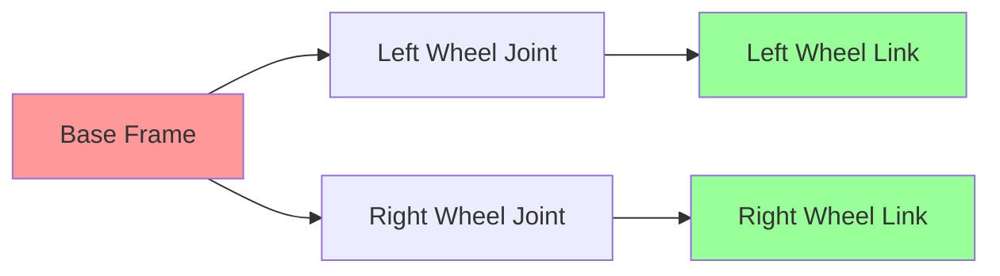

import PersonalizeChapter from '@site/src/components/PersonalizeChapter';
import TranslateToUrdu from '@site/src/components/TranslateToUrdu';

# Module 1: ROS 2 Fundamentals

This module covers the fundamentals of ROS 2 (Robot Operating System 2) for Physical AI applications, specifically targeting the Jetson NX platform with ROS 2 Humble.

## Learning Objectives

After completing this module, you will be able to:
- Understand the core concepts of ROS 2 architecture
- Create and manage ROS 2 nodes, topics, services, and actions
- Implement message passing and communication patterns
- Use launch files and parameter management
- Apply ROS 2 best practices for embedded systems

## Prerequisites

- Basic programming knowledge in Python or C++
- Understanding of Linux command line
- Familiarity with version control systems

## Topics Covered

- ROS 2 Architecture and Concepts
- Node Development in Python and C++
- Message and Service Definitions
- Launch Files and Parameter Management
- TF2 for Coordinate Transformations
- Real-time Performance Considerations
- Jetson NX Platform Integration

## Core ROS 2 Concepts

### Client Library Architecture

ROS 2 uses a client library architecture where the core functionality is implemented in a DDS (Data Distribution Service) middleware. This allows for:

- **Decentralized Communication**: No central master node required
- **Fault Tolerance**: Nodes can join/leave the network dynamically
- **Multi-language Support**: Native support for C++, Python, and other languages

### Nodes and Communication Patterns

Nodes in ROS 2 communicate through several patterns:

- **Publish/Subscribe (Topics)**: Many-to-many asynchronous communication
- **Request/Reply (Services)**: Synchronous request-response pattern
- **Action Servers/Goals**: Long-running tasks with feedback

## Code Snippets

### Basic Publisher Node (Python)

```python
import rclpy
from rclpy.node import Node
from std_msgs.msg import String

class MinimalPublisher(Node):

    def __init__(self):
        super().__init__('minimal_publisher')
        self.publisher_ = self.create_publisher(String, 'topic', 10)
        timer_period = 0.5  # seconds
        self.timer = self.create_timer(timer_period, self.timer_callback)
        self.i = 0

    def timer_callback(self):
        msg = String()
        msg.data = 'Hello World: %d' % self.i
        self.publisher_.publish(msg)
        self.get_logger().info('Publishing: "%s"' % msg.data)
        self.i += 1

def main(args=None):
    rclpy.init(args=args)
    minimal_publisher = MinimalPublisher()
    rclpy.spin(minimal_publisher)
    minimal_publisher.destroy_node()
    rclpy.shutdown()

if __name__ == '__main__':
    main()
```

### Basic Subscriber Node (Python)

```python
import rclpy
from rclpy.node import Node
from std_msgs.msg import String

class MinimalSubscriber(Node):

    def __init__(self):
        super().__init__('minimal_subscriber')
        self.subscription = self.create_subscription(
            String,
            'topic',
            self.listener_callback,
            10)
        self.subscription  # prevent unused variable warning

    def listener_callback(self, msg):
        self.get_logger().info('I heard: "%s"' % msg.data)

def main(args=None):
    rclpy.init(args=args)
    minimal_subscriber = MinimalSubscriber()
    rclpy.spin(minimal_subscriber)
    minimal_subscriber.destroy_node()
    rclpy.shutdown()

if __name__ == '__main__':
    main()
```

## URDF Examples

### Simple Differential Drive Robot

```xml
<?xml version="1.0"?>
<robot name="diff_drive_robot">
  <!-- Base Link -->
  <link name="base_link">
    <visual>
      <geometry>
        <box size="0.5 0.3 0.15"/>
      </geometry>
      <material name="light_grey">
        <color rgba="0.7 0.7 0.7 1.0"/>
      </material>
    </visual>
    <collision>
      <geometry>
        <box size="0.5 0.3 0.15"/>
      </geometry>
    </collision>
    <inertial>
      <mass value="1.0"/>
      <inertia ixx="0.01" ixy="0.0" ixz="0.0" iyy="0.01" iyz="0.0" izz="0.01"/>
    </inertial>
  </link>

  <!-- Left Wheel -->
  <joint name="left_wheel_joint" type="continuous">
    <parent link="base_link"/>
    <child link="left_wheel"/>
    <origin xyz="0.0 0.15 0.0" rpy="0 0 0"/>
    <axis xyz="0 0 1"/>
  </joint>

  <link name="left_wheel">
    <visual>
      <geometry>
        <cylinder radius="0.05" length="0.04"/>
      </geometry>
      <material name="black">
        <color rgba="0 0 0 1"/>
      </material>
    </visual>
  </link>

  <!-- Right Wheel -->
  <joint name="right_wheel_joint" type="continuous">
    <parent link="base_link"/>
    <child link="right_wheel"/>
    <origin xyz="0.0 -0.15 0.0" rpy="0 0 0"/>
    <axis xyz="0 0 1"/>
  </joint>

  <link name="right_wheel">
    <visual>
      <geometry>
        <cylinder radius="0.05" length="0.04"/>
      </geometry>
      <material name="black">
        <color rgba="0 0 0 1"/>
      </material>
    </visual>
  </link>
</robot>
```

## Kinematics Diagram



## Hardware Configuration for Jetson NX

| Component | Model | Interface | Purpose |
|-----------|-------|-----------|---------|
| Main Board | NVIDIA Jetson AGX Xavier | Integrated | Computing Platform |
| IMU | Bosch BNO055 | I2C | Orientation Sensing |
| Camera | Raspberry Pi HQ Cam | CSI | Visual Input |
| LIDAR | RPLIDAR A2 | USB | Distance Measurement |
| Motors | DC Geared Motors | PWM | Locomotion |

## Key Terms

- **DDS**: Data Distribution Service - middleware for real-time systems
- **RMW**: ROS Middleware - abstraction layer for DDS implementations
- **ament**: Build system and package manager for ROS 2
- **colcon**: Multi-package build tool for ROS 2
- **Composition**: Running multiple nodes in a single process
- **QoS**: Quality of Service - policies for message delivery

## Learning Checkpoints

### Quiz Questions
1. What is the main advantage of ROS 2 over ROS 1 regarding decentralization?
2. Name three communication patterns available in ROS 2.
3. What is the purpose of the TF2 transform library?

### Practical Exercise
Create a ROS 2 package called `my_robot_bringup` with a launch file that starts both a publisher and subscriber node exchanging sensor data.

## Hands-On Exercise

Implement a ROS 2 node that subscribes to sensor data from a simulated range finder and publishes velocity commands to drive the robot away from obstacles. Use the Twist message type from geometry_msgs.

## Personalization

<div className="personalization-options">
  <h3>Adjust Learning Path:</h3>
  <button onClick={() => setDifficulty('beginner')}>Beginner</button>
  <button onClick={() => setDifficulty('intermediate')}>Intermediate</button>
  <button onClick={() => setDifficulty('advanced')}>Advanced</button>
</div>

## Translation

<div className="translation-controls">
  <button onClick={() => translateToUrdu()}>اردو میں ترجمہ کریں</button>
</div>

<PersonalizeChapter />
<TranslateToUrdu />