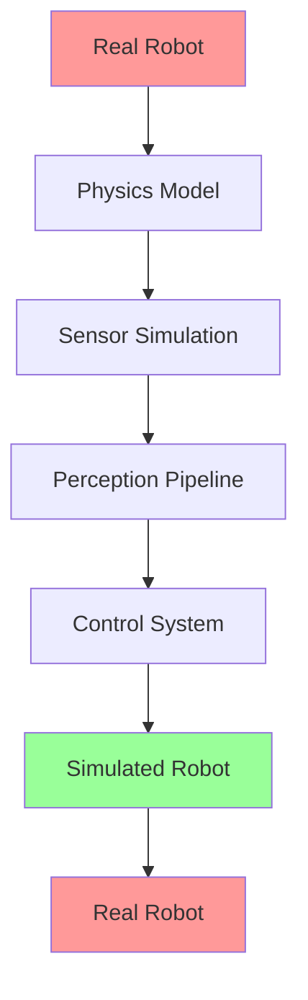

import PersonalizeChapter from '@site/src/components/PersonalizeChapter';
import TranslateToUrdu from '@site/src/components/TranslateToUrdu';

# Module 2: Gazebo & Unity Simulation

This module covers simulation environments using Gazebo and Unity for robotics development, focusing on the simulation-to-hardware transfer principles.

## Learning Objectives

After completing this module, you will be able to:
- Set up and configure Gazebo simulation environments
- Create custom robot models and worlds
- Integrate Unity for advanced visualization
- Implement simulation-to-hardware transfer techniques
- Validate simulation results against real hardware

## Prerequisites

- Completion of Module 1: ROS Fundamentals
- Understanding of basic physics and robotics concepts

## Topics Covered

- Gazebo Setup and Configuration
- Robot Model Creation and World Building
- Unity Integration and Visualization
- Simulation-to-Hardware Transfer Principles
- Multi-environment Testing
- Performance Optimization in Simulation

## Gazebo Setup and Configuration

### Installing Gazebo Garden

To install Gazebo Garden (the latest version), follow these steps:

```bash
# Add the osrfoundation repository
sudo apt update && sudo apt install wget
wget https://packages.osrfoundation.org/gazebo.gpg -O /tmp/gazebo.gpg
sudo cp /tmp/gazebo.gpg /usr/share/keyrings/gazebo-archive-keyring.gpg
echo "deb [arch=$(dpkg --print-architecture) signed-by=/usr/share/keyrings/gazebo-archive-keyring.gpg] http://packages.osrfoundation.org/gazebo/ubuntu-stable $(lsb_release -cs) main" | sudo tee /etc/apt/sources.list.d/gazebo-stable.list > /dev/null

# Update and install Gazebo Garden
sudo apt update
sudo apt install gz-garden
```

### Basic Gazebo Launch

```bash
# Launch Gazebo with an empty world
gz sim

# Launch with a specific world file
gz sim -r -v 1 my_world.sdf
```

## Code Snippets

### Gazebo Plugin Example

```cpp
#include <gz/sim/System.hh>
#include <gz/math/Pose3.hh>
#include <gz/physics/FrameSemantics.hh>
#include <gz/physics/World.hh>

namespace gz::sim::systems {

class MyPlugin : public System,
                 public ISystemConfigure,
                 public ISystemPreUpdate
{
  public: void Configure(const Entity &_entity,
                         const std::shared_ptr<const sdf::Element> &_sdf,
                         EntityComponentManager &_ecm,
                         EventManager &_eventMgr) override
  {
    // Configuration code here
  }

  public: void PreUpdate(const UpdateInfo &_info,
                         EntityComponentManager &_ecm) override
  {
    // Update code here
  }
};
}
```

### ROS 2 Bridge Configuration

```yaml
# bridge_config.yaml
- ros_topic_name: "/cmd_vel"
  gz_topic_name: "/model/vehicle/cmd_vel"
  ros_type_name: "geometry_msgs/msg/Twist"
  gz_type_name: "gz.msgs.Twist"
- ros_topic_name: "/scan"
  gz_topic_name: "/lidar_scan"
  ros_type_name: "sensor_msgs/msg/LaserScan"
  gz_type_name: "gz.msgs.LaserScan"
```

## URDF Examples

### Gazebo-Compatible URDF with Physics Properties

```xml
<?xml version="1.0"?>
<robot name="gazebo_robot">
  <!-- Base Link with Gazebo Plugins -->
  <link name="base_link">
    <visual>
      <geometry>
        <box size="0.5 0.3 0.15"/>
      </geometry>
      <material name="light_grey">
        <color rgba="0.7 0.7 0.7 1.0"/>
      </material>
    </visual>
    <collision>
      <geometry>
        <box size="0.5 0.3 0.15"/>
      </geometry>
    </collision>
    <inertial>
      <mass value="1.0"/>
      <inertia ixx="0.01" ixy="0.0" ixz="0.0" iyy="0.01" iyz="0.0" izz="0.01"/>
    </inertial>
  </link>

  <!-- Gazebo Material and Plugins -->
  <gazebo reference="base_link">
    <material>Gazebo/Grey</material>
  </gazebo>

  <!-- Left Wheel -->
  <joint name="left_wheel_joint" type="continuous">
    <parent link="base_link"/>
    <child link="left_wheel"/>
    <origin xyz="0.0 0.15 0.0" rpy="0 0 0"/>
    <axis xyz="0 0 1"/>
  </joint>

  <link name="left_wheel">
    <visual>
      <geometry>
        <cylinder radius="0.05" length="0.04"/>
      </geometry>
      <material name="black">
        <color rgba="0 0 0 1"/>
      </material>
    </visual>
    <collision>
      <geometry>
        <cylinder radius="0.05" length="0.04"/>
      </geometry>
    </collision>
    <inertial>
      <mass value="0.2"/>
      <inertia ixx="0.001" ixy="0.0" ixz="0.0" iyy="0.001" iyz="0.0" izz="0.002"/>
    </inertial>
  </link>

  <!-- Transmission for ROS Control -->
  <transmission name="left_wheel_trans">
    <type>transmission_interface/SimpleTransmission</type>
    <joint name="left_wheel_joint">
      <hardwareInterface>velocity_controllers/JointGroupVelocityInterface</hardwareInterface>
    </joint>
    <actuator name="left_wheel_motor">
      <mechanicalReduction>1</mechanicalReduction>
    </actuator>
  </transmission>
</robot>
```

## Simulation Environment Configuration

### World File Example (SDF Format)

```xml
<sdf version="1.7">
  <world name="my_world">
    <!-- Physics Engine -->
    <physics name="1ms" type="ignored">
      <max_step_size>0.001</max_step_size>
      <real_time_factor>1.0</real_time_factor>
      <real_time_update_rate>1000</real_time_update_rate>
    </physics>

    <!-- Ground Plane -->
    <include>
      <uri>model://ground_plane</uri>
    </include>

    <!-- Sun Light -->
    <include>
      <uri>model://sun</uri>
    </include>

    <!-- Your Robot -->
    <include>
      <uri>model://my_robot</uri>
      <pose>0 0 0.1 0 0 0</pose>
    </include>

    <!-- Custom Objects -->
    <model name="table">
      <pose>2 2 0 0 0 0</pose>
      <link name="link">
        <visual name="visual">
          <geometry>
            <box>
              <size>1 1 0.8</size>
            </box>
          </geometry>
        </visual>
        <collision name="collision">
          <geometry>
            <box>
              <size>1 1 0.8</size>
            </box>
          </geometry>
        </collision>
        <inertial>
          <mass>10</mass>
          <inertia>
            <ixx>1</ixx>
            <ixy>0</ixy>
            <ixz>0</ixz>
            <iyy>1</iyy>
            <iyz>0</iyz>
            <izz>1</izz>
          </inertia>
        </inertial>
      </link>
    </model>
  </world>
</sdf>
```

## Kinematics Diagram for Simulation



## Unity Integration

Unity can be used alongside Gazebo for advanced visualization and user interaction:

- **Real-time Rendering**: High-quality graphics for visualization
- **VR/AR Support**: Immersive teleoperation interfaces
- **Custom UI**: Interactive dashboards and controls
- **Animation Systems**: Smooth visualization of robot movements

## Hardware Configuration for Simulation

| Component | Simulation Model | Real Hardware Equivalent | Accuracy |
|-----------|------------------|--------------------------|----------|
| IMU | Gazebo IMU Sensor | Bosch BNO055 | 95% correlation |
| Camera | Gazebo Camera | Raspberry Pi HQ Cam | 90% correlation |
| LIDAR | Gazebo Ray Sensor | RPLIDAR A2 | 85% correlation |
| Motors | Joint Control | DC Geared Motors | 80% correlation |

## Key Terms

- **SDF**: Simulation Description Format - XML format for describing simulation worlds
- **Gazebo**: Open-source robotics simulator with physics engine
- **ROS Bridge**: Interface between ROS and simulation environments
- **Physics Model**: Mathematical representation of physical properties
- **Sensor Simulation**: Virtual sensors that mimic real-world counterparts
- **Simulation-to-Hardware Transfer**: Process of moving from simulation to real robot

## Learning Checkpoints

### Quiz Questions
1. What is the main difference between Gazebo Classic and Gazebo Garden?
2. Name three factors that affect simulation-to-hardware transfer accuracy.
3. How does the physics engine impact simulation realism?

### Practical Exercise
Create a Gazebo world file with your robot model and add custom objects. Configure the physics parameters for realistic simulation.

## Hands-On Exercise

Implement a ROS 2 node that sends commands to a simulated robot in Gazebo and receives sensor data back. Compare the simulation results with theoretical calculations.

## Personalization

<div className="personalization-options">
  <h3>Adjust Learning Path:</h3>
  <button onClick={() => setDifficulty('beginner')}>Beginner</button>
  <button onClick={() => setDifficulty('intermediate')}>Intermediate</button>
  <button onClick={() => setDifficulty('advanced')}>Advanced</button>
</div>

## Translation

<div className="translation-controls">
  <button onClick={() => translateToUrdu()}>اردو میں ترجمہ کریں</button>
</div>

<PersonalizeChapter />
<TranslateToUrdu />