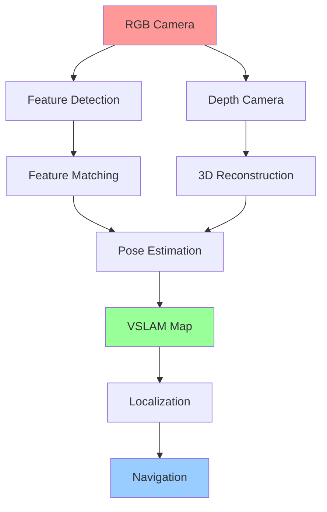

import PersonalizeChapter from '@site/src/components/PersonalizeChapter';
import TranslateToUrdu from '@site/src/components/TranslateToUrdu';

# Module 3: NVIDIA Isaac Platform

This module covers perception systems using ROS 2 and Isaac Sim for robotics applications, including advanced perception techniques and VSLAM algorithms.

## Learning Objectives

After completing this module, you will be able to:
- Implement ROS 2 perception stack components
- Develop advanced perception algorithms
- Use Isaac Sim for perception and VSLAM training
- Apply computer vision techniques to robotics
- Validate perception systems in simulation and hardware

## Prerequisites

- Completion of Module 1: ROS Fundamentals
- Completion of Module 2: Simulation Environments
- Basic understanding of computer vision concepts

## Topics Covered

- ROS 2 Perception Stack
- Advanced Perception Techniques
- Isaac Sim Perception and VSLAM
- Computer Vision for Robotics
- Sensor Integration and Calibration
- Perception Algorithm Validation

## Isaac Sim Setup and Configuration

### Installing Isaac Sim

Isaac Sim requires an NVIDIA GPU with CUDA support. Install Isaac Sim from NVIDIA Omniverse:

```bash
# Download Isaac Sim from NVIDIA Developer Portal
# Extract and run the installation script
./isaac-sim-2023.1.0.run

# Or use Docker (recommended)
docker run --gpus all -it --rm \
  --network=host \
  --volume=/tmp/.X11-unix:/tmp/.X11-unix:rw \
  --volume=$HOME/.Xauthority:/root/.Xauthority:rw \
  --volume=$PWD:/workspace \
  --env DISPLAY=$DISPLAY \
  --env NVIDIA_DRIVER_CAPABILITIES=all \
  --env PYTHONPATH=/isaac-sim/pythonpath \
  --privileged \
  nvcr.io/nvidia/isaac-sim:2023.1.0
```

## Code Snippets

### Isaac Sim Perception Example

```python
import omni
import carb
from pxr import Usd, UsdGeom, Gf
import numpy as np

# Import Isaac Sim modules
from omni.isaac.core import World
from omni.isaac.core.utils.stage import add_reference_to_stage
from omni.isaac.sensor import Camera, RotatingLidarSensor
from omni.isaac.range_sensor import _range_sensor

class PerceptionSystem:
    def __init__(self):
        self.world = World(stage_units_in_meters=1.0)
        self.setup_sensors()

    def setup_sensors(self):
        # Add RGB camera
        self.camera = Camera(
            prim_path="/World/Robot/Camera",
            position=np.array([0.0, 0.0, 0.3]),
            frequency=30,
            resolution=(640, 480)
        )

        # Add depth camera
        self.depth_camera = Camera(
            prim_path="/World/Robot/DepthCamera",
            position=np.array([0.0, 0.0, 0.3]),
            frequency=30,
            resolution=(640, 480)
        )

        # Add LIDAR sensor
        self.lidar = RotatingLidarSensor(
            prim_path="/World/Robot/Lidar",
            translation=np.array([0.0, 0.0, 0.5]),
            yaw_range=np.pi,
            horizontal_resolution=1.0,
            vertical_voxels=32
        )

    def get_rgb_image(self):
        rgb_data = self.camera.get_rgba()
        return rgb_data[:, :, :3]  # Remove alpha channel

    def get_depth_image(self):
        depth_data = self.depth_camera.get_depth_data()
        return depth_data

    def get_lidar_scan(self):
        lidar_data = self.lidar.get_point_cloud()
        return lidar_data

# Initialize perception system
perception_system = PerceptionSystem()
```

### ROS 2 Perception Node Integration

```python
import rclpy
from rclpy.node import Node
from sensor_msgs.msg import Image, PointCloud2
from cv_bridge import CvBridge
import numpy as np

class IsaacPerceptionNode(Node):
    def __init__(self):
        super().__init__('isaac_perception_node')

        # Publishers for perception data
        self.image_pub = self.create_publisher(Image, 'rgb_image', 10)
        self.pointcloud_pub = self.create_publisher(PointCloud2, 'lidar_points', 10)

        # Timer for perception loop
        self.timer = self.create_timer(0.1, self.perception_callback)

        # CV Bridge for image conversion
        self.bridge = CvBridge()

        # Initialize Isaac Sim perception system
        self.perception_system = PerceptionSystem()

    def perception_callback(self):
        # Get data from Isaac Sim
        rgb_image = self.perception_system.get_rgb_image()
        lidar_data = self.perception_system.get_lidar_scan()

        # Publish RGB image
        img_msg = self.bridge.cv2_to_imgmsg(rgb_image, encoding="rgb8")
        img_msg.header.stamp = self.get_clock().now().to_msg()
        img_msg.header.frame_id = "camera_frame"
        self.image_pub.publish(img_msg)

        # Publish point cloud data
        # Convert lidar data to PointCloud2 message
        pc_msg = self.convert_to_pointcloud2(lidar_data)
        pc_msg.header.stamp = self.get_clock().now().to_msg()
        pc_msg.header.frame_id = "lidar_frame"
        self.pointcloud_pub.publish(pc_msg)

    def convert_to_pointcloud2(self, points):
        # Implementation to convert points to PointCloud2
        # This is a simplified version
        pass

def main(args=None):
    rclpy.init(args=args)
    perception_node = IsaacPerceptionNode()
    rclpy.spin(perception_node)
    perception_node.destroy_node()
    rclpy.shutdown()

if __name__ == '__main__':
    main()
```

## URDF Examples

### Isaac Sim Compatible URDF with Sensors

```xml
<?xml version="1.0"?>
<robot name="isaac_robot">
  <!-- Base Link -->
  <link name="base_link">
    <visual>
      <geometry>
        <box size="0.5 0.3 0.15"/>
      </geometry>
      <material name="light_grey">
        <color rgba="0.7 0.7 0.7 1.0"/>
      </material>
    </visual>
    <collision>
      <geometry>
        <box size="0.5 0.3 0.15"/>
      </geometry>
    </collision>
    <inertial>
      <mass value="1.0"/>
      <inertia ixx="0.01" ixy="0.0" ixz="0.0" iyy="0.01" iyz="0.0" izz="0.01"/>
    </inertial>
  </link>

  <!-- RGB Camera Mount -->
  <joint name="camera_mount_joint" type="fixed">
    <parent link="base_link"/>
    <child link="camera_link"/>
    <origin xyz="0.15 0.0 0.1" rpy="0 0 0"/>
  </joint>

  <link name="camera_link">
    <visual>
      <geometry>
        <box size="0.05 0.05 0.05"/>
      </geometry>
    </visual>
  </link>

  <!-- Depth Camera Mount -->
  <joint name="depth_camera_mount_joint" type="fixed">
    <parent link="base_link"/>
    <child link="depth_camera_link"/>
    <origin xyz="0.15 0.0 0.1" rpy="0 0 0"/>
  </joint>

  <link name="depth_camera_link">
    <visual>
      <geometry>
        <box size="0.05 0.05 0.05"/>
      </geometry>
    </visual>
  </link>

  <!-- LIDAR Mount -->
  <joint name="lidar_mount_joint" type="fixed">
    <parent link="base_link"/>
    <child link="lidar_link"/>
    <origin xyz="0.0 0.0 0.2" rpy="0 0 0"/>
  </joint>

  <link name="lidar_link">
    <visual>
      <geometry>
        <cylinder radius="0.05" length="0.05"/>
      </geometry>
    </visual>
  </link>

  <!-- Isaac Sim Sensor Plugins -->
  <gazebo reference="camera_link">
    <sensor name="camera" type="camera">
      <always_on>true</always_on>
      <update_rate>30</update_rate>
      <camera>
        <horizontal_fov>1.047</horizontal_fov>
        <image>
          <width>640</width>
          <height>480</height>
        </image>
        <clip>
          <near>0.1</near>
          <far>10</far>
        </clip>
      </camera>
      <plugin name="camera_controller" filename="libgazebo_ros_camera.so">
        <frame_name>camera_link</frame_name>
        <topic_name>rgb_image</topic_name>
      </plugin>
    </sensor>
  </gazebo>

  <gazebo reference="lidar_link">
    <sensor name="lidar" type="ray">
      <always_on>true</always_on>
      <update_rate>10</update_rate>
      <ray>
        <scan>
          <horizontal>
            <samples>360</samples>
            <resolution>1.0</resolution>
            <min_angle>-3.14159</min_angle>
            <max_angle>3.14159</max_angle>
          </horizontal>
        </scan>
        <range>
          <min>0.1</min>
          <max>10.0</max>
          <resolution>0.01</resolution>
        </range>
      </ray>
      <plugin name="lidar_controller" filename="libgazebo_ros_ray_sensor.so">
        <frame_name>lidar_link</frame_name>
        <topic_name>scan</topic_name>
      </plugin>
    </sensor>
  </gazebo>
</robot>
```

## VSLAM Implementation

### Visual SLAM Pipeline

```python
import cv2
import numpy as np
from scipy.spatial.transform import Rotation as R

class VisualSLAM:
    def __init__(self):
        # Feature detector and descriptor
        self.detector = cv2.SIFT_create()
        self.matcher = cv2.BFMatcher()

        # Camera parameters
        self.K = np.array([[525.0, 0.0, 319.5],
                          [0.0, 525.0, 239.5],
                          [0.0, 0.0, 1.0]])

        # Pose estimation
        self.current_pose = np.eye(4)
        self.keyframes = []
        self.map_points = []

    def process_frame(self, image):
        # Detect features
        gray = cv2.cvtColor(image, cv2.COLOR_RGB2GRAY)
        keypoints, descriptors = self.detector.detectAndCompute(gray, None)

        if len(keypoints) < 10:
            return self.current_pose

        # If this is the first frame, store as keyframe
        if len(self.keyframes) == 0:
            self.keyframes.append({
                'image': image,
                'keypoints': keypoints,
                'descriptors': descriptors,
                'pose': self.current_pose.copy()
            })
            return self.current_pose

        # Match with previous keyframe
        prev_keyframe = self.keyframes[-1]
        matches = self.matcher.knnMatch(prev_keyframe['descriptors'],
                                       descriptors, k=2)

        # Apply ratio test
        good_matches = []
        for m, n in matches:
            if m.distance < 0.75 * n.distance:
                good_matches.append(m)

        if len(good_matches) >= 10:
            # Estimate pose using Essential matrix
            src_pts = np.float32([prev_keyframe['keypoints'][m.queryIdx].pt
                                 for m in good_matches]).reshape(-1, 1, 2)
            dst_pts = np.float32([keypoints[m.trainIdx].pt
                                 for m in good_matches]).reshape(-1, 1, 2)

            E, mask = cv2.findEssentialMat(src_pts, dst_pts, self.K,
                                          method=cv2.RANSAC, prob=0.999,
                                          threshold=1.0)

            if E is not None:
                _, R, t, _ = cv2.recoverPose(E, src_pts, dst_pts, self.K)

                # Update current pose
                T_delta = np.eye(4)
                T_delta[:3, :3] = R
                T_delta[:3, 3] = t.ravel()

                self.current_pose = self.current_pose @ T_delta

        # Store as keyframe if sufficient motion detected
        if np.linalg.norm(t) > 0.1 or len(good_matches) > 50:
            self.keyframes.append({
                'image': image,
                'keypoints': keypoints,
                'descriptors': descriptors,
                'pose': self.current_pose.copy()
            })

        return self.current_pose
```

## Kinematics Diagram for Perception



## Isaac Sim Perception Pipeline

| Component | Function | Input | Output |
|-----------|----------|-------|--------|
| RGB Camera | Color image capture | Scene | 2D RGB image |
| Depth Camera | Depth measurement | Scene | 2D Depth image |
| Semantic Segmentation | Object classification | Scene | Labeled pixels |
| Instance Segmentation | Object identification | Scene | Unique object masks |
| LIDAR | Distance scanning | Environment | Point cloud |
| Occupancy Grid | Environment mapping | Sensor data | 2D grid map |

## Key Terms

- **VSLAM**: Visual Simultaneous Localization and Mapping
- **Isaac Sim**: NVIDIA's robotics simulation platform
- **Semantic Segmentation**: Pixel-level object classification
- **Instance Segmentation**: Object instance identification
- **Occupancy Grid**: Probabilistic grid-based environment representation
- **Point Cloud**: 3D coordinates of sensed points
- **Essential Matrix**: Relates camera poses between views
- **Feature Descriptor**: Numerical representation of image features

## Learning Checkpoints

### Quiz Questions
1. What is the difference between semantic and instance segmentation?
2. Name three types of sensors typically used in Isaac Sim for perception.
3. How does the Essential matrix help in VSLAM systems?

### Practical Exercise
Implement a basic feature matching algorithm using SIFT features to match images from consecutive frames in Isaac Sim.

## Hands-On Exercise

Create a ROS 2 node that subscribes to camera data from Isaac Sim and performs basic object detection using OpenCV. Visualize the results in RViz.

## Personalization

<div className="personalization-options">
  <h3>Adjust Learning Path:</h3>
  <button onClick={() => setDifficulty('beginner')}>Beginner</button>
  <button onClick={() => setDifficulty('intermediate')}>Intermediate</button>
  <button onClick={() => setDifficulty('advanced')}>Advanced</button>
</div>

## Translation

<div className="translation-controls">
  <button onClick={() => translateToUrdu()}>اردو میں ترجمہ کریں</button>
</div>

<PersonalizeChapter />
<TranslateToUrdu />