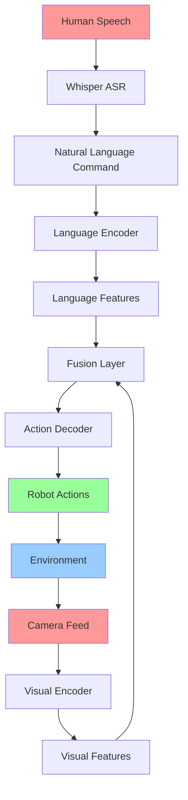

import PersonalizeChapter from '@site/src/components/PersonalizeChapter';
import TranslateToUrdu from '@site/src/components/TranslateToUrdu';

# Module 4: VLA Implementation

This module covers Vision-Language-Action (VLA) systems and LLM-to-action pipelines for autonomous robotics, including navigation and autonomous systems integration.

## Learning Objectives

After completing this module, you will be able to:
- Implement Vision-Language-Action (VLA) systems for robotics
- Create LLM-to-action pipelines with Whisper integration
- Develop navigation systems using ROS 2 navigation stack
- Integrate autonomous systems components
- Apply machine learning techniques to robotics planning

## Prerequisites

- Completion of previous modules
- Understanding of basic AI and machine learning concepts

## Topics Covered

- Vision-Language-Action (VLA) Systems
- AI Planning Systems
- LLM-to-Action Pipelines with Whisper
- Advanced Navigation Techniques
- Autonomous Systems Integration
- Voice Command Processing

## VLA System Architecture

Vision-Language-Action (VLA) systems represent the next generation of embodied AI, where vision, language, and action are unified in a single neural architecture.

### Key Components

- **Visual Encoder**: Processes visual input (images, video)
- **Language Encoder**: Processes natural language commands
- **Action Decoder**: Generates robot actions based on vision-language fusion
- **Memory System**: Maintains state and context across interactions

## Code Snippets

### VLA Implementation Example

```python
import torch
import numpy as np
from transformers import AutoTokenizer, AutoModel
import openai

class VLASystem:
    def __init__(self):
        # Initialize vision encoder
        self.vision_encoder = self.load_vision_model()

        # Initialize language encoder
        self.language_encoder = AutoModel.from_pretrained("bert-base-uncased")
        self.tokenizer = AutoTokenizer.from_pretrained("bert-base-uncased")

        # Initialize action decoder
        self.action_decoder = self.build_action_network()

        # Memory system
        self.memory_buffer = []
        self.context_window = 10

    def load_vision_model(self):
        # Load pre-trained vision model (e.g., ResNet, ViT)
        import torchvision.models as models
        vision_model = models.resnet50(pretrained=True)
        # Remove final classification layer
        vision_model.fc = torch.nn.Identity()
        return vision_model

    def build_action_network(self):
        # Simple MLP for action prediction
        return torch.nn.Sequential(
            torch.nn.Linear(1024 + 768, 512),  # vision_features + language_features
            torch.nn.ReLU(),
            torch.nn.Linear(512, 256),
            torch.nn.ReLU(),
            torch.nn.Linear(256, 6)  # 6DOF action space
        )

    def encode_visual_input(self, image_tensor):
        """Encode visual input to feature vector"""
        with torch.no_grad():
            features = self.vision_encoder(image_tensor)
        return features

    def encode_language_input(self, text_command):
        """Encode language command to feature vector"""
        inputs = self.tokenizer(text_command, return_tensors="pt", padding=True)
        with torch.no_grad():
            outputs = self.language_encoder(**inputs)
            # Use [CLS] token representation
            features = outputs.last_hidden_state[:, 0, :]
        return features

    def plan_action(self, visual_features, language_features):
        """Fuse vision and language to predict action"""
        # Concatenate vision and language features
        fused_features = torch.cat([visual_features, language_features], dim=-1)

        # Predict action
        action = self.action_decoder(fused_features)
        return action

    def process_command(self, image, command):
        """Process vision-language input and generate action"""
        # Encode inputs
        visual_features = self.encode_visual_input(image)
        language_features = self.encode_language_input(command)

        # Plan action
        action = self.plan_action(visual_features, language_features)

        # Store in memory
        self.memory_buffer.append({
            'image': image,
            'command': command,
            'action': action
        })

        # Keep memory window size
        if len(self.memory_buffer) > self.context_window:
            self.memory_buffer.pop(0)

        return action
```

### ROS 2 Action Server for VLA

```python
import rclpy
from rclpy.action import ActionServer
from rclpy.node import Node
from sensor_msgs.msg import Image
from std_msgs.msg import String
from geometry_msgs.msg import Twist
from cv_bridge import CvBridge

from vla_interfaces.action import ExecuteCommand  # Custom action

class VLAActionServer(Node):
    def __init__(self):
        super().__init__('vla_action_server')

        # Initialize VLA system
        self.vla_system = VLASystem()
        self.bridge = CvBridge()

        # Subscribe to camera feed
        self.image_sub = self.create_subscription(
            Image,
            'camera/image_raw',
            self.image_callback,
            10
        )

        # Action server
        self._action_server = ActionServer(
            self,
            ExecuteCommand,
            'execute_vla_command',
            self.execute_callback
        )

        # Store latest image
        self.latest_image = None

    def image_callback(self, msg):
        """Store latest image from camera"""
        self.latest_image = msg

    def execute_callback(self, goal_handle):
        """Execute VLA command"""
        self.get_logger().info(f'Executing command: {goal_handle.request.command}')

        if self.latest_image is None:
            goal_handle.abort()
            result = ExecuteCommand.Result()
            result.success = False
            result.message = 'No image received'
            return result

        # Convert ROS image to tensor
        cv_image = self.bridge.imgmsg_to_cv2(self.latest_image, "bgr8")
        image_tensor = torch.from_numpy(cv_image).permute(2, 0, 1).unsqueeze(0).float()

        # Process command
        action = self.vla_system.process_command(image_tensor, goal_handle.request.command)

        # Execute action (send to robot)
        self.execute_robot_action(action)

        # Complete goal
        goal_handle.succeed()
        result = ExecuteCommand.Result()
        result.success = True
        result.message = f'Executed command: {goal_handle.request.command}'
        return result

    def execute_robot_action(self, action_tensor):
        """Send action to robot"""
        cmd_vel = Twist()
        action = action_tensor.cpu().numpy()[0]

        # Map action to velocity commands
        cmd_vel.linear.x = action[0]  # forward/backward
        cmd_vel.linear.y = action[1]  # left/right
        cmd_vel.angular.z = action[2]  # rotation

        # Publish command
        cmd_pub = self.create_publisher(Twist, 'cmd_vel', 10)
        cmd_pub.publish(cmd_vel)

def main(args=None):
    rclpy.init(args=args)

    vla_server = VLAActionServer()

    try:
        rclpy.spin(vla_server)
    except KeyboardInterrupt:
        pass
    finally:
        vla_server.destroy_node()
        rclpy.shutdown()

if __name__ == '__main__':
    main()
```

### Whisper Integration for Voice Commands

```python
import whisper
import speech_recognition as sr
import threading
import queue

class VoiceCommandProcessor:
    def __init__(self):
        # Load Whisper model
        self.whisper_model = whisper.load_model("base.en")
        self.recognizer = sr.Recognizer()
        self.microphone = sr.Microphone()

        # Adjust for ambient noise
        with self.microphone as source:
            self.recognizer.adjust_for_ambient_noise(source)

        # Command queue for processing
        self.command_queue = queue.Queue()

        # Start listening thread
        self.listening_thread = threading.Thread(target=self.listen_continuously)
        self.listening_thread.daemon = True
        self.listening_thread.start()

    def listen_continuously(self):
        """Continuously listen for voice commands"""
        with self.microphone as source:
            while True:
                try:
                    # Listen for audio
                    audio = self.recognizer.listen(source, timeout=1, phrase_time_limit=5)

                    # Transcribe using Whisper
                    transcription = self.transcribe_audio(audio)

                    if transcription:
                        self.command_queue.put(transcription)

                except sr.WaitTimeoutError:
                    # Continue listening
                    continue
                except Exception as e:
                    self.get_logger().error(f'Error in voice processing: {e}')
                    continue

    def transcribe_audio(self, audio):
        """Transcribe audio using Whisper"""
        # Save audio to temporary file
        with open('/tmp/temp_audio.wav', 'wb') as f:
            f.write(audio.get_wav_data())

        # Transcribe with Whisper
        result = self.whisper_model.transcribe('/tmp/temp_audio.wav')
        return result['text']

    def get_next_command(self):
        """Get next command from queue"""
        try:
            return self.command_queue.get_nowait()
        except queue.Empty:
            return None
```

## URDF Examples

### Robot with VLA Capabilities

```xml
<?xml version="1.0"?>
<robot name="vla_robot">
  <!-- Base Link -->
  <link name="base_link">
    <visual>
      <geometry>
        <box size="0.5 0.3 0.15"/>
      </geometry>
      <material name="light_grey">
        <color rgba="0.7 0.7 0.7 1.0"/>
      </material>
    </visual>
    <collision>
      <geometry>
        <box size="0.5 0.3 0.15"/>
      </geometry>
    </collision>
    <inertial>
      <mass value="1.0"/>
      <inertia ixx="0.01" ixy="0.0" ixz="0.0" iyy="0.01" iyz="0.0" izz="0.01"/>
    </inertial>
  </link>

  <!-- Camera Mount -->
  <joint name="camera_mount_joint" type="fixed">
    <parent link="base_link"/>
    <child link="camera_link"/>
    <origin xyz="0.15 0.0 0.1" rpy="0 0 0"/>
  </joint>

  <link name="camera_link">
    <visual>
      <geometry>
        <box size="0.05 0.05 0.05"/>
      </geometry>
    </visual>
  </link>

  <!-- Microphone Mount -->
  <joint name="microphone_mount_joint" type="fixed">
    <parent link="base_link"/>
    <child link="microphone_link"/>
    <origin xyz="0.1 0.0 0.15" rpy="0 0 0"/>
  </joint>

  <link name="microphone_link">
    <visual>
      <geometry>
        <cylinder radius="0.01" length="0.02"/>
      </geometry>
    </visual>
  </link>

  <!-- VLA Controller -->
  <gazebo reference="base_link">
    <plugin name="vla_controller" filename="libvla_controller.so">
      <command_topic>execute_vla_command</command_topic>
      <image_topic>camera/image_raw</image_topic>
      <audio_topic>audio_commands</audio_topic>
    </plugin>
  </gazebo>

  <!-- Camera Sensor -->
  <gazebo reference="camera_link">
    <sensor name="camera" type="camera">
      <always_on>true</always_on>
      <update_rate>30</update_rate>
      <camera>
        <horizontal_fov>1.047</horizontal_fov>
        <image>
          <width>640</width>
          <height>480</height>
        </image>
        <clip>
          <near>0.1</near>
          <far>10</far>
        </clip>
      </camera>
      <plugin name="camera_controller" filename="libgazebo_ros_camera.so">
        <frame_name>camera_link</frame_name>
        <topic_name>camera/image_raw</topic_name>
      </plugin>
    </sensor>
  </gazebo>

  <!-- Audio Sensor (Simulated) -->
  <gazebo reference="microphone_link">
    <sensor name="microphone" type="gpu_lidar">
      <always_on>true</always_on>
      <update_rate>10</update_rate>
      <ray>
        <scan>
          <horizontal>
            <samples>1</samples>
            <resolution>1</resolution>
            <min_angle>0</min_angle>
            <max_angle>0</max_angle>
          </horizontal>
        </scan>
        <range>
          <min>0.1</min>
          <max>1.0</max>
          <resolution>0.01</resolution>
        </range>
      </ray>
      <plugin name="audio_controller" filename="libgazebo_ros_audio_device.so">
        <frame_name>microphone_link</frame_name>
        <topic_name>audio_commands</topic_name>
      </plugin>
    </sensor>
  </gazebo>
</robot>
```

## VLA System Diagram



## VLA Implementation Pipeline

| Stage | Component | Input | Output | Purpose |
|-------|-----------|-------|--------|---------|
| 1 | Vision Encoder | RGB Image | Visual Features | Extract spatial information |
| 2 | Language Encoder | Natural Language | Linguistic Features | Extract semantic meaning |
| 3 | Fusion Layer | Visual + Language | Unified Representation | Combine modalities |
| 4 | Action Decoder | Unified Features | Robot Actions | Generate executable commands |
| 5 | Execution | Robot Actions | Physical Motion | Execute in environment |

## Key Terms

- **VLA**: Vision-Language-Action - unified system for embodied AI
- **ASR**: Automatic Speech Recognition - converting speech to text
- **Vision Encoder**: Neural network processing visual input
- **Language Encoder**: Neural network processing linguistic input
- **Fusion Layer**: Combines different modalities
- **Embodied AI**: AI systems interacting with physical world
- **Action Space**: Set of possible robot actions
- **Multimodal**: Using multiple sensory modalities

## Learning Checkpoints

### Quiz Questions
1. What are the three main components of a VLA system?
2. Name the advantages of unified VLA systems over separate vision, language, and action systems.
3. How does the fusion layer contribute to VLA performance?

### Practical Exercise
Implement a simple VLA system that takes an image and natural language command as input and generates a basic navigation action (move forward, turn left, etc.).

## Hands-On Exercise

Create a complete VLA pipeline that integrates with ROS 2, including:
1. Camera input processing
2. Voice command recognition
3. VLA action generation
4. Robot control execution

## Personalization

<div className="personalization-options">
  <h3>Adjust Learning Path:</h3>
  <button onClick={() => setDifficulty('beginner')}>Beginner</button>
  <button onClick={() => setDifficulty('intermediate')}>Intermediate</button>
  <button onClick={() => setDifficulty('advanced')}>Advanced</button>
</div>

## Translation

<div className="translation-controls">
  <button onClick={() => translateToUrdu()}>اردو میں ترجمہ کریں</button>
</div>

<PersonalizeChapter />
<TranslateToUrdu />