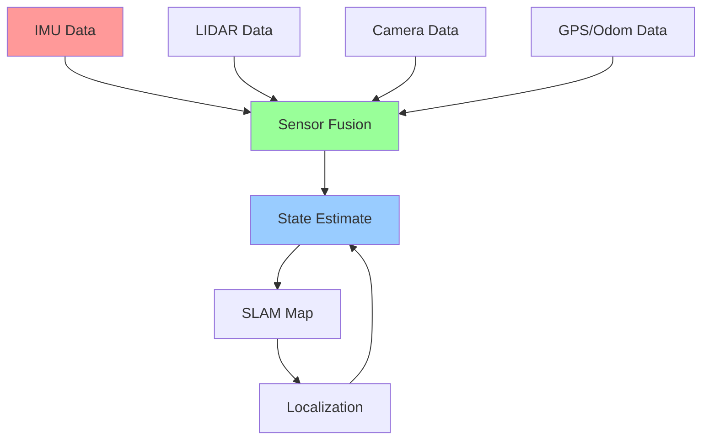

# Week 10 - Perception and Sensor Fusion

## Learning Objectives

By the end of this week, you will be able to:
- Implement sensor fusion algorithms for robust perception
- Apply Kalman filtering for state estimation
- Integrate multiple sensor modalities (LIDAR, camera, IMU)
- Implement SLAM (Simultaneous Localization and Mapping)
- Design robust perception systems for uncertain environments
- Evaluate sensor fusion performance metrics

## Sensor Fusion Fundamentals

Sensor fusion combines data from multiple sensors to achieve better accuracy and reliability than individual sensors alone. Key benefits include:

- **Redundancy**: Backup measurements if one sensor fails
- **Complementarity**: Different sensors provide complementary information
- **Improved Accuracy**: Combined measurements are more accurate
- **Robustness**: System continues operating despite sensor noise/errors

## Code Snippets

### Kalman Filter Implementation

```python
import numpy as np
from scipy.linalg import inv

class KalmanFilter:
    def __init__(self, state_dim, measurement_dim):
        """
        Initialize Kalman Filter

        Args:
            state_dim: Dimension of state vector
            measurement_dim: Dimension of measurement vector
        """
        self.state_dim = state_dim
        self.measurement_dim = measurement_dim

        # State vector [x, y, vx, vy] for 2D position and velocity
        self.x = np.zeros(state_dim)

        # State covariance matrix
        self.P = np.eye(state_dim) * 1000.0  # Initial uncertainty

        # Process noise covariance
        self.Q = np.eye(state_dim) * 0.1

        # Measurement noise covariance
        self.R = np.eye(measurement_dim) * 1.0

        # State transition model
        self.F = np.eye(state_dim)

        # Measurement model
        self.H = np.zeros((measurement_dim, state_dim))

    def predict(self, dt=1.0):
        """
        Predict next state using motion model
        For constant velocity model: x_{k+1} = F * x_k
        """
        # Update state transition matrix for constant velocity model
        # State: [x, y, vx, vy]
        self.F = np.array([
            [1, 0, dt, 0],
            [0, 1, 0, dt],
            [0, 0, 1, 0],
            [0, 0, 0, 1]
        ])

        # Predict state: x = F * x
        self.x = self.F @ self.x

        # Predict covariance: P = F * P * F^T + Q
        self.P = self.F @ self.P @ self.F.T + self.Q

    def update(self, measurement):
        """
        Update state estimate with new measurement

        Args:
            measurement: Observed measurement vector
        """
        # Innovation: y = z - H * x
        innovation = measurement - self.H @ self.x

        # Innovation covariance: S = H * P * H^T + R
        S = self.H @ self.P @ self.H.T + self.R

        # Kalman gain: K = P * H^T * S^(-1)
        K = self.P @ self.H.T @ inv(S)

        # Update state: x = x + K * y
        self.x = self.x + K @ innovation

        # Update covariance: P = (I - K * H) * P
        I = np.eye(self.state_dim)
        self.P = (I - K @ self.H) @ self.P

class ExtendedKalmanFilter(KalmanFilter):
    """
    Extended Kalman Filter for nonlinear systems
    """
    def __init__(self, state_dim, measurement_dim):
        super().__init__(state_dim, measurement_dim)

    def predict(self, dt=1.0):
        """Nonlinear prediction step"""
        # For nonlinear systems, we linearize around current state
        # This example uses constant velocity model (linear)
        # In practice, you'd implement nonlinear motion model
        super().predict(dt)

    def update(self, measurement):
        """Nonlinear update step"""
        # For EKF, we need to compute Jacobians of nonlinear measurement model
        # This example assumes linear measurement model
        super().update(measurement)

class SensorFusionNode:
    """
    ROS 2 node for sensor fusion
    """
    def __init__(self):
        import rclpy
        from rclpy.node import Node
        from sensor_msgs.msg import Imu, LaserScan, PointCloud2
        from geometry_msgs.msg import PoseWithCovarianceStamped
        from tf2_ros import TransformBroadcaster

        self.node = Node('sensor_fusion_node')

        # Initialize Kalman filter for position and velocity estimation
        # State: [x, y, theta, vx, vy, omega]
        self.kf = KalmanFilter(state_dim=6, measurement_dim=3)  # x, y, theta

        # Measurement models for different sensors
        # IMU: measures orientation and angular velocity
        self.kf.H_imu = np.array([
            [0, 0, 1, 0, 0, 0],  # theta
            [0, 0, 0, 0, 0, 1]   # omega (angular velocity)
        ])

        # LIDAR: measures position
        self.kf.H_lidar = np.array([
            [1, 0, 0, 0, 0, 0],  # x
            [0, 1, 0, 0, 0, 0]   # y
        ])

        # Initialize sensor data
        self.imu_data = None
        self.lidar_data = None
        self.odom_data = None

        # Timers for fusion updates
        self.fusion_timer = self.node.create_timer(0.05, self.perform_fusion)  # 20 Hz

        # Publishers and subscribers
        self.pose_pub = self.node.create_publisher(PoseWithCovarianceStamped, 'estimated_pose', 10)
        self.tf_broadcaster = TransformBroadcaster(self.node)

        # Sensor subscribers
        self.imu_sub = self.node.create_subscription(Imu, 'imu/data', self.imu_callback, 10)
        self.scan_sub = self.node.create_subscription(LaserScan, 'scan', self.lidar_callback, 10)

        self.node.get_logger().info("Sensor fusion node initialized")

    def imu_callback(self, msg):
        """Handle IMU data"""
        # Extract orientation (convert from quaternion to euler)
        import quaternion
        quat = np.array([msg.orientation.w, msg.orientation.x, msg.orientation.y, msg.orientation.z])
        r = quaternion.from_float_array(quat)
        euler = quaternion.as_euler_angles(r)

        # Extract angular velocity
        omega = msg.angular_velocity.z  # Around z-axis

        # Store IMU measurement: [theta, omega]
        self.imu_data = np.array([euler[2], omega])  # Yaw angle and angular velocity

    def lidar_callback(self, msg):
        """Handle LIDAR data"""
        # For simplicity, assume we get position from LIDAR
        # In practice, this would involve landmark detection or SLAM
        # This is a simplified example
        pass

    def perform_fusion(self):
        """Perform sensor fusion and publish results"""
        # Prediction step (use motion model if available)
        # For now, assume dt = 0.05 seconds
        dt = 0.05
        self.kf.predict(dt)

        # Update with available measurements
        if self.imu_data is not None:
            # Use appropriate measurement model for IMU
            # Update Kalman filter with IMU data
            pass

        if self.lidar_data is not None:
            # Update with LIDAR data
            pass

        # Publish estimated state
        self.publish_estimate()

    def publish_estimate(self):
        """Publish estimated pose"""
        from geometry_msgs.msg import PoseWithCovarianceStamped, Point, Quaternion
        from std_msgs.msg import Header

        msg = PoseWithCovarianceStamped()
        msg.header.stamp = self.node.get_clock().now().to_msg()
        msg.header.frame_id = 'map'

        # Extract position and orientation from state
        x, y, theta, vx, vy, omega = self.kf.x

        # Set position
        msg.pose.pose.position.x = float(x)
        msg.pose.pose.position.y = float(y)
        msg.pose.pose.position.z = 0.0

        # Convert theta to quaternion
        from mathutils import quaternion_from_euler
        qw, qx, qy, qz = quaternion_from_euler(0, 0, theta)
        msg.pose.pose.orientation.w = qw
        msg.pose.pose.orientation.x = qx
        msg.pose.pose.orientation.y = qy
        msg.pose.pose.orientation.z = qz

        # Set covariance
        for i in range(36):
            msg.pose.covariance[i] = float(self.kf.P[i//6, i%6])

        self.pose_pub.publish(msg)

def quaternion_from_euler(roll, pitch, yaw):
    """Convert Euler angles to quaternion"""
    cy = np.cos(yaw * 0.5)
    sy = np.sin(yaw * 0.5)
    cp = np.cos(pitch * 0.5)
    sp = np.sin(pitch * 0.5)
    cr = np.cos(roll * 0.5)
    sr = np.sin(roll * 0.5)

    w = cr * cp * cy + sr * sp * sy
    x = sr * cp * cy - cr * sp * sy
    y = cr * sp * cy + sr * cp * sy
    z = cr * cp * sy - sr * sp * cy

    return w, x, y, z
```

### Particle Filter Implementation

```python
import numpy as np
from scipy.stats import norm
from scipy.spatial.distance import cdist

class ParticleFilter:
    def __init__(self, num_particles=1000, state_dim=2):
        """
        Initialize Particle Filter

        Args:
            num_particles: Number of particles to use
            state_dim: Dimension of state vector
        """
        self.num_particles = num_particles
        self.state_dim = state_dim

        # Initialize particles randomly
        self.particles = np.random.randn(num_particles, state_dim) * 10
        self.weights = np.ones(num_particles) / num_particles

    def predict(self, motion_model_func, control_input, process_noise_std=0.1):
        """
        Predict particle states using motion model

        Args:
            motion_model_func: Function that takes (particles, control_input) and returns new particles
            control_input: Control input for motion model
            process_noise_std: Standard deviation of process noise
        """
        # Apply motion model
        self.particles = motion_model_func(self.particles, control_input)

        # Add process noise
        noise = np.random.normal(0, process_noise_std, self.particles.shape)
        self.particles += noise

    def update(self, measurement, measurement_model_func, measurement_noise_std=0.1):
        """
        Update particle weights based on measurement

        Args:
            measurement: Observed measurement
            measurement_model_func: Function that maps state to expected measurement
            measurement_noise_std: Standard deviation of measurement noise
        """
        # Calculate expected measurements for each particle
        expected_measurements = measurement_model_func(self.particles)

        # Calculate likelihood of measurement for each particle
        # Using Gaussian likelihood
        likelihoods = norm.pdf(measurement, expected_measurements, measurement_noise_std)

        # Update weights
        self.weights *= likelihoods

        # Normalize weights
        self.weights /= np.sum(self.weights)

        # Prevent numerical issues
        self.weights = np.maximum(self.weights, 1e-300)

    def resample(self):
        """Resample particles based on weights"""
        # Systematic resampling
        indices = self.systematic_resample()

        # Resample particles and reset weights
        self.particles = self.particles[indices]
        self.weights = np.ones(self.num_particles) / self.num_particles

    def systematic_resample(self):
        """Systematic resampling algorithm"""
        # Cumulative sum of weights
        cumulative_sum = np.cumsum(self.weights)

        # Generate random starting point
        start = np.random.uniform(0, 1/self.num_particles)
        indices = []

        # Generate equally spaced points
        points = start + (np.arange(self.num_particles) / self.num_particles)

        # Find indices of particles to resample
        i, j = 0, 0
        while i < self.num_particles:
            if points[i] < cumulative_sum[j]:
                indices.append(j)
                i += 1
            else:
                j += 1

        return np.array(indices)

    def estimate(self):
        """Estimate state as weighted average of particles"""
        return np.average(self.particles, axis=0, weights=self.weights)

    def motion_model(self, particles, control):
        """
        Simple motion model: x_{t+1} = x_t + v*dt + noise
        Assumes control = [vx, vy, dt]
        """
        dt = control[2] if len(control) > 2 else 0.1
        velocity = control[:2] if len(control) >= 2 else np.array([0.0, 0.0])

        # Update positions: x_new = x_old + v * dt
        updated_particles = particles.copy()
        updated_particles[:, :2] += velocity * dt

        return updated_particles

    def measurement_model(self, particles):
        """Measurement model: return expected measurements for particles"""
        # For this example, assume we measure position directly
        return particles[:, :2]  # Return x, y coordinates

# Example usage
def example_particle_filter():
    # Initialize particle filter
    pf = ParticleFilter(num_particles=1000, state_dim=4)  # [x, y, vx, vy]

    # Simulate a moving target
    true_state = np.array([0.0, 0.0, 0.1, 0.05])  # [x, y, vx, vy]

    measurements = []
    estimates = []

    for t in np.arange(0, 10, 0.1):  # 10 seconds at 10 Hz
        dt = 0.1

        # Simulate motion
        true_state[:2] += true_state[2:] * dt  # Update position

        # Add some process noise
        true_state += np.random.normal(0, 0.01, 4)

        # Generate noisy measurement
        measurement = true_state[:2] + np.random.normal(0, 0.1, 2)  # Only measure position
        measurements.append(measurement.copy())

        # Perform particle filter steps
        control = np.array([0.1, 0.05, dt])  # [vx, vy, dt]

        pf.predict(pf.motion_model, control)
        pf.update(measurement, pf.measurement_model)
        pf.resample()

        estimate = pf.estimate()
        estimates.append(estimate.copy())

        if t % 1 == 0:  # Print every second
            print(f"Time {t:.1f}: True={true_state[:2]}, Measured={measurement}, Estimated={estimate[:2]}")
```

### Multi-Sensor Integration

```python
import numpy as np
from collections import deque
import threading
import time

class MultiSensorFusion:
    def __init__(self):
        # Sensor data buffers
        self.imu_buffer = deque(maxlen=10)
        self.lidar_buffer = deque(maxlen=10)
        self.camera_buffer = deque(maxlen=10)
        self.odom_buffer = deque(maxlen=10)

        # Fusion state
        self.position = np.array([0.0, 0.0, 0.0])  # x, y, z
        self.velocity = np.array([0.0, 0.0, 0.0])  # vx, vy, vz
        self.orientation = np.array([0.0, 0.0, 0.0, 1.0])  # x, y, z, w (quaternion)
        self.timestamp = time.time()

        # Sensor uncertainties
        self.imu_uncertainty = 0.01
        self.lidar_uncertainty = 0.05
        self.camera_uncertainty = 0.03
        self.odom_uncertainty = 0.02

        # Lock for thread safety
        self.lock = threading.Lock()

    def add_imu_data(self, accel, gyro, timestamp):
        """Add IMU data to buffer"""
        with self.lock:
            self.imu_buffer.append({
                'acceleration': np.array(accel),
                'gyro': np.array(gyro),
                'timestamp': timestamp
            })

    def add_lidar_data(self, ranges, angles, timestamp):
        """Add LIDAR data to buffer"""
        with self.lock:
            self.lidar_buffer.append({
                'ranges': np.array(ranges),
                'angles': np.array(angles),
                'timestamp': timestamp
            })

    def add_camera_data(self, features, timestamp):
        """Add camera data to buffer"""
        with self.lock:
            self.camera_buffer.append({
                'features': features,
                'timestamp': timestamp
            })

    def add_odom_data(self, pose, twist, timestamp):
        """Add odometry data to buffer"""
        with self.lock:
            self.odom_buffer.append({
                'pose': pose,
                'twist': twist,
                'timestamp': timestamp
            })

    def fuse_sensors(self):
        """Perform sensor fusion to estimate state"""
        with self.lock:
            # Get latest data from all sensors
            latest_imu = self.get_latest_data(self.imu_buffer)
            latest_lidar = self.get_latest_data(self.lidar_buffer)
            latest_camera = self.get_latest_data(self.camera_buffer)
            latest_odom = self.get_latest_data(self.odom_buffer)

            # Fuse data using weighted average based on uncertainties
            if latest_odom:
                # Odometry provides good position estimate
                pos_weight = 1.0 / self.odom_uncertainty
                self.position = latest_odom['pose']['position'] * pos_weight

            if latest_imu:
                # IMU provides good orientation and acceleration
                self.orientation = latest_imu['orientation']

                # Integrate acceleration to get velocity
                if self.imu_buffer:
                    dt = 0.01  # Assume 100Hz IMU
                    self.velocity += latest_imu['acceleration'] * dt

            # Apply sensor fusion weights based on reliability
            # This is a simplified example - in practice, you'd use Kalman filtering
            self.apply_sensor_weights(latest_imu, latest_lidar, latest_camera, latest_odom)

    def get_latest_data(self, buffer):
        """Get the latest data from buffer"""
        if buffer:
            return buffer[-1]
        return None

    def apply_sensor_weights(self, imu_data, lidar_data, camera_data, odom_data):
        """Apply weighted fusion based on sensor reliability"""
        weights = []
        estimates = []

        # Position estimates from different sensors
        if odom_data:
            weights.append(1.0 / self.odom_uncertainty)
            estimates.append(odom_data['pose']['position'])

        if lidar_data:
            # Process LIDAR data to get position estimate
            # This is simplified - in practice, you'd do landmark matching
            lidar_pos = self.process_lidar_position(lidar_data)
            if lidar_pos is not None:
                weights.append(1.0 / self.lidar_uncertainty)
                estimates.append(lidar_pos)

        if camera_data:
            # Process camera data to get position estimate
            camera_pos = self.process_camera_position(camera_data)
            if camera_pos is not None:
                weights.append(1.0 / self.camera_uncertainty)
                estimates.append(camera_pos)

        # Weighted average of position estimates
        if estimates and weights:
            weights = np.array(weights)
            estimates = np.array(estimates)

            # Normalize weights
            weights = weights / np.sum(weights)

            # Calculate weighted average
            fused_position = np.average(estimates, axis=0, weights=weights)

            # Update position with fused estimate
            self.position = fused_position

    def process_lidar_position(self, lidar_data):
        """Process LIDAR data to estimate position relative to landmarks"""
        # This is a simplified approach
        # In practice, you'd use landmark matching or SLAM
        ranges = lidar_data['ranges']
        angles = lidar_data['angles']

        # Find closest obstacle to estimate proximity
        if len(ranges) > 0:
            min_idx = np.argmin(ranges)
            min_range = ranges[min_idx]
            min_angle = angles[min_idx]

            # Convert polar to cartesian
            x_obs = min_range * np.cos(min_angle)
            y_obs = min_range * np.sin(min_angle)

            # Return observation (would need landmark map to convert to absolute position)
            return np.array([x_obs, y_obs, 0.0])

        return None

    def process_camera_position(self, camera_data):
        """Process camera data to estimate position"""
        # This is a simplified approach
        # In practice, you'd use feature tracking or visual odometry
        features = camera_data['features']

        # For this example, return a dummy position based on features
        # In reality, you'd track features across frames
        if features:
            # Calculate average feature position as proxy for camera position
            avg_x = np.mean([f['x'] for f in features if 'x' in f])
            avg_y = np.mean([f['y'] for f in features if 'y' in f])
            return np.array([avg_x, avg_y, 0.0])

        return None

class SLAMNode:
    """
    Simultaneous Localization and Mapping node
    """
    def __init__(self):
        # Landmark map (in a real system, this would be much more complex)
        self.landmarks = {}  # Dictionary: landmark_id -> [x, y]
        self.pose_graph = []  # Graph of poses and constraints

        # Covariance for landmark positions
        self.landmark_covariances = {}

    def add_landmark_observation(self, landmark_id, relative_pose, sensor_uncertainty=0.1):
        """
        Add landmark observation to map

        Args:
            landmark_id: Unique identifier for landmark
            relative_pose: Position of landmark relative to robot [x, y]
            sensor_uncertainty: Uncertainty in sensor measurement
        """
        # Get current robot pose (this would come from localization)
        robot_pose = np.array([0.0, 0.0, 0.0])  # [x, y, theta]

        # Convert relative pose to global coordinates
        cos_th = np.cos(robot_pose[2])
        sin_th = np.sin(robot_pose[2])

        global_x = robot_pose[0] + relative_pose[0] * cos_th - relative_pose[1] * sin_th
        global_y = robot_pose[1] + relative_pose[0] * sin_th + relative_pose[1] * cos_th

        # Update landmark position estimate
        if landmark_id in self.landmarks:
            # Fuse with existing estimate
            old_pos = self.landmarks[landmark_id]
            old_cov = self.landmark_covariances[landmark_id]

            # Simple weighted fusion
            weight_old = 1.0 / (old_cov + 1e-6)
            weight_new = 1.0 / (sensor_uncertainty**2)

            new_pos = (weight_old * old_pos + weight_new * np.array([global_x, global_y])) / (weight_old + weight_new)
            new_cov = 1.0 / (weight_old + weight_new)

            self.landmarks[landmark_id] = new_pos
            self.landmark_covariances[landmark_id] = new_cov
        else:
            # Add new landmark
            self.landmarks[landmark_id] = np.array([global_x, global_y])
            self.landmark_covariances[landmark_id] = sensor_uncertainty**2

    def loop_closure_detection(self, current_features, threshold=0.8):
        """
        Detect loop closures by comparing current features with previous observations

        Args:
            current_features: Current set of observed features
            threshold: Similarity threshold for loop closure

        Returns:
            loop_closure_candidate: Previous pose that matches current view
        """
        # This is a simplified approach
        # In practice, you'd use more sophisticated place recognition
        if len(self.pose_graph) > 10:  # Need enough history
            # Compare current features with features from previous poses
            # Return index of most similar pose
            pass

        return None

    def optimize_map(self):
        """
        Optimize map and robot trajectory using pose graph optimization
        """
        # This would implement graph SLAM optimization
        # Using techniques like Gauss-Newton or Levenberg-Marquardt
        pass

# Example usage
def example_sensor_fusion():
    fusion_system = MultiSensorFusion()

    # Simulate sensor data over time
    for t in np.arange(0, 5, 0.1):
        # Simulate IMU data
        accel = [0.1 * np.sin(t), 0.05 * np.cos(t), 9.81]
        gyro = [0.01, 0.02, 0.03]
        fusion_system.add_imu_data(accel, gyro, t)

        # Simulate LIDAR data
        ranges = np.random.uniform(0.5, 10.0, 360)  # 360 degree scan
        angles = np.linspace(0, 2*np.pi, 360)
        fusion_system.add_lidar_data(ranges, angles, t)

        # Simulate camera features
        features = [{'x': 100 + i*10, 'y': 150 + i*5} for i in range(20)]
        fusion_system.add_camera_data(features, t)

        # Simulate odometry
        pose = {'position': [t*0.2, t*0.1, 0.0]}
        twist = {'linear': [0.2, 0.1, 0.0], 'angular': [0.0, 0.0, 0.01]}
        fusion_system.add_odom_data(pose, twist, t)

        # Perform fusion
        fusion_system.fuse_sensors()

        if int(t*10) % 10 == 0:  # Print every second
            print(f"Time {t:.1f}: Position={fusion_system.position}")
```

## URDF Examples

### Multi-Sensor Robot Platform

```xml
<?xml version="1.0"?>
<robot name="multi_sensor_robot">
  <!-- Base Link -->
  <link name="base_link">
    <visual>
      <geometry>
        <cylinder radius="0.3" length="0.15"/>
      </geometry>
      <material name="gray">
        <color rgba="0.5 0.5 0.5 1.0"/>
      </material>
    </visual>
    <collision>
      <geometry>
        <cylinder radius="0.3" length="0.15"/>
      </geometry>
    </collision>
    <inertial>
      <mass value="10.0"/>
      <inertia ixx="0.4" ixy="0.0" ixz="0.0" iyy="0.4" iyz="0.0" izz="0.2"/>
    </inertial>
  </link>

  <!-- Wheels -->
  <joint name="wheel_left_joint" type="continuous">
    <parent link="base_link"/>
    <child link="wheel_left"/>
    <origin xyz="0 0.25 -0.05" rpy="0 0 0"/>
    <axis xyz="0 0 1"/>
    <dynamics damping="0.1" friction="0.0"/>
  </joint>

  <link name="wheel_left">
    <visual>
      <geometry>
        <cylinder radius="0.1" length="0.05"/>
      </geometry>
      <material name="black">
        <color rgba="0.0 0.0 0.0 1.0"/>
      </material>
    </visual>
    <collision>
      <geometry>
        <cylinder radius="0.1" length="0.05"/>
      </geometry>
    </collision>
    <inertial>
      <mass value="1.0"/>
      <inertia ixx="0.005" ixy="0.0" ixz="0.0" iyy="0.005" iyz="0.0" izz="0.01"/>
    </inertial>
  </link>

  <joint name="wheel_right_joint" type="continuous">
    <parent link="base_link"/>
    <child link="wheel_right"/>
    <origin xyz="0 -0.25 -0.05" rpy="0 0 0"/>
    <axis xyz="0 0 1"/>
    <dynamics damping="0.1" friction="0.0"/>
  </joint>

  <link name="wheel_right">
    <visual>
      <geometry>
        <cylinder radius="0.1" length="0.05"/>
      </geometry>
      <material name="black">
        <color rgba="0.0 0.0 0.0 1.0"/>
      </material>
    </visual>
    <collision>
      <geometry>
        <cylinder radius="0.1" length="0.05"/>
      </geometry>
    </collision>
    <inertial>
      <mass value="1.0"/>
      <inertia ixx="0.005" ixy="0.0" ixz="0.0" iyy="0.005" iyz="0.0" izz="0.01"/>
    </inertial>
  </link>

  <!-- IMU Mount -->
  <joint name="imu_mount_joint" type="fixed">
    <parent link="base_link"/>
    <child link="imu_link"/>
    <origin xyz="0.0 0.0 0.1" rpy="0 0 0"/>
  </joint>

  <link name="imu_link"/>

  <!-- LIDAR Mount -->
  <joint name="lidar_mount_joint" type="fixed">
    <parent link="base_link"/>
    <child link="lidar_link"/>
    <origin xyz="0.0 0.0 0.2" rpy="0 0 0"/>
  </joint>

  <link name="lidar_link">
    <visual>
      <geometry>
        <cylinder radius="0.05" length="0.05"/>
      </geometry>
      <material name="red">
        <color rgba="1.0 0.0 0.0 1.0"/>
      </material>
    </visual>
  </link>

  <!-- Camera Mount -->
  <joint name="camera_mount_joint" type="fixed">
    <parent link="base_link"/>
    <child link="camera_link"/>
    <origin xyz="0.2 0.0 0.1" rpy="0 0 0"/>
  </joint>

  <link name="camera_link">
    <visual>
      <geometry>
        <box size="0.05 0.05 0.05"/>
      </geometry>
      <material name="blue">
        <color rgba="0.0 0.0 1.0 1.0"/>
      </material>
    </visual>
  </link>

  <!-- GPS Mount -->
  <joint name="gps_mount_joint" type="fixed">
    <parent link="base_link"/>
    <child link="gps_link"/>
    <origin xyz="0.0 0.0 0.25" rpy="0 0 0"/>
  </joint>

  <link name="gps_link"/>

  <!-- Multi-Sensor Plugins -->
  <gazebo reference="imu_link">
    <sensor name="imu_sensor" type="imu">
      <always_on>true</always_on>
      <update_rate>100</update_rate>
      <plugin name="imu_controller" filename="libgazebo_ros_imu.so">
        <frame_name>imu_link</frame_name>
        <topic_name>imu/data</topic_name>
        <gaussian_noise>0.01</gaussian_noise>
      </plugin>
    </sensor>
  </gazebo>

  <gazebo reference="lidar_link">
    <sensor name="lidar_sensor" type="ray">
      <always_on>true</always_on>
      <update_rate>10</update_rate>
      <ray>
        <scan>
          <horizontal>
            <samples>360</samples>
            <resolution>1.0</resolution>
            <min_angle>-3.14159</min_angle>
            <max_angle>3.14159</max_angle>
          </horizontal>
        </scan>
        <range>
          <min>0.1</min>
          <max>30.0</max>
          <resolution>0.01</resolution>
        </range>
      </ray>
      <plugin name="lidar_controller" filename="libgazebo_ros_laser.so">
        <frame_name>lidar_link</frame_name>
        <topic_name>scan</topic_name>
        <gaussian_noise>0.01</gaussian_noise>
      </plugin>
    </sensor>
  </gazebo>

  <gazebo reference="camera_link">
    <sensor name="camera_sensor" type="camera">
      <always_on>true</always_on>
      <update_rate>30</update_rate>
      <camera>
        <horizontal_fov>1.047</horizontal_fov>
        <image>
          <width>640</width>
          <height>480</height>
        </image>
        <clip>
          <near>0.1</near>
          <far>10</far>
        </clip>
      </camera>
      <plugin name="camera_controller" filename="libgazebo_ros_camera.so">
        <frame_name>camera_link</frame_name>
        <topic_name>camera/image_raw</topic_name>
      </plugin>
    </sensor>
  </gazebo>

  <gazebo reference="gps_link">
    <sensor name="gps_sensor" type="gps">
      <always_on>true</always_on>
      <update_rate>1</update_rate>
      <plugin name="gps_controller" filename="libgazebo_ros_gps.so">
        <frame_name>gps_link</frame_name>
        <topic_name>gps/fix</topic_name>
      </plugin>
    </sensor>
  </gazebo>

  <!-- Differential Drive Controller -->
  <gazebo>
    <plugin name="diff_drive" filename="libgazebo_ros_diff_drive.so">
      <left_joint>wheel_left_joint</left_joint>
      <right_joint>wheel_right_joint</right_joint>
      <wheel_separation>0.5</wheel_separation>
      <wheel_diameter>0.2</wheel_diameter>
      <command_topic>cmd_vel</command_topic>
      <odometry_topic>odom</odometry_topic>
      <odometry_frame>odom</odometry_frame>
      <robot_base_frame>base_link</robot_base_frame>
    </plugin>
  </gazebo>

  <!-- Sensor Fusion Controller -->
  <gazebo reference="base_link">
    <plugin name="sensor_fusion" filename="libsensor_fusion_plugin.so">
      <imu_topic>imu/data</imu_topic>
      <lidar_topic>scan</lidar_topic>
      <camera_topic>camera/image_raw</camera_topic>
      <gps_topic>gps/fix</gps_topic>
      <odometry_topic>odom</odometry_topic>
      <fusion_output_topic>estimated_pose</fusion_output_topic>
    </plugin>
  </gazebo>
</robot>
```

## Sensor Fusion Pipeline Diagram



## Sensor Comparison

| Sensor Type | Accuracy | Update Rate | Range | Indoor/Outdoor | Key Limitations |
|-------------|----------|-------------|-------|----------------|-----------------|
| IMU | Medium | 100-1000Hz | Unlimited | Both | Drift over time |
| LIDAR | High | 10-20Hz | 10-100m | Both | Reflective surfaces |
| Camera | High | 30-60Hz | Depends on lighting | Both | Lighting conditions |
| GPS | High | 1-10Hz | Unlimited | Outdoor | Multipath, indoors |
| Encoder | High | 50-200Hz | Unlimited | Both | Slip, calibration |
| Ultrasonic | Low | 10-50Hz | 0.1-10m | Both | Surface dependency |

## Key Terms

- **Sensor Fusion**: Combining data from multiple sensors for improved accuracy
- **Kalman Filter**: Optimal estimator for linear systems with Gaussian noise
- **Particle Filter**: Non-parametric filter for nonlinear/non-Gaussian systems
- **SLAM**: Simultaneous Localization and Mapping
- **Covariance**: Measure of uncertainty in state estimates
- **Observability**: Ability to determine system state from outputs
- **Data Association**: Matching sensor observations to known landmarks
- **Loop Closure**: Recognizing previously visited locations

## Learning Checkpoints

### Quiz Questions
1. What are the main advantages of sensor fusion over single-sensor approaches?
2. Explain the difference between Kalman Filter and Particle Filter.
3. What is the observability problem in sensor fusion?

### Practical Exercise
Implement a simple Kalman Filter that fuses IMU and LIDAR data to estimate robot position.

## Hands-On Exercise

Create a ROS 2 node that subscribes to multiple sensor topics (IMU, LIDAR, camera) and implements a basic sensor fusion algorithm to estimate the robot's state.

## Personalization

<div className="personalization-options">
  <h3>Adjust Learning Path:</h3>
  <button onClick={() => setDifficulty('beginner')}>Beginner</button>
  <button onClick={() => setDifficulty('intermediate')}>Intermediate</button>
  <button onClick={() => setDifficulty('advanced')}>Advanced</button>
</div>

## Translation

<div className="translation-controls">
  <button onClick={() => translateToUrdu()}>اردو میں ترجمہ کریں</button>
</div>