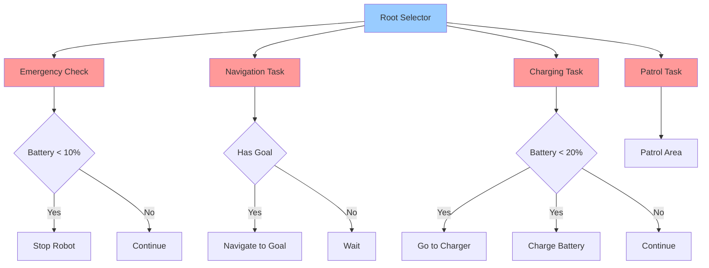

# Week 11 - AI Planning and Decision Making

## Learning Objectives

By the end of this week, you will be able to:
- Implement classical planning algorithms for robotics
- Apply search algorithms (A*, Dijkstra, RRT) for path planning
- Design decision-making systems using finite state machines
- Implement behavior trees for complex robot behaviors
- Apply reinforcement learning for planning and control
- Integrate planning with perception and control systems
- Evaluate planning algorithms for optimality and efficiency

## Planning in Robotics

AI planning is crucial for enabling robots to make intelligent decisions and execute complex tasks. Planning algorithms help robots determine sequences of actions to achieve goals while considering constraints and optimizing for various criteria. Key planning types include:

- **Motion Planning**: Finding collision-free paths through configuration space
- **Task Planning**: Sequencing high-level tasks to achieve goals
- **Temporal Planning**: Considering timing and duration of actions
- **Multi-Agent Planning**: Coordinating multiple agents/robots
- **Contingency Planning**: Handling uncertainties and exceptions

## Code Snippets

### Path Planning Algorithms

```python
import numpy as np
import heapq
from typing import List, Tuple, Optional, Dict, Set
import matplotlib.pyplot as plt
from dataclasses import dataclass
from enum import Enum

@dataclass
class Node:
    """Node for path planning algorithms"""
    x: float
    y: float
    cost: float = 0.0
    parent: Optional['Node'] = None

    def __lt__(self, other):
        return self.cost < other.cost

    def __eq__(self, other):
        return self.x == other.x and self.y == other.y

class GridMap:
    """Grid-based representation of the environment"""
    def __init__(self, width: int, height: int, resolution: float = 1.0):
        self.width = width
        self.height = height
        self.resolution = resolution
        self.grid = np.zeros((height, width), dtype=bool)  # False = free, True = occupied

    def is_free(self, x: float, y: float) -> bool:
        """Check if a position is free (not occupied)"""
        if x < 0 or x >= self.width or y < 0 or y >= self.height:
            return False
        return not self.grid[int(y)][int(x)]

    def set_obstacle(self, x: int, y: int):
        """Set a cell as occupied"""
        if 0 <= x < self.width and 0 <= y < self.height:
            self.grid[y][x] = True

    def get_neighbors(self, node: Node) -> List[Node]:
        """Get valid neighboring nodes (8-connected)"""
        neighbors = []

        # 8-connected neighborhood (including diagonals)
        for dx in [-1, 0, 1]:
            for dy in [-1, 0, 1]:
                if dx == 0 and dy == 0:
                    continue  # Skip current node

                new_x = node.x + dx
                new_y = node.y + dy

                if self.is_free(new_x, new_y):
                    # Calculate movement cost (diagonal vs straight)
                    move_cost = np.sqrt(2) if dx != 0 and dy != 0 else 1.0
                    neighbors.append(Node(new_x, new_y, node.cost + move_cost, node))

        return neighbors

class AStarPlanner:
    """A* path planning algorithm implementation"""
    def __init__(self, grid_map: GridMap):
        self.grid_map = grid_map

    def heuristic(self, node: Node, goal: Node) -> float:
        """Heuristic function for A* (Euclidean distance)"""
        return np.sqrt((node.x - goal.x)**2 + (node.y - goal.y)**2)

    def plan_path(self, start: Node, goal: Node) -> Optional[List[Node]]:
        """
        Plan path from start to goal using A* algorithm

        Args:
            start: Start node
            goal: Goal node

        Returns:
            List of nodes forming the path, or None if no path exists
        """
        # Priority queue: (f_score, node)
        open_set = [(0.0, start)]

        # Keep track of visited nodes and their g_scores
        g_scores = {start: start.cost}
        closed_set = set()

        while open_set:
            current_f, current = heapq.heappop(open_set)

            # Check if we reached the goal
            if current.x == goal.x and current.y == goal.y:
                return self.reconstruct_path(current)

            # Mark as visited
            closed_set.add((current.x, current.y))

            # Explore neighbors
            for neighbor in self.grid_map.get_neighbors(current):
                if (neighbor.x, neighbor.y) in closed_set:
                    continue

                # Calculate tentative g_score
                tentative_g = g_scores[current] + self.get_move_cost(current, neighbor)

                # If this path to neighbor is better than previous one
                if neighbor not in g_scores or tentative_g < g_scores[neighbor]:
                    g_scores[neighbor] = tentative_g
                    f_score = tentative_g + self.heuristic(neighbor, goal)

                    # Add to open set
                    heapq.heappush(open_set, (f_score, neighbor))

        # No path found
        return None

    def get_move_cost(self, node1: Node, node2: Node) -> float:
        """Calculate movement cost between two adjacent nodes"""
        return np.sqrt((node1.x - node2.x)**2 + (node1.y - node2.y)**2)

    def reconstruct_path(self, goal_node: Node) -> List[Node]:
        """Reconstruct path from goal to start by following parent pointers"""
        path = []
        current = goal_node

        while current is not None:
            path.append(current)
            current = current.parent

        # Reverse to get path from start to goal
        return path[::-1]

class RRTPlanner:
    """Rapidly-Exploring Random Tree (RRT) path planning algorithm"""
    def __init__(self, grid_map: GridMap, step_size: float = 1.0, max_iterations: int = 10000):
        self.grid_map = grid_map
        self.step_size = step_size
        self.max_iterations = max_iterations

    def plan_path(self, start: Node, goal: Node, goal_bias: float = 0.1) -> Optional[List[Node]]:
        """
        Plan path using RRT algorithm

        Args:
            start: Start configuration
            goal: Goal configuration
            goal_bias: Probability of sampling goal instead of random point

        Returns:
            List of nodes forming the path, or None if no path found
        """
        # Initialize tree with start node
        tree = [start]
        nodes_dict = {(start.x, start.y): start}

        for iteration in range(self.max_iterations):
            # Sample random point (with bias toward goal)
            if np.random.random() < goal_bias:
                rand_x, rand_y = goal.x, goal.y
            else:
                rand_x = np.random.uniform(0, self.grid_map.width)
                rand_y = np.random.uniform(0, self.grid_map.height)

            rand_node = Node(rand_x, rand_y)

            # Find nearest node in tree
            nearest_node = self.find_nearest(tree, rand_node)

            # Extend tree toward random point
            new_node = self.extend_toward(nearest_node, rand_node)

            if new_node is not None:
                tree.append(new_node)
                nodes_dict[(new_node.x, new_node.y)] = new_node

                # Check if we're close to goal
                if self.distance(new_node, goal) < self.step_size:
                    # Connect to goal and return path
                    goal.parent = new_node
                    return self.reconstruct_path_to_start(goal, nodes_dict)

        # Path not found
        return None

    def find_nearest(self, tree: List[Node], target: Node) -> Node:
        """Find nearest node in tree to target"""
        nearest = tree[0]
        min_dist = self.distance(nearest, target)

        for node in tree[1:]:
            dist = self.distance(node, target)
            if dist < min_dist:
                min_dist = dist
                nearest = node

        return nearest

    def extend_toward(self, from_node: Node, to_node: Node) -> Optional[Node]:
        """Extend tree from from_node toward to_node"""
        direction = np.array([to_node.x - from_node.x, to_node.y - from_node.y])
        dist = np.linalg.norm(direction)

        if dist < self.step_size:
            # If target is close enough, just connect directly
            if self.grid_map.is_free(to_node.x, to_node.y):
                to_node.cost = from_node.cost + dist
                to_node.parent = from_node
                return to_node
        else:
            # Move step_size toward target
            direction_norm = direction / dist
            new_x = from_node.x + direction_norm[0] * self.step_size
            new_y = from_node.y + direction_norm[1] * self.step_size

            if self.grid_map.is_free(new_x, new_y):
                new_node = Node(new_x, new_y)
                new_node.cost = from_node.cost + self.step_size
                new_node.parent = from_node
                return new_node

        return None

    def distance(self, node1: Node, node2: Node) -> float:
        """Calculate Euclidean distance between nodes"""
        return np.sqrt((node1.x - node2.x)**2 + (node1.y - node2.y)**2)

    def reconstruct_path_to_start(self, goal_node: Node, nodes_dict: Dict) -> List[Node]:
        """Reconstruct path from goal to start"""
        path = []
        current = goal_node

        while current is not None:
            path.append(current)
            current = current.parent

        # Reverse to get path from start to goal
        return path[::-1]

# Example usage
def example_path_planning():
    # Create a grid map with some obstacles
    grid_map = GridMap(50, 50)

    # Add some obstacles
    for i in range(10, 20):
        grid_map.set_obstacle(i, 25)

    for i in range(30, 40):
        grid_map.set_obstacle(35, i)

    # Define start and goal positions
    start = Node(5.0, 5.0)
    goal = Node(45.0, 45.0)

    # Test A* planning
    astar_planner = AStarPlanner(grid_map)
    astar_path = astar_planner.plan_path(start, goal)

    if astar_path:
        print(f"A* found path with {len(astar_path)} nodes")
    else:
        print("A* could not find a path")

    # Test RRT planning
    rrt_planner = RRTPlanner(grid_map, step_size=2.0)
    rrt_path = rrt_planner.plan_path(start, goal)

    if rrt_path:
        print(f"RRT found path with {len(rrt_path)} nodes")
    else:
        print("RRT could not find a path")

    # Visualize results (if matplotlib is available)
    try:
        plt.figure(figsize=(12, 5))

        # Plot grid map
        plt.subplot(1, 2, 1)
        plt.imshow(grid_map.grid, cmap='binary', origin='lower')
        plt.title('Grid Map with Obstacles')

        # Plot A* path
        if astar_path:
            path_x = [node.x for node in astar_path]
            path_y = [node.y for node in astar_path]
            plt.plot(path_x, path_y, 'r-', linewidth=2, label='A* Path')
            plt.scatter(start.x, start.y, c='green', s=100, label='Start')
            plt.scatter(goal.x, goal.y, c='red', s=100, label='Goal')

        plt.legend()
        plt.grid(True)

        # Plot RRT tree
        plt.subplot(1, 2, 2)
        plt.imshow(grid_map.grid, cmap='binary', origin='lower')
        plt.title('RRT Tree')

        # Plot RRT path
        if rrt_path:
            path_x = [node.x for node in rrt_path]
            path_y = [node.y for node in rrt_path]
            plt.plot(path_x, path_y, 'r-', linewidth=2, label='RRT Path')
            plt.scatter(start.x, start.y, c='green', s=100, label='Start')
            plt.scatter(goal.x, goal.y, c='red', s=100, label='Goal')

        plt.legend()
        plt.grid(True)
        plt.show()
    except ImportError:
        print("Matplotlib not available for visualization")
```

### Finite State Machine Implementation

```python
from enum import Enum
from abc import ABC, abstractmethod
import time
from typing import Any, Dict, Optional

class RobotState(Enum):
    """Enumeration of possible robot states"""
    IDLE = "idle"
    NAVIGATING = "navigating"
    MANIPULATING = "manipulating"
    PERCEIVING = "perceiving"
    CHARGING = "charging"
    EMERGENCY_STOP = "emergency_stop"

class State(ABC):
    """Abstract base class for robot states"""

    def __init__(self, name: str):
        self.name = name
        self.start_time = None

    def enter(self, robot):
        """Called when entering the state"""
        self.start_time = time.time()
        print(f"Entering state: {self.name}")

    def exit(self, robot):
        """Called when exiting the state"""
        print(f"Exiting state: {self.name}")

    @abstractmethod
    def execute(self, robot, sensors_data: Dict[str, Any]) -> RobotState:
        """
        Execute state behavior and return next state

        Args:
            robot: Robot instance
            sensors_data: Dictionary of sensor readings

        Returns:
            Next state to transition to
        """
        pass

    def get_duration(self) -> float:
        """Get time spent in current state"""
        if self.start_time is not None:
            return time.time() - self.start_time
        return 0.0

class IdleState(State):
    """Robot is waiting for commands"""

    def __init__(self):
        super().__init__(RobotState.IDLE)
        self.inactivity_threshold = 30.0  # seconds

    def execute(self, robot, sensors_data: Dict[str, Any]) -> RobotState:
        # Check if there's a navigation goal
        if robot.has_navigation_goal():
            return RobotState.NAVIGATING

        # Check if there's a manipulation task
        if robot.has_manipulation_task():
            return RobotState.MANIPULATING

        # Check if there's a charging request
        if robot.needs_charging():
            return RobotState.CHARGING

        # Check for emergency stop
        if sensors_data.get('emergency_stop', False):
            return RobotState.EMERGENCY_STOP

        # Check for inactivity timeout
        if self.get_duration() > self.inactivity_threshold:
            # Robot goes into low-power mode or performs periodic checks
            robot.perform_periodic_tasks()

        return RobotState.IDLE

class NavigatingState(State):
    """Robot is moving to a destination"""

    def __init__(self):
        super().__init__(RobotState.NAVIGATING)
        self.path_executor = None
        self.replan_threshold = 0.5  # meters
        self.max_replan_attempts = 5

    def enter(self, robot):
        super().enter(robot)
        # Plan path to goal
        self.path_executor = robot.get_path_executor()
        self.path_executor.plan_to_goal(robot.get_current_goal())
        self.replan_attempts = 0

    def execute(self, robot, sensors_data: Dict[str, Any]) -> RobotState:
        # Check for obstacles in path
        obstacles = sensors_data.get('obstacles', [])

        if self.path_executor.has_obstacle_ahead(obstacles, self.replan_threshold):
            # Replan path
            self.replan_attempts += 1
            if self.replan_attempts < self.max_replan_attempts:
                self.path_executor.replan()
            else:
                # Too many replanning attempts - go to idle
                robot.cancel_navigation()
                return RobotState.IDLE

        # Execute path following
        self.path_executor.follow_path()

        # Check if goal reached
        if self.path_executor.is_goal_reached():
            return RobotState.IDLE

        # Check for emergency stop
        if sensors_data.get('emergency_stop', False):
            self.path_executor.stop_motion()
            return RobotState.EMERGENCY_STOP

        # Check if goal was canceled
        if not robot.has_active_goal():
            self.path_executor.stop_motion()
            return RobotState.IDLE

        return RobotState.NAVIGATING

class ManipulatingState(State):
    """Robot is performing manipulation task"""

    def __init__(self):
        super().__init__(RobotState.MANIPULATING)
        self.manipulation_executor = None
        self.task_timeout = 60.0  # seconds

    def enter(self, robot):
        super().enter(robot)
        # Initialize manipulation task
        self.manipulation_executor = robot.get_manipulation_executor()
        self.manipulation_executor.start_task(robot.get_current_task())

    def execute(self, robot, sensors_data: Dict[str, Any]) -> RobotState:
        # Execute manipulation
        self.manipulation_executor.execute_step()

        # Check if task completed
        if self.manipulation_executor.is_task_completed():
            return RobotState.IDLE

        # Check for failure
        if self.manipulation_executor.has_failed() or self.get_duration() > self.task_timeout:
            # Handle failure - maybe retry or go to idle
            robot.handle_manipulation_failure()
            return RobotState.IDLE

        # Check for emergency stop
        if sensors_data.get('emergency_stop', False):
            self.manipulation_executor.stop_task()
            return RobotState.EMERGENCY_STOP

        return RobotState.MANIPULATING

class FSMController:
    """Finite State Machine controller for robot"""

    def __init__(self):
        # Initialize states
        self.states = {
            RobotState.IDLE: IdleState(),
            RobotState.NAVIGATING: NavigatingState(),
            RobotState.MANIPULATING: ManipulatingState(),
            # Add other states as needed
        }

        self.current_state = RobotState.IDLE
        self.previous_state = None

        # Initialize current state
        self.active_state = self.states[self.current_state]
        self.active_state.enter(None)  # robot will be passed during execution

    def update(self, robot, sensors_data: Dict[str, Any]) -> RobotState:
        """
        Update FSM with sensor data and return next state

        Args:
            robot: Robot instance
            sensors_data: Dictionary of sensor readings

        Returns:
            Current state
        """
        # Execute current state
        next_state = self.active_state.execute(robot, sensors_data)

        # Handle state transition if needed
        if next_state != self.current_state:
            # Exit current state
            self.active_state.exit(robot)

            # Update state
            self.previous_state = self.current_state
            self.current_state = next_state
            self.active_state = self.states[next_state]

            # Enter new state
            self.active_state.enter(robot)

        return self.current_state

    def get_current_state(self) -> RobotState:
        """Get current state"""
        return self.current_state

    def force_transition(self, new_state: RobotState):
        """Force transition to a specific state"""
        if new_state != self.current_state:
            self.active_state.exit(None)
            self.previous_state = self.current_state
            self.current_state = new_state
            self.active_state = self.states[new_state]
            self.active_state.enter(None)

# Example robot class that uses the FSM
class Robot:
    """Example robot that uses FSM for decision making"""

    def __init__(self):
        self.fsm = FSMController()
        self.navigation_goal = None
        self.manipulation_task = None
        self.battery_level = 100.0
        self.charging_station_pos = (0, 0)

    def has_navigation_goal(self) -> bool:
        """Check if there's an active navigation goal"""
        return self.navigation_goal is not None

    def has_manipulation_task(self) -> bool:
        """Check if there's an active manipulation task"""
        return self.manipulation_task is not None

    def needs_charging(self) -> bool:
        """Check if robot needs charging"""
        return self.battery_level < 20.0

    def get_current_goal(self) -> tuple:
        """Get current navigation goal"""
        return self.navigation_goal

    def has_active_goal(self) -> bool:
        """Check if navigation goal is still active"""
        return self.navigation_goal is not None

    def cancel_navigation(self):
        """Cancel current navigation goal"""
        self.navigation_goal = None

    def get_path_executor(self):
        """Get path execution interface"""
        # This would return a path executor object in a real implementation
        return PathExecutor()

    def get_manipulation_executor(self):
        """Get manipulation execution interface"""
        # This would return a manipulation executor in a real implementation
        return ManipulationExecutor()

    def get_current_task(self):
        """Get current manipulation task"""
        return self.manipulation_task

    def handle_manipulation_failure(self):
        """Handle manipulation task failure"""
        print("Handling manipulation failure")
        self.manipulation_task = None

    def perform_periodic_tasks(self):
        """Perform periodic tasks when idle"""
        print("Performing periodic tasks...")
        # Check battery, update map, etc.

    def run(self):
        """Main robot execution loop"""
        # Simulate sensor data
        sensors_data = {
            'obstacles': [],
            'battery': self.battery_level,
            'emergency_stop': False
        }

        # Update FSM
        current_state = self.fsm.update(self, sensors_data)
        print(f"Current state: {current_state}")

        return current_state

class PathExecutor:
    """Placeholder for path execution functionality"""

    def plan_to_goal(self, goal):
        print(f"Planning to goal: {goal}")

    def follow_path(self):
        print("Following path...")

    def has_obstacle_ahead(self, obstacles, threshold):
        return len(obstacles) > 0  # Simplified

    def is_goal_reached(self):
        return False  # Simplified

    def stop_motion(self):
        print("Stopping motion")

    def replan(self):
        print("Replanning path...")

class ManipulationExecutor:
    """Placeholder for manipulation execution functionality"""

    def start_task(self, task):
        print(f"Starting manipulation task: {task}")

    def execute_step(self):
        print("Executing manipulation step...")

    def is_task_completed(self):
        return False  # Simplified

    def has_failed(self):
        return False  # Simplified

    def stop_task(self):
        print("Stopping manipulation task")
```

### Behavior Trees Implementation

```python
from abc import ABC, abstractmethod
from enum import Enum
from typing import Any, Dict, List, Optional
import time

class NodeStatus(Enum):
    """Status of a behavior tree node"""
    SUCCESS = "success"
    FAILURE = "failure"
    RUNNING = "running"

class BehaviorNode(ABC):
    """Abstract base class for behavior tree nodes"""

    def __init__(self, name: str):
        self.name = name
        self.status = NodeStatus.RUNNING
        self.children: List['BehaviorNode'] = []
        self.blackboard: Dict[str, Any] = {}

    @abstractmethod
    def tick(self, blackboard: Dict[str, Any]) -> NodeStatus:
        """
        Execute one cycle of the node

        Args:
            blackboard: Shared memory for the behavior tree

        Returns:
            Status of the node execution
        """
        pass

    def add_child(self, child: 'BehaviorNode'):
        """Add a child node"""
        self.children.append(child)

    def reset(self):
        """Reset node state"""
        self.status = NodeStatus.RUNNING
        for child in self.children:
            child.reset()

class CompositeNode(BehaviorNode):
    """Base class for nodes with children"""

    def __init__(self, name: str):
        super().__init__(name)
        self.current_child_idx = 0

    def reset(self):
        super().reset()
        self.current_child_idx = 0
        for child in self.children:
            child.reset()

class SequenceNode(CompositeNode):
    """Sequence node: executes children in order until one fails"""

    def tick(self, blackboard: Dict[str, Any]) -> NodeStatus:
        for i in range(self.current_child_idx, len(self.children)):
            child = self.children[i]
            child_status = child.tick(blackboard)

            if child_status == NodeStatus.FAILURE:
                self.current_child_idx = 0  # Reset for next time
                return NodeStatus.FAILURE
            elif child_status == NodeStatus.RUNNING:
                self.current_child_idx = i
                return NodeStatus.RUNNING
            # If SUCCESS, continue to next child

        # All children succeeded
        self.current_child_idx = 0
        return NodeStatus.SUCCESS

class SelectorNode(CompositeNode):
    """Selector node: executes children in order until one succeeds"""

    def tick(self, blackboard: Dict[str, Any]) -> NodeStatus:
        for i in range(self.current_child_idx, len(self.children)):
            child = self.children[i]
            child_status = child.tick(blackboard)

            if child_status == NodeStatus.SUCCESS:
                self.current_child_idx = 0  # Reset for next time
                return NodeStatus.SUCCESS
            elif child_status == NodeStatus.RUNNING:
                self.current_child_idx = i
                return NodeStatus.RUNNING
            # If FAILURE, continue to next child

        # All children failed
        self.current_child_idx = 0
        return NodeStatus.FAILURE

class DecoratorNode(BehaviorNode):
    """Decorator node: modifies behavior of a single child"""

    def __init__(self, name: str, child: BehaviorNode):
        super().__init__(name)
        self.child = child

    def reset(self):
        super().reset()
        self.child.reset()

class InverterNode(DecoratorNode):
    """Inverter decorator: inverts the result of its child"""

    def tick(self, blackboard: Dict[str, Any]) -> NodeStatus:
        child_status = self.child.tick(blackboard)

        if child_status == NodeStatus.SUCCESS:
            return NodeStatus.FAILURE
        elif child_status == NodeStatus.FAILURE:
            return NodeStatus.SUCCESS
        else:
            return NodeStatus.RUNNING

class RepeatNode(DecoratorNode):
    """Repeat decorator: repeats child execution a specified number of times"""

    def __init__(self, name: str, child: BehaviorNode, num_repeats: int):
        super().__init__(name, child)
        self.num_repeats = num_repeats
        self.count = 0

    def tick(self, blackboard: Dict[str, Any]) -> NodeStatus:
        while self.count < self.num_repeats:
            child_status = self.child.tick(blackboard)

            if child_status == NodeStatus.RUNNING:
                return NodeStatus.RUNNING
            elif child_status == NodeStatus.FAILURE:
                self.count = 0
                return NodeStatus.FAILURE

            # Child succeeded, increment counter
            self.count += 1

            if self.count >= self.num_repeats:
                self.count = 0
                return NodeStatus.SUCCESS

        # Should not reach here normally
        self.count = 0
        return NodeStatus.SUCCESS

class ActionNode(BehaviorNode):
    """Leaf node that performs an action"""

    def __init__(self, name: str, action_func):
        super().__init__(name)
        self.action_func = action_func
        self.start_time = None

    def tick(self, blackboard: Dict[str, Any]) -> NodeStatus:
        # Call the action function
        result = self.action_func(blackboard)
        return result

class ConditionNode(BehaviorNode):
    """Leaf node that checks a condition"""

    def __init__(self, name: str, condition_func):
        super().__init__(name)
        self.condition_func = condition_func

    def tick(self, blackboard: Dict[str, Any]) -> NodeStatus:
        # Call the condition function
        if self.condition_func(blackboard):
            return NodeStatus.SUCCESS
        else:
            return NodeStatus.FAILURE

class RobotBehaviorTree:
    """Complete behavior tree for robot decision making"""

    def __init__(self):
        self.root = self.build_tree()
        self.blackboard = {
            'battery_level': 80.0,
            'goal_reached': False,
            'obstacle_detected': False,
            'object_detected': False,
            'gripper_empty': True
        }

    def build_tree(self) -> BehaviorNode:
        """
        Build the robot behavior tree
        Root: Selector (try different behaviors)
        """
        # Main selector - tries different behaviors in order
        main_selector = SelectorNode("Main_Behaviors")

        # Emergency behavior: Stop if battery is low
        battery_check = ConditionNode("Battery_Low", lambda bb: bb['battery_level'] < 10.0)
        emergency_stop = ActionNode("Emergency_Stop", self.emergency_stop)
        battery_sequence = SequenceNode("Battery_Check_Sequence")
        battery_sequence.add_child(battery_check)
        battery_sequence.add_child(emergency_stop)

        # Navigation behavior
        has_goal = ConditionNode("Has_Navigation_Goal", lambda bb: not bb['goal_reached'])
        navigate_to_goal = ActionNode("Navigate_To_Goal", self.navigate_to_goal)
        navigation_sequence = SequenceNode("Navigation_Sequence")
        navigation_sequence.add_child(has_goal)
        navigation_sequence.add_child(navigate_to_goal)

        # Charging behavior
        needs_charging = ConditionNode("Needs_Charging", lambda bb: bb['battery_level'] < 20.0)
        move_to_charger = ActionNode("Move_To_Charger", self.move_to_charger)
        start_charging = ActionNode("Start_Charging", self.start_charging)
        charging_sequence = SequenceNode("Charging_Sequence")
        charging_sequence.add_child(needs_charging)
        charging_sequence.add_child(move_to_charger)
        charging_sequence.add_child(start_charging)

        # Patrol behavior (default)
        patrol_action = ActionNode("Patrol", self.patrol)
        patrol_sequence = SequenceNode("Patrol_Sequence")
        patrol_sequence.add_child(patrol_action)

        # Add all sequences to main selector
        main_selector.add_child(battery_sequence)
        main_selector.add_child(charging_sequence)
        main_selector.add_child(navigation_sequence)
        main_selector.add_child(patrol_sequence)

        return main_selector

    def emergency_stop(self, blackboard: Dict[str, Any]) -> NodeStatus:
        """Emergency stop action"""
        print("EMERGENCY STOP!")
        # Actually stop the robot
        blackboard['robot_stopped'] = True
        return NodeStatus.SUCCESS

    def navigate_to_goal(self, blackboard: Dict[str, Any]) -> NodeStatus:
        """Navigate to goal action"""
        print("Navigating to goal...")
        # Simulate navigation
        # In real implementation, this would call navigation stack
        blackboard['goal_reached'] = True  # For simulation
        return NodeStatus.SUCCESS

    def move_to_charger(self, blackboard: Dict[str, Any]) -> NodeStatus:
        """Move to charger action"""
        print("Moving to charging station...")
        # Simulate movement to charger
        return NodeStatus.SUCCESS

    def start_charging(self, blackboard: Dict[str, Any]) -> NodeStatus:
        """Start charging action"""
        print("Starting to charge...")
        # Simulate charging
        blackboard['battery_level'] = min(100.0, blackboard['battery_level'] + 10.0)
        return NodeStatus.SUCCESS

    def patrol(self, blackboard: Dict[str, Any]) -> NodeStatus:
        """Patrol action"""
        print("Patrolling area...")
        # Simulate patrol behavior
        return NodeStatus.SUCCESS

    def update(self) -> NodeStatus:
        """Update the behavior tree"""
        return self.root.tick(self.blackboard)

    def reset(self):
        """Reset the behavior tree"""
        self.root.reset()

# Example usage
def example_behavior_tree():
    bt = RobotBehaviorTree()

    # Simulate several cycles
    for i in range(10):
        print(f"\nCycle {i+1}:")
        status = bt.update()
        print(f"Tree status: {status}")
        print(f"Blackboard: {bt.blackboard}")

        # Modify blackboard for next cycle
        bt.blackboard['battery_level'] -= 2.0
        bt.blackboard['goal_reached'] = False

class TaskPlanner:
    """High-level task planner that creates behavior trees for complex tasks"""

    def __init__(self):
        self.known_tasks = {
            'pick_and_place': self.create_pick_and_place_tree,
            'room_cleaning': self.create_room_cleaning_tree,
            'delivery': self.create_delivery_tree,
            'patrol': self.create_patrol_tree
        }

    def create_pick_and_place_tree(self) -> BehaviorNode:
        """Create behavior tree for pick and place task"""
        # Sequence: Navigate to object -> Pick up -> Navigate to goal -> Place
        main_sequence = SequenceNode("Pick_And_Place_Main")

        # Navigate to object
        navigate_to_obj = ActionNode("Navigate_To_Object", self.navigate_to_object)
        main_sequence.add_child(navigate_to_obj)

        # Grasp object
        grasp_obj = ActionNode("Grasp_Object", self.grasp_object)
        main_sequence.add_child(grasp_obj)

        # Navigate to goal
        navigate_to_goal = ActionNode("Navigate_To_Goal", self.navigate_to_goal)
        main_sequence.add_child(navigate_to_goal)

        # Release object
        release_obj = ActionNode("Release_Object", self.release_object)
        main_sequence.add_child(release_obj)

        return main_sequence

    def create_room_cleaning_tree(self) -> BehaviorNode:
        """Create behavior tree for room cleaning task"""
        # Selector: If dirty spot detected -> clean it, else -> continue patrolling
        cleaning_selector = SelectorNode("Room_Cleaning")

        # Clean detected spot
        spot_detected = ConditionNode("Spot_Detected", lambda bb: bb.get('dirty_spot_detected', False))
        clean_spot = ActionNode("Clean_Spot", self.clean_spot)
        spot_cleaning_seq = SequenceNode("Spot_Cleaning_Sequence")
        spot_cleaning_seq.add_child(spot_detected)
        spot_cleaning_seq.add_child(clean_spot)

        # Continue cleaning
        continue_cleaning = ActionNode("Continue_Cleaning", self.continue_cleaning)

        cleaning_selector.add_child(spot_cleaning_seq)
        cleaning_selector.add_child(continue_cleaning)

        return cleaning_selector

    def plan_task(self, task_name: str, params: Dict[str, Any] = None) -> Optional[BehaviorNode]:
        """Plan a task by creating appropriate behavior tree"""
        if task_name in self.known_tasks:
            return self.known_tasks[task_name]()
        else:
            print(f"Unknown task: {task_name}")
            return None

    def navigate_to_object(self, blackboard: Dict[str, Any]) -> NodeStatus:
        print("Navigating to object...")
        return NodeStatus.SUCCESS

    def grasp_object(self, blackboard: Dict[str, Any]) -> NodeStatus:
        print("Grasping object...")
        blackboard['gripper_empty'] = False
        return NodeStatus.SUCCESS

    def release_object(self, blackboard: Dict[str, Any]) -> NodeStatus:
        print("Releasing object...")
        blackboard['gripper_empty'] = True
        return NodeStatus.SUCCESS

    def clean_spot(self, blackboard: Dict[str, Any]) -> NodeStatus:
        print("Cleaning detected spot...")
        blackboard['dirty_spot_detected'] = False
        return NodeStatus.SUCCESS

    def continue_cleaning(self, blackboard: Dict[str, Any]) -> NodeStatus:
        print("Continuing cleaning routine...")
        return NodeStatus.SUCCESS

# Example of using the task planner
def example_task_planning():
    planner = TaskPlanner()

    # Plan a pick and place task
    pick_place_tree = planner.plan_task('pick_and_place')

    if pick_place_tree:
        print("Executing pick and place task...")
        # Execute the tree for a few cycles
        blackboard = {'gripper_empty': True, 'object_grasped': False}

        for i in range(4):
            status = pick_place_tree.tick(blackboard)
            print(f"Cycle {i+1}: Status = {status}, Blackboard = {blackboard}")
```

## URDF Examples

### Robot with Planning Capabilities

```xml
<?xml version="1.0"?>
<robot name="planning_robot">
  <!-- Base Link -->
  <link name="base_link">
    <visual>
      <geometry>
        <cylinder radius="0.3" length="0.15"/>
      </geometry>
      <material name="blue">
        <color rgba="0.0 0.0 1.0 1.0"/>
      </material>
    </visual>
    <collision>
      <geometry>
        <cylinder radius="0.3" length="0.15"/>
      </geometry>
    </collision>
    <inertial>
      <mass value="15.0"/>
      <inertia ixx="0.5" ixy="0.0" ixz="0.0" iyy="0.5" iyz="0.0" izz="0.3"/>
    </inertial>
  </link>

  <!-- Wheels -->
  <joint name="wheel_left_joint" type="continuous">
    <parent link="base_link"/>
    <child link="wheel_left"/>
    <origin xyz="0 0.25 -0.05" rpy="0 0 0"/>
    <axis xyz="0 0 1"/>
  </joint>

  <link name="wheel_left">
    <visual>
      <geometry>
        <cylinder radius="0.1" length="0.05"/>
      </geometry>
      <material name="black">
        <color rgba="0.0 0.0 0.0 1.0"/>
      </material>
    </visual>
  </link>

  <joint name="wheel_right_joint" type="continuous">
    <parent link="base_link"/>
    <child link="wheel_right"/>
    <origin xyz="0 -0.25 -0.05" rpy="0 0 0"/>
    <axis xyz="0 0 1"/>
  </joint>

  <link name="wheel_right">
    <visual>
      <geometry>
        <cylinder radius="0.1" length="0.05"/>
      </geometry>
      <material name="black">
        <color rgba="0.0 0.0 0.0 1.0"/>
      </material>
    </visual>
  </link>

  <!-- Planning Sensors -->
  <joint name="lidar_mount_joint" type="fixed">
    <parent link="base_link"/>
    <child link="lidar_link"/>
    <origin xyz="0.0 0.0 0.2" rpy="0 0 0"/>
  </joint>

  <link name="lidar_link">
    <visual>
      <geometry>
        <cylinder radius="0.05" length="0.05"/>
      </geometry>
    </visual>
  </link>

  <joint name="camera_mount_joint" type="fixed">
    <parent link="base_link"/>
    <child link="camera_link"/>
    <origin xyz="0.2 0.0 0.15" rpy="0 0 0"/>
  </joint>

  <link name="camera_link">
    <visual>
      <geometry>
        <box size="0.05 0.05 0.05"/>
      </geometry>
    </visual>
  </link>

  <!-- Planning Controller -->
  <gazebo reference="base_link">
    <plugin name="planning_controller" filename="libplanning_controller.so">
      <command_topic>planning_commands</command_topic>
      <feedback_topic>planning_feedback</feedback_topic>
      <lidar_topic>scan</lidar_topic>
      <camera_topic>camera/image_raw</camera_topic>
    </plugin>
  </gazebo>

  <!-- LIDAR Sensor -->
  <gazebo reference="lidar_link">
    <sensor name="lidar" type="ray">
      <always_on>true</always_on>
      <update_rate>10</update_rate>
      <ray>
        <scan>
          <horizontal>
            <samples>360</samples>
            <resolution>1.0</resolution>
            <min_angle>-3.14159</min_angle>
            <max_angle>3.14159</max_angle>
          </horizontal>
        </scan>
        <range>
          <min>0.1</min>
          <max>10.0</max>
          <resolution>0.01</resolution>
        </range>
      </ray>
      <plugin name="lidar_controller" filename="libgazebo_ros_ray_sensor.so">
        <frame_name>lidar_link</frame_name>
        <topic_name>scan</topic_name>
      </plugin>
    </sensor>
  </gazebo>

  <!-- Camera Sensor -->
  <gazebo reference="camera_link">
    <sensor name="camera" type="camera">
      <always_on>true</always_on>
      <update_rate>30</update_rate>
      <camera>
        <horizontal_fov>1.047</horizontal_fov>
        <image>
          <width>640</width>
          <height>480</height>
        </image>
        <clip>
          <near>0.1</near>
          <far>10</far>
        </clip>
      </camera>
      <plugin name="camera_controller" filename="libgazebo_ros_camera.so">
        <frame_name>camera_link</frame_name>
        <topic_name>camera/image_raw</topic_name>
      </plugin>
    </sensor>
  </gazebo>

  <!-- Differential Drive Controller -->
  <gazebo>
    <plugin name="diff_drive" filename="libgazebo_ros_diff_drive.so">
      <left_joint>wheel_left_joint</left_joint>
      <right_joint>wheel_right_joint</right_joint>
      <wheel_separation>0.5</wheel_separation>
      <wheel_diameter>0.2</wheel_diameter>
      <command_topic>cmd_vel</command_topic>
      <odometry_topic>odom</odometry_topic>
      <odometry_frame>odom</odometry_frame>
      <robot_base_frame>base_link</robot_base_frame>
    </plugin>
  </gazebo>

  <!-- Planning Algorithms Plugin -->
  <gazebo reference="base_link">
    <plugin name="planning_algorithms" filename="libplanning_algorithms.so">
      <algorithm>a_star</algorithm>
      <map_resolution>0.05</map_resolution>
      <inflation_radius>0.5</inflation_radius>
      <topic_prefix>planning</topic_prefix>
    </plugin>
  </gazebo>
</robot>
```

## Planning Algorithm Comparison

| Algorithm | Completeness | Optimality | Time Complexity | Space Complexity | Best Use Case |
|-----------|--------------|------------|-----------------|------------------|---------------|
| A* | Complete | Optimal | O(b^d) | O(b^d) | Static environments with good heuristics |
| Dijkstra | Complete | Optimal | O(V²) or O(E + V log V) | O(V) | Uniform cost grids |
| RRT | Probabilistically Complete | Not Optimal | O(n) per iteration | O(n) | High-dimensional spaces, kinodynamic planning |
| RRT* | Asymptotically Optimal | Optimal as n→∞ | O(n) per iteration | O(n) | Optimal motion planning |
| PRM | Probabilistically Complete | Not Optimal | O(kn²) for query | O(n) | Multiple queries in same map |
| D* Lite | Complete | Optimal | O(n²) worst case | O(n) | Dynamic/replanning environments |

## Behavior Tree Elements



## Key Terms

- **Planning**: Process of determining a sequence of actions to achieve a goal
- **Path Planning**: Finding geometric path from start to goal
- **Motion Planning**: Finding path considering robot dynamics and constraints
- **Task Planning**: High-level sequencing of actions
- **Reactive Planning**: Immediate response to environmental changes
- **Deliberative Planning**: Careful consideration of multiple alternatives
- **Anytime Algorithm**: Algorithm that can return valid solution at any time
- **Probabilistic Completeness**: Algorithm finds solution if one exists given enough time
- **Asymptotic Optimality**: Solution quality improves with computation time
- **Configuration Space**: Space of all possible robot configurations
- **Free Space**: Subset of configuration space where robot doesn't collide
- **C-obstacle**: Region in configuration space where robot collides with obstacles

## Learning Checkpoints

### Quiz Questions
1. What is the main difference between A* and Dijkstra's algorithm?
2. When would you choose RRT over A* for path planning?
3. Explain the difference between sequence and selector nodes in behavior trees.

### Practical Exercise
Implement a hybrid planning approach that uses A* for global path planning and RRT for local obstacle avoidance.

## Hands-On Exercise

Create a complete behavior tree that implements a robot's daily routine including navigation, manipulation, charging, and emergency handling. Test the tree with different environmental conditions.

## Personalization

<div className="personalization-options">
  <h3>Adjust Learning Path:</h3>
  <button onClick={() => setDifficulty('beginner')}>Beginner</button>
  <button onClick={() => setDifficulty('intermediate')}>Intermediate</button>
  <button onClick={() => setDifficulty('advanced')}>Advanced</button>
</div>

## Translation

<div className="translation-controls">
  <button onClick={() => translateToUrdu()}>اردو میں ترجمہ کریں</button>
</div>