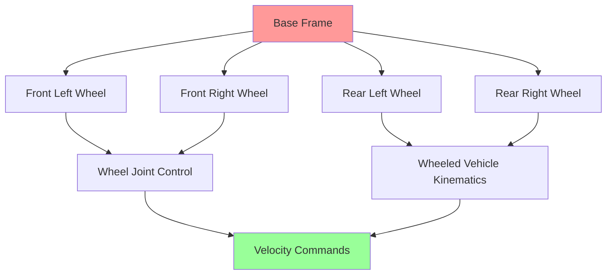

# Week 3 - ROS 2 Advanced Topics

## Learning Objectives

By the end of this week, you will be able to:
- Implement custom message and service types in ROS 2
- Use Actions for long-running tasks with feedback
- Configure and use parameters effectively
- Implement lifecycle nodes for robust systems
- Debug and profile ROS 2 applications

## Custom Messages and Services

### Creating Custom Messages

ROS 2 allows you to define custom message types for your specific application needs. Custom messages are defined in `.msg` files in the `msg/` directory of your package.

Example custom message (`CustomSensorData.msg`):
```
# Custom sensor data message
Header header
float64 temperature
float64 humidity
int32[] sensor_readings
bool status_ok
```

### Creating Custom Services

Services are defined in `.srv` files and consist of a request and response separated by `---`.

Example custom service (`NavigateToPosition.srv`):
```
# Request
float64 x
float64 y
float64 theta
---
# Response
bool success
string message
```

## Code Snippets

### Custom Action Example

Actions are defined in `.action` files and include Goal, Result, and Feedback:

```python
# MoveRobot.action
geometry_msgs/PoseStamped target_pose
---
bool success
string message
---
geometry_msgs/PoseStamped current_pose
float64 distance_remaining
```

### Action Server Implementation

```python
import rclpy
from rclpy.action import ActionServer
from rclpy.node import Node

from geometry_msgs.msg import PoseStamped
from my_robot_interfaces.action import MoveRobot  # Custom action

class MoveRobotActionServer(Node):

    def __init__(self):
        super().__init__('move_robot_action_server')
        self._action_server = ActionServer(
            self,
            MoveRobot,
            'move_robot',
            self.execute_callback)

    def execute_callback(self, goal_handle):
        self.get_logger().info('Executing goal...')

        feedback_msg = MoveRobot.Feedback()
        result = MoveRobot.Result()

        # Simulate robot movement
        for i in range(0, 101, 5):
            # Check if goal was cancelled
            if goal_handle.is_cancel_requested:
                goal_handle.canceled()
                self.get_logger().info('Goal canceled')
                return result

            # Update feedback
            feedback_msg.distance_remaining = float(100 - i)
            feedback_msg.current_pose.pose.position.x = float(i / 100.0)
            goal_handle.publish_feedback(feedback_msg)

            # Sleep to simulate work
            time.sleep(0.1)

        goal_handle.succeed()
        result.success = True
        result.message = 'Goal reached successfully'
        self.get_logger().info('Goal succeeded')

        return result

def main(args=None):
    rclpy.init(args=args)
    action_server = MoveRobotActionServer()
    rclpy.spin(action_server)
    rclpy.shutdown()

if __name__ == '__main__':
    main()
```

### Parameter Declaration and Usage

```python
import rclpy
from rclpy.node import Node

class ParameterExampleNode(Node):

    def __init__(self):
        super().__init__('parameter_example_node')

        # Declare parameters with default values and descriptions
        self.declare_parameter('robot_name', 'my_robot')
        self.declare_parameter('max_velocity', 1.0)
        self.declare_parameter('safety_distance', 0.5)

        # Get parameter values
        self.robot_name = self.get_parameter('robot_name').value
        self.max_velocity = self.get_parameter('max_velocity').value
        self.safety_distance = self.get_parameter('safety_distance').value

        self.get_logger().info(f'Robot name: {self.robot_name}')
        self.get_logger().info(f'Max velocity: {self.max_velocity}')

def main(args=None):
    rclpy.init(args=args)
    node = ParameterExampleNode()
    rclpy.spin(node)
    node.destroy_node()
    rclpy.shutdown()

if __name__ == '__main__':
    main()
```

## URDF Examples

### Advanced URDF with Transmission and Gazebo Plugins

```xml
<?xml version="1.0"?>
<robot name="advanced_robot" xmlns:xacro="http://www.ros.org/wiki/xacro">

  <!-- Include other URDF/XACRO files -->
  <xacro:include filename="$(find my_robot_description)/urdf/materials.xacro" />
  <xacro:include filename="$(find my_robot_description)/urdf/transmissions.xacro" />

  <!-- Base Link -->
  <link name="base_link">
    <visual>
      <geometry>
        <mesh filename="package://my_robot_description/meshes/base_link.stl"/>
      </geometry>
      <material name="white"/>
    </visual>
    <collision>
      <geometry>
        <mesh filename="package://my_robot_description/meshes/base_link.stl"/>
      </geometry>
    </collision>
    <inertial>
      <mass value="10.0"/>
      <inertia ixx="0.4" ixy="0.0" ixz="0.0" iyy="0.4" iyz="0.0" izz="0.2"/>
    </inertial>
  </link>

  <!-- Wheel macros -->
  <xacro:macro name="wheel" params="prefix *origin">
    <link name="${prefix}_wheel">
      <visual>
        <geometry>
          <cylinder radius="0.1" length="0.05"/>
        </geometry>
        <material name="black"/>
      </visual>
      <collision>
        <geometry>
          <cylinder radius="0.1" length="0.05"/>
        </geometry>
      </collision>
      <inertial>
        <mass value="1.0"/>
        <inertia ixx="0.01" ixy="0.0" ixz="0.0" iyy="0.01" iyz="0.0" izz="0.02"/>
      </inertial>
    </link>

    <joint name="${prefix}_wheel_joint" type="continuous">
      <xacro:insert_block name="origin"/>
      <axis xyz="0 0 1"/>
      <parent link="base_link"/>
      <child link="${prefix}_wheel"/>
    </joint>

    <!-- Transmission for ROS Control -->
    <transmission name="${prefix}_wheel_trans">
      <type>transmission_interface/SimpleTransmission</type>
      <joint name="${prefix}_wheel_joint">
        <hardwareInterface>hardware_interface/VelocityJointInterface</hardwareInterface>
      </joint>
      <actuator name="${prefix}_wheel_motor">
        <mechanicalReduction>1</mechanicalReduction>
      </actuator>
    </transmission>
  </xacro:macro>

  <!-- Wheels -->
  <xacro:wheel prefix="front_left">
    <origin xyz="0.2 0.15 0" rpy="0 0 0"/>
  </xacro:wheel>

  <xacro:wheel prefix="front_right">
    <origin xyz="0.2 -0.15 0" rpy="0 0 0"/>
  </xacro:wheel>

  <xacro:wheel prefix="rear_left">
    <origin xyz="-0.2 0.15 0" rpy="0 0 0"/>
  </xacro:wheel>

  <xacro:wheel prefix="rear_right">
    <origin xyz="-0.2 -0.15 0" rpy="0 0 0"/>
  </xacro:wheel>

  <!-- Gazebo plugins -->
  <gazebo reference="base_link">
    <material>Gazebo/White</material>
  </gazebo>

  <gazebo>
    <plugin name="diff_drive" filename="libgazebo_ros_diff_drive.so">
      <left_joint>front_left_wheel_joint</left_joint>
      <right_joint>front_right_wheel_joint</right_joint>
      <wheel_separation>0.3</wheel_separation>
      <wheel_diameter>0.2</wheel_diameter>
      <command_topic>cmd_vel</command_topic>
      <odometry_topic>odom</odometry_topic>
      <odometry_frame>odom</odometry_frame>
      <robot_base_frame>base_link</robot_base_frame>
    </plugin>
  </gazebo>

</robot>
```

## Kinematics Diagrams



## Hardware Tables

### Advanced Sensor Integration

| Sensor Type | Model | Interface | ROS Package | Purpose |
|-------------|-------|-----------|-------------|---------|
| 3D LIDAR | Ouster OS1-64 | Ethernet | ouster-ros | 3D mapping and navigation |
| Stereo Camera | ZED 2i | USB 3.0 | zed-ros-wrapper | Depth perception and navigation |
| Thermal Camera | FLIR Lepton | SPI | flir-camera-driver | Thermal imaging for special applications |
| IMU | VectorNav VN-100 | UART/SPI | vectornav | Precise orientation and acceleration |

## Key Terms

- **Action**: Long-running task with feedback and goal management
- **Parameter**: Runtime-configurable values for nodes
- **Lifecycle Node**: Node with explicit state management
- **Custom Message**: User-defined data structures for communication
- **Service**: Synchronous request/response communication
- **Topic**: Asynchronous publish/subscribe communication

## Learning Checkpoints

### Quiz Questions
1. What is the difference between a service and an action in ROS 2?
2. How do you declare a parameter in a ROS 2 node?
3. What are the three parts of an action definition?

### Practical Exercise
Create a custom action that moves a simulated robot to a specified location with feedback on progress.

## Hands-On Exercise

Implement a ROS 2 node that uses parameters to configure its behavior and communicates using a custom message type. Test the parameter changes using the command line.

## Personalization

<div className="personalization-options">
  <h3>Adjust Learning Path:</h3>
  <button onClick={() => setDifficulty('beginner')}>Beginner</button>
  <button onClick={() => setDifficulty('intermediate')}>Intermediate</button>
  <button onClick={() => setDifficulty('advanced')}>Advanced</button>
</div>

## Translation

<div className="translation-controls">
  <button onClick={() => translateToUrdu()}>اردو میں ترجمہ کریں</button>
</div>