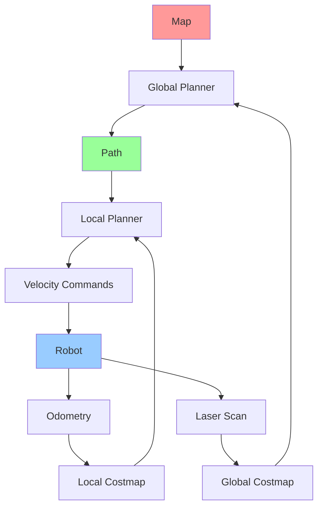

# Week 4 - Navigation and Path Planning

## Learning Objectives

By the end of this week, you will be able to:
- Implement navigation stack components in ROS 2
- Create and manage costmaps for obstacle avoidance
- Plan paths using various algorithms (Dijkstra, A*, RRT)
- Execute navigation goals with obstacle avoidance
- Integrate localization and mapping with navigation

## Navigation Stack Overview

The ROS 2 Navigation stack consists of several key components that work together to enable autonomous navigation:

- **AMCL (Adaptive Monte Carlo Localization)**: Localizes the robot in a known map
- **Costmap 2D**: Maintains obstacle information for planning and control
- **Global Planner**: Computes optimal path from start to goal
- **Local Planner**: Executes path following with obstacle avoidance
- **Controller**: Sends velocity commands to robot hardware

## Code Snippets

### Navigation Node Example

```python
import rclpy
from rclpy.node import Node
from nav2_msgs.action import NavigateToPose
from geometry_msgs.msg import PoseStamped
from action_msgs.msg import GoalStatus
import tf_transformations

class NavigationNode(Node):

    def __init__(self):
        super().__init__('navigation_node')

        # Create action client for navigation
        self.nav_client = ActionClient(self, NavigateToPose, 'navigate_to_pose')

    def navigate_to_pose(self, x, y, theta):
        """Send navigation goal to the robot"""
        # Wait for action server
        self.nav_client.wait_for_server()

        # Create goal message
        goal_msg = NavigateToPose.Goal()
        goal_msg.pose.header.frame_id = 'map'
        goal_msg.pose.header.stamp = self.get_clock().now().to_msg()

        # Set position
        goal_msg.pose.pose.position.x = x
        goal_msg.pose.pose.position.y = y
        goal_msg.pose.pose.position.z = 0.0

        # Set orientation (convert theta to quaternion)
        quat = tf_transformations.quaternion_from_euler(0, 0, theta)
        goal_msg.pose.pose.orientation.x = quat[0]
        goal_msg.pose.pose.orientation.y = quat[1]
        goal_msg.pose.pose.orientation.z = quat[2]
        goal_msg.pose.pose.orientation.w = quat[3]

        # Send goal
        self.get_logger().info(f'Sending navigation goal to ({x}, {y})')
        send_goal_future = self.nav_client.send_goal_async(goal_msg)
        send_goal_future.add_done_callback(self.goal_response_callback)

    def goal_response_callback(self, future):
        """Handle goal response"""
        goal_handle = future.result()
        if not goal_handle.accepted:
            self.get_logger().info('Goal rejected')
            return

        self.get_logger().info('Goal accepted')
        get_result_future = goal_handle.get_result_async()
        get_result_future.add_done_callback(self.get_result_callback)

    def get_result_callback(self, future):
        """Handle result callback"""
        status = future.result().status
        result = future.result().result

        if status == GoalStatus.STATUS_SUCCEEDED:
            self.get_logger().info('Navigation succeeded')
        else:
            self.get_logger().info(f'Navigation failed with status: {status}')

def main(args=None):
    rclpy.init(args=args)

    nav_node = NavigationNode()

    # Example: Navigate to position (2.0, 1.0) facing 90 degrees
    nav_node.navigate_to_pose(2.0, 1.0, 1.57)

    rclpy.spin(nav_node)
    nav_node.destroy_node()
    rclpy.shutdown()

if __name__ == '__main__':
    main()
```

### Costmap Configuration

```yaml
# costmap_common_params.yaml
global_costmap:
  global_frame: map
  robot_base_frame: base_link
  update_frequency: 10.0
  publish_frequency: 10.0
  width: 20
  height: 20
  resolution: 0.05
  origin_x: -10.0
  origin_y: -10.0
  plugins:
    - {name: static_layer, type: "nav2_costmap_2d::StaticLayer"}
    - {name: inflation_layer, type: "nav2_costmap_2d::InflationLayer"}

local_costmap:
  global_frame: odom
  robot_base_frame: base_link
  update_frequency: 10.0
  publish_frequency: 10.0
  width: 5
  height: 5
  resolution: 0.05
  origin_x: -2.5
  origin_y: -2.5
  plugins:
    - {name: obstacle_layer, type: "nav2_costmap_2d::ObstacleLayer"}
    - {name: inflation_layer, type: "nav2_costmap_2d::InflationLayer"}

# Obstacle layer configuration
obstacle_layer:
  enabled: true
  observation_sources: scan
  scan:
    topic: /scan
    max_obstacle_height: 2.0
    clearing: true
    marking: true
    data_type: LaserScan
    raytrace_max_range: 3.0
    raytrace_min_range: 0.0
    obstacle_max_range: 2.5
    obstacle_min_range: 0.0

# Inflation layer configuration
inflation_layer:
  enabled: true
  cost_scaling_factor: 10.0
  inflation_radius: 0.55
```

### Path Planning Algorithm Example

```python
import numpy as np
import heapq

class AStarPlanner:
    def __init__(self, occupancy_grid, resolution=0.05):
        self.grid = occupancy_grid  # 2D array with 0=free, 1=occupied
        self.resolution = resolution

    def heuristic(self, pos1, pos2):
        """Calculate heuristic distance (Manhattan distance)"""
        return abs(pos1[0] - pos2[0]) + abs(pos1[1] - pos2[1])

    def get_neighbors(self, pos):
        """Get valid neighbors of a position"""
        neighbors = []
        for dx in [-1, 0, 1]:
            for dy in [-1, 0, 1]:
                if dx == 0 and dy == 0:
                    continue  # Skip current position

                new_pos = (pos[0] + dx, pos[1] + dy)

                # Check bounds
                if (0 <= new_pos[0] < self.grid.shape[0] and
                    0 <= new_pos[1] < self.grid.shape[1]):

                    # Check if cell is free
                    if self.grid[new_pos[0], new_pos[1]] == 0:
                        neighbors.append(new_pos)

        return neighbors

    def plan_path(self, start, goal):
        """Plan path using A* algorithm"""
        # Priority queue: (cost, position)
        open_set = [(0, start)]
        came_from = {}

        # Costs
        g_score = {start: 0}
        f_score = {start: self.heuristic(start, goal)}

        while open_set:
            current_cost, current = heapq.heappop(open_set)

            if current == goal:
                # Reconstruct path
                path = [current]
                while current in came_from:
                    current = came_from[current]
                    path.append(current)
                path.reverse()
                return path

            for neighbor in self.get_neighbors(current):
                tentative_g_score = g_score[current] + 1  # Assuming uniform cost

                if neighbor not in g_score or tentative_g_score < g_score[neighbor]:
                    came_from[neighbor] = current
                    g_score[neighbor] = tentative_g_score
                    f_score[neighbor] = tentative_g_score + self.heuristic(neighbor, goal)

                    heapq.heappush(open_set, (f_score[neighbor], neighbor))

        return None  # No path found

# Example usage
def example_usage():
    # Create a simple occupancy grid (10x10, with some obstacles)
    grid = np.zeros((10, 10))
    grid[3, 3:7] = 1  # Horizontal obstacle
    grid[5:8, 5] = 1  # Vertical obstacle

    planner = AStarPlanner(grid)
    path = planner.plan_path((0, 0), (9, 9))

    if path:
        print("Path found:", path)
    else:
        print("No path found")
```

## URDF Examples

### Robot with Navigation Sensors

```xml
<?xml version="1.0"?>
<robot name="navigation_robot">
  <!-- Base Link -->
  <link name="base_link">
    <visual>
      <geometry>
        <cylinder radius="0.3" length="0.15"/>
      </geometry>
      <material name="blue">
        <color rgba="0 0 1 1"/>
      </material>
    </visual>
    <collision>
      <geometry>
        <cylinder radius="0.3" length="0.15"/>
      </geometry>
    </collision>
    <inertial>
      <mass value="10.0"/>
      <inertia ixx="0.4" ixy="0.0" ixz="0.0" iyy="0.4" iyz="0.0" izz="0.2"/>
    </inertial>
  </link>

  <!-- Wheels -->
  <joint name="wheel_left_joint" type="continuous">
    <parent link="base_link"/>
    <child link="wheel_left"/>
    <origin xyz="0 0.25 -0.05" rpy="0 0 0"/>
    <axis xyz="0 0 1"/>
  </joint>

  <link name="wheel_left">
    <visual>
      <geometry>
        <cylinder radius="0.1" length="0.05"/>
      </geometry>
      <material name="black">
        <color rgba="0 0 0 1"/>
      </material>
    </visual>
  </link>

  <joint name="wheel_right_joint" type="continuous">
    <parent link="base_link"/>
    <child link="wheel_right"/>
    <origin xyz="0 -0.25 -0.05" rpy="0 0 0"/>
    <axis xyz="0 0 1"/>
  </joint>

  <link name="wheel_right">
    <visual>
      <geometry>
        <cylinder radius="0.1" length="0.05"/>
      </geometry>
      <material name="black">
        <color rgba="0 0 0 1"/>
      </material>
    </visual>
  </link>

  <!-- LIDAR Mount -->
  <joint name="lidar_mount_joint" type="fixed">
    <parent link="base_link"/>
    <child link="lidar_link"/>
    <origin xyz="0.0 0.0 0.2" rpy="0 0 0"/>
  </joint>

  <link name="lidar_link">
    <visual>
      <geometry>
        <cylinder radius="0.05" length="0.05"/>
      </geometry>
    </visual>
  </link>

  <!-- IMU Mount -->
  <joint name="imu_mount_joint" type="fixed">
    <parent link="base_link"/>
    <child link="imu_link"/>
    <origin xyz="0.0 0.0 0.1" rpy="0 0 0"/>
  </joint>

  <link name="imu_link"/>

  <!-- Navigation Sensors -->
  <gazebo reference="lidar_link">
    <sensor name="lidar" type="ray">
      <always_on>true</always_on>
      <update_rate>10</update_rate>
      <ray>
        <scan>
          <horizontal>
            <samples>360</samples>
            <resolution>1.0</resolution>
            <min_angle>-3.14159</min_angle>
            <max_angle>3.14159</max_angle>
          </horizontal>
        </scan>
        <range>
          <min>0.1</min>
          <max>10.0</max>
          <resolution>0.01</resolution>
        </range>
      </ray>
      <plugin name="lidar_controller" filename="libgazebo_ros_ray_sensor.so">
        <frame_name>lidar_link</frame_name>
        <topic_name>scan</topic_name>
      </plugin>
    </sensor>
  </gazebo>

  <gazebo reference="imu_link">
    <sensor name="imu" type="imu">
      <always_on>true</always_on>
      <update_rate>100</update_rate>
      <plugin name="imu_controller" filename="libgazebo_ros_imu.so">
        <frame_name>imu_link</frame_name>
        <topic_name>imu</topic_name>
      </plugin>
    </sensor>
  </gazebo>

  <!-- Differential Drive Controller -->
  <gazebo>
    <plugin name="diff_drive" filename="libgazebo_ros_diff_drive.so">
      <left_joint>wheel_left_joint</left_joint>
      <right_joint>wheel_right_joint</right_joint>
      <wheel_separation>0.5</wheel_separation>
      <wheel_diameter>0.2</wheel_diameter>
      <command_topic>cmd_vel</command_topic>
      <odometry_topic>odom</odometry_topic>
      <odometry_frame>odom</odometry_frame>
      <robot_base_frame>base_link</robot_base_frame>
    </plugin>
  </gazebo>
</robot>
```

## Kinematics Diagrams



## Navigation Hardware Configuration

| Component | Model | Interface | Purpose | Accuracy |
|-----------|-------|-----------|---------|----------|
| LIDAR | Hokuyo UST-10LX | Ethernet | Obstacle detection | Range: ±20mm |
| IMU | Microstrain 3DM-GX5-25 | RS-485 | Orientation & acceleration | Accel: ±0.05m/s² |
| Wheel Encoders | Incremental Optical | Quadrature | Odometry | Resolution: 1000 PPR |
| Camera | Intel RealSense D435 | USB 3.0 | Visual navigation | Depth: ±2mm |

## Key Terms

- **AMCL**: Adaptive Monte Carlo Localization - probabilistic localization algorithm
- **Costmap**: Grid-based representation of obstacles and costs for navigation
- **Path Planning**: Algorithmic process of finding a safe path from start to goal
- **Global Planner**: Computes optimal path considering static obstacles
- **Local Planner**: Executes path following with dynamic obstacle avoidance
- **TF**: Transform Framework - coordinate transformation system
- **SLAM**: Simultaneous Localization and Mapping

## Learning Checkpoints

### Quiz Questions
1. What is the main difference between global and local planners?
2. Name three path planning algorithms and their characteristics.
3. How does AMCL differ from other localization methods?

### Practical Exercise
Create a navigation configuration for your robot and plan a path from one corner of a room to another, avoiding obstacles.

## Hands-On Exercise

Implement a simple A* path planning algorithm that works with an occupancy grid map. Visualize the resulting path and compare it to the shortest possible path.

## Personalization

<div className="personalization-options">
  <h3>Adjust Learning Path:</h3>
  <button onClick={() => setDifficulty('beginner')}>Beginner</button>
  <button onClick={() => setDifficulty('intermediate')}>Intermediate</button>
  <button onClick={() => setDifficulty('advanced')}>Advanced</button>
</div>

## Translation

<div className="translation-controls">
  <button onClick={() => translateToUrdu()}>اردو میں ترجمہ کریں</button>
</div>