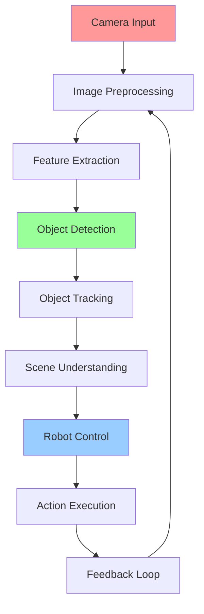

# Week 5 - Computer Vision for Robotics

## Learning Objectives

By the end of this week, you will be able to:
- Implement basic computer vision algorithms for robotics applications
- Use OpenCV for image processing and feature extraction
- Apply object detection and tracking techniques
- Integrate vision systems with robot control
- Perform stereo vision and depth estimation

## Computer Vision Fundamentals

Computer vision in robotics involves processing visual information to understand and interact with the environment. Key components include:

- **Image Acquisition**: Capturing images from cameras
- **Preprocessing**: Enhancing image quality and reducing noise
- **Feature Extraction**: Identifying distinctive elements in images
- **Object Recognition**: Detecting and classifying objects
- **Tracking**: Following objects across multiple frames

## Code Snippets

### Basic Image Processing with OpenCV

```python
import cv2
import numpy as np
import rclpy
from rclpy.node import Node
from sensor_msgs.msg import Image
from cv_bridge import CvBridge

class VisionNode(Node):
    def __init__(self):
        super().__init__('vision_node')

        # Initialize CV bridge
        self.bridge = CvBridge()

        # Create subscription to camera feed
        self.subscription = self.create_subscription(
            Image,
            '/camera/image_raw',
            self.image_callback,
            10
        )

        # Create publisher for processed image
        self.publisher = self.create_publisher(
            Image,
            '/camera/processed_image',
            10
        )

        # Processed image counter
        self.processed_count = 0

    def image_callback(self, msg):
        """Process incoming image"""
        try:
            # Convert ROS Image to OpenCV
            cv_image = self.bridge.imgmsg_to_cv2(msg, "bgr8")

            # Apply basic image processing
            processed_image = self.process_image(cv_image)

            # Convert back to ROS Image
            processed_msg = self.bridge.cv2_to_imgmsg(processed_image, "bgr8")
            processed_msg.header = msg.header

            # Publish processed image
            self.publisher.publish(processed_msg)

            self.processed_count += 1
            if self.processed_count % 30 == 0:  # Log every 30 frames
                self.get_logger().info(f'Processed {self.processed_count} images')

        except Exception as e:
            self.get_logger().error(f'Error processing image: {e}')

    def process_image(self, image):
        """Apply image processing techniques"""
        # Convert to grayscale
        gray = cv2.cvtColor(image, cv2.COLOR_BGR2GRAY)

        # Apply Gaussian blur to reduce noise
        blurred = cv2.GaussianBlur(gray, (5, 5), 0)

        # Apply threshold
        _, thresh = cv2.threshold(blurred, 127, 255, cv2.THRESH_BINARY)

        # Apply morphological operations to clean up
        kernel = np.ones((3, 3), np.uint8)
        opening = cv2.morphologyEx(thresh, cv2.MORPH_OPEN, kernel, iterations=2)

        # Find contours
        contours, _ = cv2.findContours(opening, cv2.RETR_EXTERNAL, cv2.CHAIN_APPROX_SIMPLE)

        # Draw contours on original image
        result = image.copy()
        cv2.drawContours(result, contours, -1, (0, 255, 0), 2)

        return result

def main(args=None):
    rclpy.init(args=args)
    vision_node = VisionNode()

    try:
        rclpy.spin(vision_node)
    except KeyboardInterrupt:
        pass
    finally:
        vision_node.destroy_node()
        rclpy.shutdown()

if __name__ == '__main__':
    main()
```

### Feature Detection and Matching

```python
import cv2
import numpy as np

class FeatureDetector:
    def __init__(self):
        # Initialize SIFT detector
        self.detector = cv2.SIFT_create()
        # Initialize matcher
        self.matcher = cv2.BFMatcher()

    def detect_and_describe(self, image):
        """Detect features and compute descriptors"""
        gray = cv2.cvtColor(image, cv2.COLOR_BGR2GRAY)
        keypoints, descriptors = self.detector.detectAndCompute(gray, None)
        return keypoints, descriptors

    def match_features(self, desc1, desc2):
        """Match features between two images"""
        if desc1 is None or desc2 is None:
            return []

        # Use KNN matching
        matches = self.matcher.knnMatch(desc1, desc2, k=2)

        # Apply Lowe's ratio test
        good_matches = []
        for m, n in matches:
            if m.distance < 0.75 * n.distance:
                good_matches.append(m)

        return good_matches

    def find_object(self, scene_image, template_image):
        """Find template in scene using feature matching"""
        # Detect features in both images
        kp1, desc1 = self.detect_and_describe(template_image)
        kp2, desc2 = self.detect_and_describe(scene_image)

        if desc1 is None or desc2 is None:
            return None, None

        # Match features
        matches = self.match_features(desc1, desc2)

        if len(matches) >= 10:
            # Extract matched keypoints
            src_pts = np.float32([kp1[m.queryIdx].pt for m in matches]).reshape(-1, 1, 2)
            dst_pts = np.float32([kp2[m.trainIdx].pt for m in matches]).reshape(-1, 1, 2)

            # Find homography matrix
            M, mask = cv2.findHomography(src_pts, dst_pts, cv2.RANSAC, 5.0)

            if M is not None:
                # Define template corners
                h, w = template_image.shape[:2]
                corners = np.float32([
                    [0, 0], [w, 0], [w, h], [0, h]
                ]).reshape(-1, 1, 2)

                # Transform corners to scene
                transformed_corners = cv2.perspectiveTransform(corners, M)

                return transformed_corners, matches
        else:
            print(f"Not enough matches found: {len(matches)}/{10}")

        return None, None

# Example usage
def example_feature_detection():
    # Load images
    template = cv2.imread('template.jpg')
    scene = cv2.imread('scene.jpg')

    if template is None or scene is None:
        print("Could not load images")
        return

    detector = FeatureDetector()
    corners, matches = detector.find_object(scene, template)

    if corners is not None:
        # Draw rectangle around detected object
        result = scene.copy()
        cv2.polylines(result, [np.int32(corners)], True, (0, 255, 0), 3, cv2.LINE_AA)
        cv2.imshow('Detected Object', result)
        cv2.waitKey(0)
        cv2.destroyAllWindows()
    else:
        print("Object not found in scene")
```

### Object Detection with YOLO

```python
import cv2
import numpy as np

class YOLODetector:
    def __init__(self, config_path, weights_path, names_path):
        # Load YOLO network
        self.net = cv2.dnn.readNet(weights_path, config_path)

        # Load class names
        with open(names_path, 'r') as f:
            self.classes = [line.strip() for line in f.readlines()]

        # Get output layers
        layer_names = self.net.getLayerNames()
        self.output_layers = [layer_names[i[0] - 1] for i in self.net.getUnconnectedOutLayers()]

        # Set backend and target
        self.net.setPreferableBackend(cv2.dnn.DNN_BACKEND_OPENCV)
        self.net.setPreferableTarget(cv2.dnn.DNN_TARGET_CPU)

    def detect_objects(self, image, confidence_threshold=0.5):
        """Detect objects in image using YOLO"""
        height, width, channels = image.shape

        # Prepare image for YOLO
        blob = cv2.dnn.blobFromImage(image, 0.00392, (416, 416), (0, 0, 0), True, crop=False)
        self.net.setInput(blob)
        outputs = self.net.forward(self.output_layers)

        # Process outputs
        boxes = []
        confidences = []
        class_ids = []

        for output in outputs:
            for detection in output:
                scores = detection[5:]
                class_id = np.argmax(scores)
                confidence = scores[class_id]

                if confidence > confidence_threshold:
                    # Object detected
                    center_x = int(detection[0] * width)
                    center_y = int(detection[1] * height)
                    w = int(detection[2] * width)
                    h = int(detection[3] * height)

                    # Rectangle coordinates
                    x = int(center_x - w / 2)
                    y = int(center_y - h / 2)

                    boxes.append([x, y, w, h])
                    confidences.append(float(confidence))
                    class_ids.append(class_id)

        # Apply non-maximum suppression
        indexes = cv2.dnn.NMSBoxes(boxes, confidences, confidence_threshold, 0.4)

        # Format results
        detections = []
        if len(indexes) > 0:
            for i in indexes.flatten():
                x, y, w, h = boxes[i]
                class_name = self.classes[class_ids[i]]
                confidence = confidences[i]
                detections.append({
                    'bbox': (x, y, w, h),
                    'class': class_name,
                    'confidence': confidence
                })

        return detections

    def draw_detections(self, image, detections):
        """Draw bounding boxes on image"""
        colors = np.random.uniform(0, 255, size=(len(self.classes), 3))

        for detection in detections:
            x, y, w, h = detection['bbox']
            class_name = detection['class']
            confidence = detection['confidence']

            # Draw bounding box
            color = colors[list(self.classes).index(class_name)]
            cv2.rectangle(image, (x, y), (x + w, y + h), color, 2)

            # Draw label
            label = f"{class_name}: {confidence:.2f}"
            cv2.putText(image, label, (x, y - 10), cv2.FONT_HERSHEY_SIMPLEX, 0.5, color, 2)

        return image
```

## URDF Examples

### Vision-enabled Robot

```xml
<?xml version="1.0"?>
<robot name="vision_robot">
  <!-- Base Link -->
  <link name="base_link">
    <visual>
      <geometry>
        <cylinder radius="0.3" length="0.15"/>
      </geometry>
      <material name="gray">
        <color rgba="0.5 0.5 0.5 1.0"/>
      </material>
    </visual>
    <collision>
      <geometry>
        <cylinder radius="0.3" length="0.15"/>
      </geometry>
    </collision>
    <inertial>
      <mass value="10.0"/>
      <inertia ixx="0.4" ixy="0.0" ixz="0.0" iyy="0.4" iyz="0.0" izz="0.2"/>
    </inertial>
  </link>

  <!-- Wheels -->
  <joint name="wheel_left_joint" type="continuous">
    <parent link="base_link"/>
    <child link="wheel_left"/>
    <origin xyz="0 0.25 -0.05" rpy="0 0 0"/>
    <axis xyz="0 0 1"/>
  </joint>

  <link name="wheel_left">
    <visual>
      <geometry>
        <cylinder radius="0.1" length="0.05"/>
      </geometry>
      <material name="black">
        <color rgba="0 0 0 1"/>
      </material>
    </visual>
  </link>

  <joint name="wheel_right_joint" type="continuous">
    <parent link="base_link"/>
    <child link="wheel_right"/>
    <origin xyz="0 -0.25 -0.05" rpy="0 0 0"/>
    <axis xyz="0 0 1"/>
  </joint>

  <link name="wheel_right">
    <visual>
      <geometry>
        <cylinder radius="0.1" length="0.05"/>
      </geometry>
      <material name="black">
        <color rgba="0 0 0 1"/>
      </material>
    </visual>
  </link>

  <!-- Camera Mount -->
  <joint name="camera_mount_joint" type="fixed">
    <parent link="base_link"/>
    <child link="camera_link"/>
    <origin xyz="0.2 0.0 0.1" rpy="0 0 0"/>
  </joint>

  <link name="camera_link">
    <visual>
      <geometry>
        <box size="0.05 0.05 0.05"/>
      </geometry>
      <material name="red">
        <color rgba="1 0 0 1"/>
      </material>
    </visual>
  </link>

  <!-- Depth Camera Mount -->
  <joint name="depth_camera_mount_joint" type="fixed">
    <parent link="base_link"/>
    <child link="depth_camera_link"/>
    <origin xyz="0.2 0.0 0.1" rpy="0 0 0"/>
  </joint>

  <link name="depth_camera_link">
    <visual>
      <geometry>
        <box size="0.05 0.05 0.05"/>
      </geometry>
      <material name="blue">
        <color rgba="0 0 1 1"/>
      </material>
    </visual>
  </link>

  <!-- Vision Sensors -->
  <gazebo reference="camera_link">
    <sensor name="camera" type="camera">
      <always_on>true</always_on>
      <update_rate>30</update_rate>
      <camera>
        <horizontal_fov>1.047</horizontal_fov>
        <image>
          <width>640</width>
          <height>480</height>
        </image>
        <clip>
          <near>0.1</near>
          <far>10</far>
        </clip>
      </camera>
      <plugin name="camera_controller" filename="libgazebo_ros_camera.so">
        <frame_name>camera_link</frame_name>
        <topic_name>camera/image_raw</topic_name>
      </plugin>
    </sensor>
  </gazebo>

  <gazebo reference="depth_camera_link">
    <sensor name="depth_camera" type="depth">
      <always_on>true</always_on>
      <update_rate>30</update_rate>
      <camera>
        <horizontal_fov>1.047</horizontal_fov>
        <image>
          <width>640</width>
          <height>480</height>
        </image>
        <clip>
          <near>0.1</near>
          <far>10</far>
        </clip>
      </camera>
      <plugin name="depth_camera_controller" filename="libgazebo_ros_openni_kinect.so">
        <frame_name>depth_camera_link</frame_name>
        <depth_image_topic_name>depth/image_raw</depth_image_topic_name>
        <point_cloud_topic_name>depth/points</point_cloud_topic_name>
      </plugin>
    </sensor>
  </gazebo>

  <!-- Differential Drive Controller -->
  <gazebo>
    <plugin name="diff_drive" filename="libgazebo_ros_diff_drive.so">
      <left_joint>wheel_left_joint</left_joint>
      <right_joint>wheel_right_joint</right_joint>
      <wheel_separation>0.5</wheel_separation>
      <wheel_diameter>0.2</wheel_diameter>
      <command_topic>cmd_vel</command_topic>
      <odometry_topic>odom</odometry_topic>
      <odometry_frame>odom</odometry_frame>
      <robot_base_frame>base_link</robot_base_frame>
    </plugin>
  </gazebo>
</robot>
```

## Computer Vision Pipeline Diagram



## Vision Algorithms Comparison

| Algorithm | Purpose | Speed | Accuracy | Use Case |
|-----------|---------|-------|----------|----------|
| SIFT | Feature Detection | Medium | High | Object Recognition |
| ORB | Feature Detection | Fast | Medium | Real-time Applications |
| YOLO | Object Detection | Very Fast | High | Real-time Detection |
| HOG+SVM | Pedestrian Detection | Medium | Medium | Safety Applications |
| Optical Flow | Motion Tracking | Fast | Medium | Movement Analysis |
| Stereo Vision | Depth Estimation | Slow | High | 3D Reconstruction |

## Key Terms

- **OpenCV**: Open Computer Vision library for image processing
- **Feature Detection**: Finding distinctive points in an image
- **Homography**: Transformation between two planes
- **Stereo Vision**: Depth estimation using two cameras
- **Optical Flow**: Motion of objects between frames
- **Perspective Transform**: Correcting perspective distortion
- **Image Segmentation**: Partitioning image into regions

## Learning Checkpoints

### Quiz Questions
1. What is the main advantage of SIFT over ORB for feature detection?
2. Name three different approaches for object detection in robotics.
3. How does stereo vision enable depth estimation?

### Practical Exercise
Implement a simple object detection system that can identify and track a colored ball in real-time video feed.

## Hands-On Exercise

Create a ROS 2 node that subscribes to camera data, detects a specific object (e.g., a colored ball), and publishes commands to drive the robot toward the object.

## Personalization

<div className="personalization-options">
  <h3>Adjust Learning Path:</h3>
  <button onClick={() => setDifficulty('beginner')}>Beginner</button>
  <button onClick={() => setDifficulty('intermediate')}>Intermediate</button>
  <button onClick={() => setDifficulty('advanced')}>Advanced</button>
</div>

## Translation

<div className="translation-controls">
  <button onClick={() => translateToUrdu()}>اردو میں ترجمہ کریں</button>
</div>