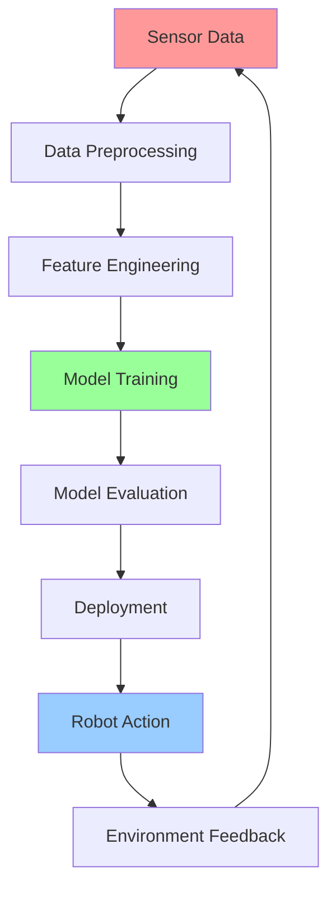

# Week 6 - Machine Learning for Robotics

## Learning Objectives

By the end of this week, you will be able to:
- Apply supervised learning algorithms to robotics problems
- Implement reinforcement learning for robot control
- Use deep learning for perception and decision making
- Train neural networks for robot behavior prediction
- Integrate ML models with ROS 2 systems

## Machine Learning in Robotics

Machine learning is transforming robotics by enabling robots to learn from experience and adapt to new situations. Key applications include:

- **Perception**: Object recognition, scene understanding
- **Control**: Learning motor skills and navigation strategies
- **Prediction**: Anticipating human intentions and environmental changes
- **Planning**: Learning efficient paths and manipulation strategies

## Code Snippets

### Supervised Learning for Robot Control

```python
import numpy as np
import pandas as pd
from sklearn.model_selection import train_test_split
from sklearn.ensemble import RandomForestRegressor
from sklearn.metrics import mean_squared_error
import joblib

class RobotControlLearner:
    def __init__(self):
        self.model = RandomForestRegressor(n_estimators=100, random_state=42)
        self.is_trained = False

    def prepare_dataset(self, sensor_data, motor_commands):
        """
        Prepare dataset from sensor readings and corresponding motor commands

        Args:
            sensor_data: Array of sensor readings [distance_front, distance_left, distance_right, ...]
            motor_commands: Array of motor commands [linear_x, angular_z]
        """
        # Create features from sensor data
        features = []
        labels = []

        for i in range(len(sensor_data)):
            # Current sensor readings
            current_sensors = sensor_data[i]

            # Previous sensor readings (for temporal context)
            prev_sensors = sensor_data[i-1] if i > 0 else np.zeros_like(sensor_data[i])

            # Combined features
            combined_features = np.concatenate([current_sensors, prev_sensors])

            features.append(combined_features)
            labels.append(motor_commands[i])

        return np.array(features), np.array(labels)

    def train(self, sensor_data, motor_commands):
        """Train the robot control model"""
        X, y = self.prepare_dataset(sensor_data, motor_commands)

        # Split data into training and testing sets
        X_train, X_test, y_train, y_test = train_test_split(X, y, test_size=0.2, random_state=42)

        # Train the model
        self.model.fit(X_train, y_train)

        # Evaluate on test set
        y_pred = self.model.predict(X_test)
        mse = mean_squared_error(y_test, y_pred)

        self.is_trained = True
        print(f"Model trained with MSE: {mse}")

        return mse

    def predict_control(self, sensor_reading, prev_sensor_reading=None):
        """Predict motor commands based on sensor readings"""
        if not self.is_trained:
            raise ValueError("Model must be trained first")

        if prev_sensor_reading is None:
            prev_sensor_reading = np.zeros_like(sensor_reading)

        # Combine current and previous sensor readings
        features = np.concatenate([sensor_reading, prev_sensor_reading]).reshape(1, -1)

        # Predict motor commands
        motor_cmd = self.model.predict(features)[0]

        return motor_cmd

    def save_model(self, filepath):
        """Save trained model to file"""
        joblib.dump(self.model, filepath)

    def load_model(self, filepath):
        """Load trained model from file"""
        self.model = joblib.load(filepath)
        self.is_trained = True

# Example usage
def example_supervised_learning():
    # Simulated sensor data and motor commands
    # In practice, these would come from robot experiments
    sensor_data = np.random.rand(1000, 5)  # 5 sensor readings
    motor_commands = np.random.rand(1000, 2)  # linear_x, angular_z

    learner = RobotControlLearner()
    learner.train(sensor_data, motor_commands)

    # Predict for new sensor reading
    new_sensor = np.random.rand(5)
    predicted_command = learner.predict_control(new_sensor)
    print(f"Predicted command: {predicted_command}")
```

### Reinforcement Learning for Navigation

```python
import numpy as np
import random
from collections import defaultdict

class QLearningNavigator:
    def __init__(self, state_space, action_space, learning_rate=0.1, discount_factor=0.95, epsilon=1.0, epsilon_decay=0.995, min_epsilon=0.01):
        self.state_space = state_space
        self.action_space = action_space
        self.learning_rate = learning_rate
        self.discount_factor = discount_factor
        self.epsilon = epsilon
        self.epsilon_decay = epsilon_decay
        self.min_epsilon = min_epsilon

        # Initialize Q-table
        self.q_table = defaultdict(lambda: np.zeros(action_space))

    def discretize_state(self, continuous_state):
        """Convert continuous state to discrete state for Q-learning"""
        # Example: discretize continuous position into grid cells
        x, y = continuous_state
        grid_size = 0.5  # 0.5 meter grid cells
        discrete_x = int(x / grid_size)
        discrete_y = int(y / grid_size)
        return (discrete_x, discrete_y)

    def choose_action(self, state):
        """Choose action using epsilon-greedy policy"""
        # Convert continuous state to discrete state
        discrete_state = self.discretize_state(state)

        # Exploration vs exploitation
        if random.random() < self.epsilon:
            # Explore: random action
            return random.randint(0, self.action_space - 1)
        else:
            # Exploit: best known action
            return np.argmax(self.q_table[discrete_state])

    def update_q_value(self, state, action, reward, next_state):
        """Update Q-value using Q-learning update rule"""
        discrete_state = self.discretize_state(state)
        discrete_next_state = self.discretize_state(next_state)

        # Get current Q-value
        current_q = self.q_table[discrete_state][action]

        # Get max Q-value for next state
        max_next_q = np.max(self.q_table[discrete_next_state])

        # Calculate target Q-value
        target_q = reward + self.discount_factor * max_next_q

        # Update Q-value
        self.q_table[discrete_state][action] = current_q + self.learning_rate * (target_q - current_q)

    def decay_epsilon(self):
        """Decay exploration rate"""
        self.epsilon = max(self.min_epsilon, self.epsilon * self.epsilon_decay)

class RobotEnvironment:
    def __init__(self, grid_size=10):
        self.grid_size = grid_size
        self.robot_pos = [0, 0]  # Starting position
        self.goal_pos = [grid_size-1, grid_size-1]  # Goal position
        self.obstacles = [(3, 3), (4, 4), (5, 5)]  # Obstacle positions

    def reset(self):
        """Reset environment to initial state"""
        self.robot_pos = [0, 0]
        return self.robot_pos[:]

    def step(self, action):
        """Take action and return (next_state, reward, done)"""
        # Define actions: 0=up, 1=right, 2=down, 3=left
        action_effects = [(-1, 0), (0, 1), (1, 0), (0, -1)]

        # Calculate new position
        new_row = self.robot_pos[0] + action_effects[action][0]
        new_col = self.robot_pos[1] + action_effects[action][1]

        # Check bounds
        if 0 <= new_row < self.grid_size and 0 <= new_col < self.grid_size:
            # Check for obstacles
            if (new_row, new_col) not in self.obstacles:
                self.robot_pos = [new_row, new_col]

        # Calculate reward
        reward = -0.1  # Small negative reward for each step (encourage efficiency)

        # Check if reached goal
        if self.robot_pos[0] == self.goal_pos[0] and self.robot_pos[1] == self.goal_pos[1]:
            reward = 10  # Large positive reward for reaching goal
            done = True
        elif (self.robot_pos[0], self.robot_pos[1]) in self.obstacles:
            reward = -5  # Penalty for hitting obstacle
            done = False
        else:
            # Distance-based reward (closer to goal = better)
            dist_to_goal = abs(self.robot_pos[0] - self.goal_pos[0]) + abs(self.robot_pos[1] - self.goal_pos[1])
            reward -= dist_to_goal * 0.01
            done = False

        return self.robot_pos[:], reward, done

# Example training loop
def train_navigation_agent(episodes=1000):
    env = RobotEnvironment()
    agent = QLearningNavigator(state_space=100, action_space=4)  # 10x10 grid -> 100 states, 4 actions

    for episode in range(episodes):
        state = env.reset()
        total_reward = 0

        while True:
            action = agent.choose_action(state)
            next_state, reward, done = env.step(action)

            agent.update_q_value(state, action, reward, next_state)
            state = next_state
            total_reward += reward

            if done:
                break

        agent.decay_epsilon()

        if episode % 100 == 0:
            print(f"Episode {episode}, Total Reward: {total_reward}, Epsilon: {agent.epsilon}")

    return agent
```

### Deep Learning with TensorFlow/Keras

```python
import tensorflow as tf
from tensorflow import keras
import numpy as np

class RobotDeepLearner:
    def __init__(self, input_shape, num_actions):
        self.input_shape = input_shape
        self.num_actions = num_actions
        self.model = self.build_model()

    def build_model(self):
        """Build neural network for robot learning"""
        model = keras.Sequential([
            keras.layers.Dense(128, activation='relu', input_shape=self.input_shape),
            keras.layers.Dropout(0.3),
            keras.layers.Dense(64, activation='relu'),
            keras.layers.Dropout(0.3),
            keras.layers.Dense(32, activation='relu'),
            keras.layers.Dense(self.num_actions, activation='linear')  # No activation for regression
        ])

        model.compile(
            optimizer='adam',
            loss='mse',
            metrics=['mae']
        )

        return model

    def preprocess_state(self, state):
        """Preprocess state for neural network"""
        # Normalize state values
        state = np.array(state)
        state = state.astype(np.float32)

        # Add batch dimension if needed
        if len(state.shape) == 1:
            state = state.reshape(1, -1)

        return state

    def predict_action_values(self, state):
        """Predict Q-values for all actions"""
        state = self.preprocess_state(state)
        q_values = self.model.predict(state, verbose=0)
        return q_values[0]  # Remove batch dimension

    def train_batch(self, states, targets, epochs=1):
        """Train on a batch of experiences"""
        states = self.preprocess_state(states)
        targets = np.array(targets)

        history = self.model.fit(
            states, targets,
            epochs=epochs,
            verbose=0,
            shuffle=True
        )

        return history.history['loss'][-1]  # Return final loss

    def save_model(self, filepath):
        """Save model to file"""
        self.model.save(filepath)

    def load_model(self, filepath):
        """Load model from file"""
        self.model = keras.models.load_model(filepath)

# Deep Q-Network (DQN) Agent
class DQNAgent:
    def __init__(self, input_shape, num_actions, learning_rate=0.001, gamma=0.95, epsilon=1.0, epsilon_decay=0.995, min_epsilon=0.01):
        self.input_shape = input_shape
        self.num_actions = num_actions
        self.gamma = gamma
        self.epsilon = epsilon
        self.epsilon_decay = epsilon_decay
        self.min_epsilon = min_epsilon

        # Main network
        self.main_network = RobotDeepLearner(input_shape, num_actions)

        # Target network (for stable training)
        self.target_network = RobotDeepLearner(input_shape, num_actions)

        # Copy weights from main to target network
        self.update_target_network()

    def update_target_network(self):
        """Copy weights from main network to target network"""
        self.target_network.model.set_weights(self.main_network.model.get_weights())

    def choose_action(self, state, training=True):
        """Choose action using epsilon-greedy policy"""
        if training and np.random.random() < self.epsilon:
            # Explore: random action
            return np.random.choice(self.num_actions)
        else:
            # Exploit: best known action
            q_values = self.main_network.predict_action_values(state)
            return np.argmax(q_values)

    def train(self, experiences, batch_size=32):
        """Train on batch of experiences"""
        if len(experiences) < batch_size:
            return None

        # Sample random batch
        batch_indices = np.random.choice(len(experiences), size=batch_size, replace=False)
        batch = [experiences[i] for i in batch_indices]

        # Extract components
        states = np.array([exp[0] for exp in batch])
        actions = np.array([exp[1] for exp in batch])
        rewards = np.array([exp[2] for exp in batch])
        next_states = np.array([exp[3] for exp in batch])
        dones = np.array([exp[4] for exp in batch])

        # Predict Q-values for current states
        current_q_values = self.main_network.model.predict(states, verbose=0)

        # Predict Q-values for next states using target network
        next_q_values = self.target_network.model.predict(next_states, verbose=0)

        # Calculate target Q-values
        targets = current_q_values.copy()
        for i in range(batch_size):
            if dones[i]:
                targets[i][actions[i]] = rewards[i]
            else:
                targets[i][actions[i]] = rewards[i] + self.gamma * np.max(next_q_values[i])

        # Train main network
        loss = self.main_network.train_batch(states, targets)

        # Decay epsilon
        if self.epsilon > self.min_epsilon:
            self.epsilon *= self.epsilon_decay

        return loss

    def save_model(self, filepath):
        """Save both main and target networks"""
        self.main_network.save_model(filepath + "_main.h5")
        self.target_network.save_model(filepath + "_target.h5")

    def load_model(self, filepath):
        """Load both main and target networks"""
        self.main_network.load_model(filepath + "_main.h5")
        self.target_network.load_model(filepath + "_target.h5")
```

## URDF Examples

### ML-Enabled Robot with Sensors

```xml
<?xml version="1.0"?>
<robot name="ml_robot">
  <!-- Base Link -->
  <link name="base_link">
    <visual>
      <geometry>
        <cylinder radius="0.3" length="0.15"/>
      </geometry>
      <material name="dark_gray">
        <color rgba="0.3 0.3 0.3 1.0"/>
      </material>
    </visual>
    <collision>
      <geometry>
        <cylinder radius="0.3" length="0.15"/>
      </geometry>
    </collision>
    <inertial>
      <mass value="10.0"/>
      <inertia ixx="0.4" ixy="0.0" ixz="0.0" iyy="0.4" iyz="0.0" izz="0.2"/>
    </inertial>
  </link>

  <!-- Wheels -->
  <joint name="wheel_left_joint" type="continuous">
    <parent link="base_link"/>
    <child link="wheel_left"/>
    <origin xyz="0 0.25 -0.05" rpy="0 0 0"/>
    <axis xyz="0 0 1"/>
  </joint>

  <link name="wheel_left">
    <visual>
      <geometry>
        <cylinder radius="0.1" length="0.05"/>
      </geometry>
      <material name="black">
        <color rgba="0 0 0 1"/>
      </material>
    </visual>
  </link>

  <joint name="wheel_right_joint" type="continuous">
    <parent link="base_link"/>
    <child link="wheel_right"/>
    <origin xyz="0 -0.25 -0.05" rpy="0 0 0"/>
    <axis xyz="0 0 1"/>
  </joint>

  <link name="wheel_right">
    <visual>
      <geometry>
        <cylinder radius="0.1" length="0.05"/>
      </geometry>
      <material name="black">
        <color rgba="0 0 0 1"/>
      </material>
    </visual>
  </link>

  <!-- LIDAR Mount -->
  <joint name="lidar_mount_joint" type="fixed">
    <parent link="base_link"/>
    <child link="lidar_link"/>
    <origin xyz="0.0 0.0 0.2" rpy="0 0 0"/>
  </joint>

  <link name="lidar_link">
    <visual>
      <geometry>
        <cylinder radius="0.05" length="0.05"/>
      </geometry>
    </visual>
  </link>

  <!-- Camera Mount -->
  <joint name="camera_mount_joint" type="fixed">
    <parent link="base_link"/>
    <child link="camera_link"/>
    <origin xyz="0.2 0.0 0.1" rpy="0 0 0"/>
  </joint>

  <link name="camera_link">
    <visual>
      <geometry>
        <box size="0.05 0.05 0.05"/>
      </geometry>
    </visual>
  </link>

  <!-- IMU Mount -->
  <joint name="imu_mount_joint" type="fixed">
    <parent link="base_link"/>
    <child link="imu_link"/>
    <origin xyz="0.0 0.0 0.1" rpy="0 0 0"/>
  </joint>

  <link name="imu_link"/>

  <!-- ML Sensors -->
  <gazebo reference="lidar_link">
    <sensor name="lidar" type="ray">
      <always_on>true</always_on>
      <update_rate>10</update_rate>
      <ray>
        <scan>
          <horizontal>
            <samples>360</samples>
            <resolution>1.0</resolution>
            <min_angle>-3.14159</min_angle>
            <max_angle>3.14159</max_angle>
          </horizontal>
        </scan>
        <range>
          <min>0.1</min>
          <max>10.0</max>
          <resolution>0.01</resolution>
        </range>
      </ray>
      <plugin name="lidar_controller" filename="libgazebo_ros_ray_sensor.so">
        <frame_name>lidar_link</frame_name>
        <topic_name>scan</topic_name>
      </plugin>
    </sensor>
  </gazebo>

  <gazebo reference="camera_link">
    <sensor name="camera" type="camera">
      <always_on>true</always_on>
      <update_rate>30</update_rate>
      <camera>
        <horizontal_fov>1.047</horizontal_fov>
        <image>
          <width>640</width>
          <height>480</height>
        </image>
        <clip>
          <near>0.1</near>
          <far>10</far>
        </clip>
      </camera>
      <plugin name="camera_controller" filename="libgazebo_ros_camera.so">
        <frame_name>camera_link</frame_name>
        <topic_name>camera/image_raw</topic_name>
      </plugin>
    </sensor>
  </gazebo>

  <gazebo reference="imu_link">
    <sensor name="imu" type="imu">
      <always_on>true</always_on>
      <update_rate>100</update_rate>
      <plugin name="imu_controller" filename="libgazebo_ros_imu.so">
        <frame_name>imu_link</frame_name>
        <topic_name>imu</topic_name>
      </plugin>
    </sensor>
  </gazebo>

  <!-- Differential Drive Controller -->
  <gazebo>
    <plugin name="diff_drive" filename="libgazebo_ros_diff_drive.so">
      <left_joint>wheel_left_joint</left_joint>
      <right_joint>wheel_right_joint</right_joint>
      <wheel_separation>0.5</wheel_separation>
      <wheel_diameter>0.2</wheel_diameter>
      <command_topic>cmd_vel</command_topic>
      <odometry_topic>odom</odometry_topic>
      <odometry_frame>odom</odometry_frame>
      <robot_base_frame>base_link</robot_base_frame>
    </plugin>
  </gazebo>

  <!-- ML Controller Plugin -->
  <gazebo reference="base_link">
    <plugin name="ml_controller" filename="libml_controller.so">
      <lidar_topic>scan</lidar_topic>
      <camera_topic>camera/image_raw</camera_topic>
      <imu_topic>imu</imu_topic>
      <command_topic>cmd_vel</command_topic>
      <model_file>/models/ml_robot_model.h5</model_file>
    </plugin>
  </gazebo>
</robot>
```

## ML Pipeline Diagram



## Machine Learning Algorithms for Robotics

| Algorithm | Type | Application | Advantages | Disadvantages |
|-----------|------|-------------|------------|---------------|
| Random Forest | Supervised | Control prediction | Robust, handles outliers | Black box, memory intensive |
| SVM | Supervised | Classification | Effective in high dimensions | Sensitive to parameters |
| Q-Learning | Reinforcement | Navigation | Theoretical guarantees | Slow convergence |
| Deep Q-Network | Deep RL | Complex control | Handles high-dim inputs | Sample inefficient |
| LSTM | Sequential | Trajectory prediction | Handles sequences | Computationally expensive |
| CNN | Deep Learning | Perception | Spatial feature extraction | Requires lots of data |

## Key Terms

- **Supervised Learning**: Learning from labeled examples
- **Reinforcement Learning**: Learning through trial and error with rewards
- **Deep Learning**: Neural networks with multiple layers
- **Q-Learning**: Value-based reinforcement learning algorithm
- **Experience Replay**: Storing and sampling past experiences
- **Target Network**: Stable network for training deep RL agents
- **Epsilon-Greedy**: Exploration-exploitation strategy
- **Feature Engineering**: Creating meaningful input representations

## Learning Checkpoints

### Quiz Questions
1. What is the main advantage of using deep learning over traditional ML for robotics perception?
2. Explain the purpose of the target network in DQN.
3. What is experience replay and why is it important in deep RL?

### Practical Exercise
Implement a simple supervised learning model that predicts robot wheel velocities based on LIDAR scan data for obstacle avoidance.

## Hands-On Exercise

Create a ROS 2 node that implements a basic reinforcement learning agent for navigation. The agent should learn to navigate to a goal while avoiding obstacles based on sensor feedback.

## Personalization

<div className="personalization-options">
  <h3>Adjust Learning Path:</h3>
  <button onClick={() => setDifficulty('beginner')}>Beginner</button>
  <button onClick={() => setDifficulty('intermediate')}>Intermediate</button>
  <button onClick={() => setDifficulty('advanced')}>Advanced</button>
</div>

## Translation

<div className="translation-controls">
  <button onClick={() => translateToUrdu()}>اردو میں ترجمہ کریں</button>
</div>