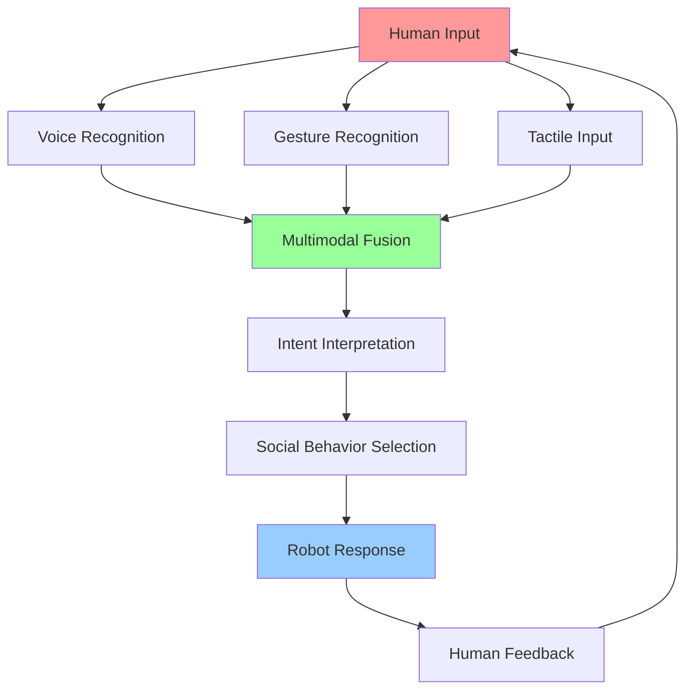

# Week 7 - Human-Robot Interaction

## Learning Objectives

By the end of this week, you will be able to:
- Design intuitive interfaces for human-robot interaction
- Implement voice command processing with speech recognition
- Create gesture recognition systems for robot control
- Develop social robotics behaviors and expressions
- Integrate multimodal interaction systems (voice, gesture, touch)
- Implement safety protocols for human-robot interaction

## Human-Robot Interaction Principles

Human-Robot Interaction (HRI) focuses on designing robots that can effectively communicate and collaborate with humans. Key principles include:

- **Transparency**: Robots should communicate their intentions clearly
- **Predictability**: Robot behavior should be understandable and consistent
- **Trust**: Building confidence in robot capabilities and safety
- **Social Cues**: Using human-like communication signals
- **Adaptability**: Adjusting to individual human preferences and abilities

## Code Snippets

### Voice Command Processing

```python
import rclpy
from rclpy.node import Node
from std_msgs.msg import String
from geometry_msgs.msg import Twist
import speech_recognition as sr
import pyttsx3
import threading
import queue

class VoiceCommandNode(Node):
    def __init__(self):
        super().__init__('voice_command_node')

        # Initialize speech recognizer and synthesizer
        self.recognizer = sr.Recognizer()
        self.microphone = sr.Microphone()

        # Initialize text-to-speech engine
        self.tts_engine = pyttsx3.init()
        self.tts_engine.setProperty('rate', 150)  # Speed of speech
        self.tts_engine.setProperty('volume', 0.9)  # Volume level

        # Adjust microphone for ambient noise
        with self.microphone as source:
            self.recognizer.adjust_for_ambient_noise(source)

        # Publishers and subscribers
        self.cmd_vel_pub = self.create_publisher(Twist, 'cmd_vel', 10)
        self.voice_cmd_pub = self.create_publisher(String, 'voice_commands', 10)

        # Command queue for processing
        self.command_queue = queue.Queue()

        # Start voice recognition thread
        self.voice_thread = threading.Thread(target=self.listen_for_voice_commands)
        self.voice_thread.daemon = True
        self.voice_thread.start()

        # Timer to process commands
        self.command_timer = self.create_timer(0.1, self.process_commands)

    def listen_for_voice_commands(self):
        """Continuously listen for voice commands"""
        with self.microphone as source:
            while True:
                try:
                    # Listen for audio with timeout
                    self.get_logger().info("Listening for voice commands...")
                    audio = self.recognizer.listen(source, timeout=1, phrase_time_limit=5)

                    # Recognize speech using Google's service
                    command_text = self.recognizer.recognize_google(audio)

                    self.get_logger().info(f"Heard command: {command_text}")

                    # Add to command queue
                    self.command_queue.put(command_text.lower())

                except sr.WaitTimeoutError:
                    # Continue listening if no audio detected
                    continue
                except sr.UnknownValueError:
                    self.get_logger().warn("Could not understand audio")
                    continue
                except sr.RequestError as e:
                    self.get_logger().error(f"Could not request results; {e}")
                    continue
                except Exception as e:
                    self.get_logger().error(f"Error in voice recognition: {e}")
                    continue

    def process_commands(self):
        """Process voice commands from queue"""
        try:
            while True:  # Process all available commands
                command = self.command_queue.get_nowait()

                # Process the command
                self.handle_voice_command(command)

        except queue.Empty:
            # No commands to process
            pass

    def handle_voice_command(self, command):
        """Handle recognized voice commands"""
        cmd_vel = Twist()

        if 'forward' in command or 'go straight' in command or 'move ahead' in command:
            cmd_vel.linear.x = 0.5  # Move forward
            self.speak_response("Moving forward")
        elif 'backward' in command or 'back' in command:
            cmd_vel.linear.x = -0.5  # Move backward
            self.speak_response("Moving backward")
        elif 'turn left' in command or 'left' in command:
            cmd_vel.angular.z = 0.5  # Turn left
            self.speak_response("Turning left")
        elif 'turn right' in command or 'right' in command:
            cmd_vel.angular.z = -0.5  # Turn right
            self.speak_response("Turning right")
        elif 'stop' in command or 'halt' in command:
            # Stop movement (Twist is already zero)
            self.speak_response("Stopping")
        elif 'hello' in command or 'hi' in command:
            self.speak_response("Hello! How can I help you?")
        elif 'help' in command:
            self.speak_response("I can move forward, backward, turn left, turn right, or stop. Say 'help' for more options.")
        else:
            self.speak_response(f"I don't understand '{command}'. Say 'help' for available commands.")
            return

        # Publish command
        self.cmd_vel_pub.publish(cmd_vel)

        # Publish voice command for logging
        cmd_msg = String()
        cmd_msg.data = command
        self.voice_cmd_pub.publish(cmd_msg)

    def speak_response(self, text):
        """Speak response using text-to-speech"""
        self.get_logger().info(f"Speaking: {text}")
        self.tts_engine.say(text)
        self.tts_engine.runAndWait()

def main(args=None):
    rclpy.init(args=args)

    voice_node = VoiceCommandNode()

    try:
        rclpy.spin(voice_node)
    except KeyboardInterrupt:
        pass
    finally:
        voice_node.destroy_node()
        rclpy.shutdown()

if __name__ == '__main__':
    main()
```

### Gesture Recognition System

```python
import cv2
import mediapipe as mp
import numpy as np
from collections import deque
import math

class GestureRecognizer:
    def __init__(self):
        # Initialize MediaPipe Hands
        self.mp_hands = mp.solutions.hands
        self.hands = self.mp_hands.Hands(
            static_image_mode=False,
            max_num_hands=2,
            min_detection_confidence=0.7,
            min_tracking_confidence=0.5
        )
        self.mp_draw = mp.solutions.drawing_utils

        # Gesture history for smoothing
        self.gesture_history = deque(maxlen=10)

        # Finger tip indices
        self.tip_ids = [4, 8, 12, 16, 20]  # Thumb, Index, Middle, Ring, Pinky

    def process_frame(self, frame):
        """Process frame for hand gestures"""
        # Convert BGR to RGB
        rgb_frame = cv2.cvtColor(frame, cv2.COLOR_BGR2RGB)

        # Process the frame
        results = self.hands.process(rgb_frame)

        gesture_result = {
            'hands_detected': 0,
            'gestures': [],
            'hand_positions': []
        }

        if results.multi_hand_landmarks:
            gesture_result['hands_detected'] = len(results.multi_hand_landmarks)

            for hand_landmarks, handedness in zip(results.multi_hand_landmarks, results.multi_handedness):
                # Draw landmarks
                self.mp_draw.draw_landmarks(
                    frame,
                    hand_landmarks,
                    self.mp_hands.HAND_CONNECTIONS
                )

                # Analyze gesture
                gesture = self.analyze_gesture(hand_landmarks, frame)
                gesture_result['gestures'].append(gesture)

                # Get hand position
                hand_pos = self.get_hand_position(hand_landmarks, frame)
                gesture_result['hand_positions'].append(hand_pos)

                # Add gesture to history
                self.gesture_history.append(gesture['gesture_type'])

        return frame, gesture_result

    def analyze_gesture(self, landmarks, frame):
        """Analyze finger positions to determine gesture"""
        # Get landmark positions
        landmark_list = []
        for id, lm in enumerate(landmarks.landmark):
            h, w, c = frame.shape
            cx, cy = int(lm.x * w), int(lm.y * h)
            landmark_list.append([id, cx, cy])

        if len(landmark_list) != 0:
            # Determine which fingers are up
            fingers = []

            # Thumb: compare thumb tip with thumb ip joint
            if len(landmark_list) > 4:
                if landmark_list[self.tip_ids[0]][1] < landmark_list[self.tip_ids[0] - 2][1]:  # Right hand
                    fingers.append(1)
                elif landmark_list[self.tip_ids[0]][1] > landmark_list[self.tip_ids[0] - 2][1]:  # Left hand
                    fingers.append(1)
                else:
                    fingers.append(0)

            # Other fingers: compare tip with pip joint
            for id in range(1, 5):
                if len(landmark_list) > self.tip_ids[id]:
                    if landmark_list[self.tip_ids[id]][2] < landmark_list[self.tip_ids[id] - 2][2]:
                        fingers.append(1)
                    else:
                        fingers.append(0)

            # Count raised fingers
            total_fingers = sum(fingers)

            # Determine gesture based on finger configuration
            gesture_type = self.classify_gesture(fingers, landmark_list)

            return {
                'gesture_type': gesture_type,
                'finger_count': total_fingers,
                'fingers_up': fingers
            }

        return {'gesture_type': 'unknown', 'finger_count': 0, 'fingers_up': []}

    def classify_gesture(self, fingers, landmarks):
        """Classify gesture based on finger configuration"""
        # Thumbs up
        if fingers == [1, 0, 0, 0, 0]:
            return 'thumbs_up'
        # Peace sign (index and middle up)
        elif fingers == [0, 1, 1, 0, 0]:
            return 'peace'
        # Victory (index up)
        elif fingers == [0, 1, 0, 0, 0]:
            return 'victory'
        # Rock and roll (index and pinky up)
        elif fingers == [0, 1, 0, 0, 1]:
            return 'rock'
        # Stop (all fingers up)
        elif fingers == [1, 1, 1, 1, 1]:
            return 'stop'
        # Fist (all fingers down)
        elif fingers == [0, 0, 0, 0, 0]:
            return 'fist'
        # Pointing (index finger up, others down)
        elif fingers == [0, 1, 0, 0, 0]:
            return 'point'
        else:
            return 'other'

    def get_hand_position(self, landmarks, frame):
        """Get the center position of the hand"""
        landmark_list = []
        for lm in landmarks.landmark:
            h, w, c = frame.shape
            cx, cy = int(lm.x * w), int(lm.y * h)
            landmark_list.append([cx, cy])

        if landmark_list:
            # Calculate centroid of all landmarks
            avg_x = sum([pt[0] for pt in landmark_list]) // len(landmark_list)
            avg_y = sum([pt[1] for pt in landmark_list]) // len(landmark_list)
            return (avg_x, avg_y)

        return (0, 0)

    def get_smoothed_gesture(self):
        """Get smoothed gesture from history"""
        if len(self.gesture_history) == 0:
            return 'unknown'

        # Get most common gesture in history
        gesture_counts = {}
        for gesture in self.gesture_history:
            gesture_counts[gesture] = gesture_counts.get(gesture, 0) + 1

        return max(gesture_counts, key=gesture_counts.get)

class GestureControlNode:
    def __init__(self):
        import rclpy
        from rclpy.node import Node
        from sensor_msgs.msg import Image
        from geometry_msgs.msg import Twist
        from cv_bridge import CvBridge

        self.node = Node('gesture_control_node')
        self.bridge = CvBridge()

        # Publishers
        self.cmd_vel_pub = self.node.create_publisher(Twist, 'cmd_vel', 10)
        self.image_pub = self.node.create_publisher(Image, 'gesture_output', 10)

        # Subscribers
        self.image_sub = self.node.create_subscription(
            Image,
            'camera/image_raw',
            self.image_callback,
            10
        )

        # Gesture recognizer
        self.gestureRecognizer = GestureRecognizer()

        # Last processed gesture
        self.last_gesture = 'unknown'

        self.node.get_logger().info("Gesture control node initialized")

    def image_callback(self, msg):
        """Process incoming image for gesture recognition"""
        try:
            # Convert ROS image to OpenCV
            cv_image = self.bridge.imgmsg_to_cv2(msg, "bgr8")

            # Process frame for gestures
            processed_frame, gesture_result = self.gestureRecognizer.process_frame(cv_image)

            # Handle gestures
            if gesture_result['gestures']:
                for gesture in gesture_result['gestures']:
                    if gesture['gesture_type'] != self.last_gesture:
                        self.handle_gesture(gesture['gesture_type'])
                        self.last_gesture = gesture['gesture_type']

            # Convert back to ROS image and publish
            output_msg = self.bridge.cv2_to_imgmsg(processed_frame, "bgr8")
            output_msg.header = msg.header
            self.image_pub.publish(output_msg)

        except Exception as e:
            self.node.get_logger().error(f"Error processing image: {e}")

    def handle_gesture(self, gesture_type):
        """Handle recognized gesture"""
        from geometry_msgs.msg import Twist

        cmd_vel = Twist()

        if gesture_type == 'thumbs_up':
            cmd_vel.linear.x = 0.3  # Move forward slowly
            self.node.get_logger().info("Gesture: Thumbs up - Moving forward")
        elif gesture_type == 'peace':
            cmd_vel.angular.z = 0.5  # Turn left
            self.node.get_logger().info("Gesture: Peace - Turning left")
        elif gesture_type == 'rock':
            cmd_vel.angular.z = -0.5  # Turn right
            self.node.get_logger().info("Gesture: Rock - Turning right")
        elif gesture_type == 'stop':
            # Stop (Twist is already zero)
            self.node.get_logger().info("Gesture: Stop - Stopping")
        elif gesture_type == 'fist':
            cmd_vel.linear.x = -0.3  # Move backward slowly
            self.node.get_logger().info("Gesture: Fist - Moving backward")
        else:
            self.node.get_logger().info(f"Recognized gesture: {gesture_type}")

        # Publish command
        self.cmd_vel_pub.publish(cmd_vel)

def main_gesture():
    import rclpy
    rclpy.init()

    gesture_node = GestureControlNode()

    try:
        rclpy.spin(gesture_node.node)
    except KeyboardInterrupt:
        pass
    finally:
        gesture_node.node.destroy_node()
        rclpy.shutdown()
```

### Social Behavior System

```python
import time
import json
from enum import Enum

class RobotEmotionalState(Enum):
    NEUTRAL = "neutral"
    HAPPY = "happy"
    EXCITED = "excited"
    CONFUSED = "confused"
    ATTENTIVE = "attentive"
    SLEEPY = "sleepy"

class SocialBehaviorManager:
    def __init__(self, robot_name="Robot"):
        self.robot_name = robot_name
        self.emotional_state = RobotEmotionalState.NEUTRAL
        self.interaction_history = []
        self.last_interaction_time = time.time()
        self.social_rules = self.load_social_rules()

    def load_social_rules(self):
        """Load social interaction rules"""
        return {
            "greeting_responses": {
                "hello": ["Hello!", "Hi there!", "Greetings!"],
                "hi": ["Hi!", "Hello!", "Hey!"],
                "good morning": ["Good morning!", "Morning!"],
                "good evening": ["Good evening!", "Evening!"]
            },
            "farewell_responses": {
                "bye": ["Goodbye!", "See you later!", "Bye!"],
                "goodbye": ["Goodbye!", "Take care!", "See you!"],
                "see you": ["See you!", "Later!", "Bye!"]
            },
            "positive_interactions": ["thank you", "nice", "great", "good job", "awesome"],
            "negative_interactions": ["sorry", "wrong", "stop", "not working"]
        }

    def update_emotional_state(self, interaction_type="neutral"):
        """Update robot's emotional state based on interaction"""
        current_time = time.time()

        if interaction_type == "positive":
            if self.emotional_state in [RobotEmotionalState.NEUTRAL, RobotEmotionalState.ATTENTIVE]:
                self.emotional_state = RobotEmotionalState.HAPPY
            elif self.emotional_state == RobotEmotionalState.HAPPY:
                self.emotional_state = RobotEmotionalState.EXCITED
        elif interaction_type == "negative":
            if self.emotional_state in [RobotEmotionalState.HAPPY, RobotEmotionalState.EXCITED]:
                self.emotional_state = RobotEmotionalState.CONFUSED
        elif interaction_type == "attention":
            self.emotional_state = RobotEmotionalState.ATTENTIVE
        elif current_time - self.last_interaction_time > 30:  # 30 seconds of inactivity
            if self.emotional_state != RobotEmotionalState.SLEEPY:
                self.emotional_state = RobotEmotionalState.SLEEPY

        self.last_interaction_time = current_time

    def generate_response(self, user_input):
        """Generate appropriate social response"""
        user_input_lower = user_input.lower()

        # Check for greetings
        for greeting, responses in self.social_rules["greeting_responses"].items():
            if greeting in user_input_lower:
                self.update_emotional_state("positive")
                return responses[0]  # Could be randomized

        # Check for farewells
        for farewell, responses in self.social_rules["farewell_responses"].items():
            if farewell in user_input_lower:
                self.update_emotional_state("neutral")
                return responses[0]

        # Check for positive interactions
        for pos_phrase in self.social_rules["positive_interactions"]:
            if pos_phrase in user_input_lower:
                self.update_emotional_state("positive")
                return f"Thank you! I'm happy to help!"

        # Check for negative interactions
        for neg_phrase in self.social_rules["negative_interactions"]:
            if neg_phrase in user_input_lower:
                self.update_emotional_state("negative")
                return f"I apologize. How can I assist you better?"

        # Default response
        self.update_emotional_state("attention")
        return f"Hello! I'm {self.robot_name}. How can I assist you today?"

    def get_behavior_indicators(self):
        """Get behavioral indicators based on emotional state"""
        behaviors = {
            RobotEmotionalState.NEUTRAL: {
                "speed": "normal",
                "tone": "friendly",
                "movements": "moderate"
            },
            RobotEmotionalState.HAPPY: {
                "speed": "lively",
                "tone": "cheerful",
                "movements": "animated"
            },
            RobotEmotionalState.EXCITED: {
                "speed": "fast",
                "tone": "enthusiastic",
                "movements": "expressive"
            },
            RobotEmotionalState.CONFUSED: {
                "speed": "slow",
                "tone": "cautious",
                "movements": "hesitant"
            },
            RobotEmotionalState.ATTENTIVE: {
                "speed": "responsive",
                "tone": "focused",
                "movements": "attentive"
            },
            RobotEmotionalState.SLEEPY: {
                "speed": "slow",
                "tone": "calm",
                "movements": "minimal"
            }
        }

        return behaviors.get(self.emotional_state, behaviors[RobotEmotionalState.NEUTRAL])

# Example usage
def example_social_behavior():
    sbm = SocialBehaviorManager("Robbie")

    # Simulate interactions
    interactions = [
        "hello",
        "thank you",
        "that's great!",
        "something went wrong",
        "bye"
    ]

    for interaction in interactions:
        response = sbm.generate_response(interaction)
        behavior = sbm.get_behavior_indicators()

        print(f"User: {interaction}")
        print(f"Robot: {response}")
        print(f"Behavior: {behavior}")
        print("---")
```

## URDF Examples

### Social Robot with Expression Capabilities

```xml
<?xml version="1.0"?>
<robot name="social_robot">
  <!-- Base Link -->
  <link name="base_link">
    <visual>
      <geometry>
        <cylinder radius="0.3" length="0.15"/>
      </geometry>
      <material name="light_blue">
        <color rgba="0.5 0.7 1.0 1.0"/>
      </material>
    </visual>
    <collision>
      <geometry>
        <cylinder radius="0.3" length="0.15"/>
      </geometry>
    </collision>
    <inertial>
      <mass value="10.0"/>
      <inertia ixx="0.4" ixy="0.0" ixz="0.0" iyy="0.4" iyz="0.0" izz="0.2"/>
    </inertial>
  </link>

  <!-- Wheels -->
  <joint name="wheel_left_joint" type="continuous">
    <parent link="base_link"/>
    <child link="wheel_left"/>
    <origin xyz="0 0.25 -0.05" rpy="0 0 0"/>
    <axis xyz="0 0 1"/>
  </joint>

  <link name="wheel_left">
    <visual>
      <geometry>
        <cylinder radius="0.1" length="0.05"/>
      </geometry>
      <material name="black">
        <color rgba="0 0 0 1"/>
      </material>
    </visual>
  </link>

  <joint name="wheel_right_joint" type="continuous">
    <parent link="base_link"/>
    <child link="wheel_right"/>
    <origin xyz="0 -0.25 -0.05" rpy="0 0 0"/>
    <axis xyz="0 0 1"/>
  </joint>

  <link name="wheel_right">
    <visual>
      <geometry>
        <cylinder radius="0.1" length="0.05"/>
      </geometry>
      <material name="black">
        <color rgba="0 0 0 1"/>
      </material>
    </visual>
  </link>

  <!-- Torso -->
  <joint name="torso_joint" type="fixed">
    <parent link="base_link"/>
    <child link="torso"/>
    <origin xyz="0.0 0.0 0.075" rpy="0 0 0"/>
  </joint>

  <link name="torso">
    <visual>
      <geometry>
        <cylinder radius="0.15" length="0.3"/>
      </geometry>
      <material name="white">
        <color rgba="1.0 1.0 1.0 1.0"/>
      </material>
    </visual>
  </link>

  <!-- Head -->
  <joint name="neck_joint" type="revolute">
    <parent link="torso"/>
    <child link="head"/>
    <origin xyz="0.0 0.0 0.3" rpy="0 0 0"/>
    <axis xyz="0 0 1"/>
    <limit lower="-1.57" upper="1.57" effort="10.0" velocity="1.0"/>
  </joint>

  <link name="head">
    <visual>
      <geometry>
        <sphere radius="0.1"/>
      </geometry>
      <material name="skin">
        <color rgba="0.9 0.8 0.7 1.0"/>
      </material>
    </visual>
  </link>

  <!-- Eyes (for expression) -->
  <joint name="eye_left_joint" type="fixed">
    <parent link="head"/>
    <child link="eye_left"/>
    <origin xyz="0.03 0.05 0.0" rpy="0 0 0"/>
  </joint>

  <link name="eye_left">
    <visual>
      <geometry>
        <sphere radius="0.015"/>
      </geometry>
      <material name="black">
        <color rgba="0 0 0 1"/>
      </material>
    </visual>
  </link>

  <joint name="eye_right_joint" type="fixed">
    <parent link="head"/>
    <child link="eye_right"/>
    <origin xyz="0.03 -0.05 0.0" rpy="0 0 0"/>
  </joint>

  <link name="eye_right">
    <visual>
      <geometry>
        <sphere radius="0.015"/>
      </geometry>
      <material name="black">
        <color rgba="0 0 0 1"/>
      </material>
    </visual>
  </link>

  <!-- Mouth (for expression) -->
  <joint name="mouth_joint" type="revolute">
    <parent link="head"/>
    <child link="mouth"/>
    <origin xyz="0.0 0.0 -0.05" rpy="0 0 0"/>
    <axis xyz="0 1 0"/>
    <limit lower="-0.2" upper="0.2" effort="1.0" velocity="0.5"/>
  </joint>

  <link name="mouth">
    <visual>
      <geometry>
        <box size="0.03 0.01 0.01"/>
      </geometry>
      <material name="pink">
        <color rgba="1.0 0.7 0.7 1.0"/>
      </material>
    </visual>
  </link>

  <!-- Arms -->
  <joint name="shoulder_left_joint" type="revolute">
    <parent link="torso"/>
    <child link="upper_arm_left"/>
    <origin xyz="0.0 0.15 0.15" rpy="0 0 0"/>
    <axis xyz="0 1 0"/>
    <limit lower="-1.57" upper="1.57" effort="10.0" velocity="1.0"/>
  </joint>

  <link name="upper_arm_left">
    <visual>
      <geometry>
        <cylinder radius="0.03" length="0.15"/>
      </geometry>
      <material name="light_blue">
        <color rgba="0.5 0.7 1.0 1.0"/>
      </material>
    </visual>
  </link>

  <joint name="shoulder_right_joint" type="revolute">
    <parent link="torso"/>
    <child link="upper_arm_right"/>
    <origin xyz="0.0 -0.15 0.15" rpy="0 0 0"/>
    <axis xyz="0 1 0"/>
    <limit lower="-1.57" upper="1.57" effort="10.0" velocity="1.0"/>
  </joint>

  <link name="upper_arm_right">
    <visual>
      <geometry>
        <cylinder radius="0.03" length="0.15"/>
      </geometry>
      <material name="light_blue">
        <color rgba="0.5 0.7 1.0 1.0"/>
      </material>
    </visual>
  </link>

  <!-- HRI Sensors -->
  <gazebo reference="head">
    <sensor name="face_camera" type="camera">
      <always_on>true</always_on>
      <update_rate>30</update_rate>
      <camera>
        <horizontal_fov>1.047</horizontal_fov>
        <image>
          <width>640</width>
          <height>480</height>
        </image>
        <clip>
          <near>0.1</near>
          <far>10</far>
        </clip>
      </camera>
      <plugin name="face_camera_controller" filename="libgazebo_ros_camera.so">
        <frame_name>head</frame_name>
        <topic_name>face_camera/image_raw</topic_name>
      </plugin>
    </sensor>
  </gazebo>

  <gazebo reference="torso">
    <sensor name="microphone_array" type="ray">
      <always_on>true</always_on>
      <update_rate>100</update_rate>
      <ray>
        <scan>
          <horizontal>
            <samples>8</samples>
            <resolution>1.0</resolution>
            <min_angle>-3.14159</min_angle>
            <max_angle>3.14159</max_angle>
          </horizontal>
        </scan>
        <range>
          <min>0.1</min>
          <max>5.0</max>
          <resolution>0.01</resolution>
        </range>
      </ray>
      <plugin name="microphone_controller" filename="libgazebo_ros_audio_device.so">
        <frame_name>torso</frame_name>
        <topic_name>audio_commands</topic_name>
      </plugin>
    </sensor>
  </gazebo>

  <!-- Differential Drive Controller -->
  <gazebo>
    <plugin name="diff_drive" filename="libgazebo_ros_diff_drive.so">
      <left_joint>wheel_left_joint</left_joint>
      <right_joint>wheel_right_joint</right_joint>
      <wheel_separation>0.5</wheel_separation>
      <wheel_diameter>0.2</wheel_diameter>
      <command_topic>cmd_vel</command_topic>
      <odometry_topic>odom</odometry_topic>
      <odometry_frame>odom</odometry_frame>
      <robot_base_frame>base_link</robot_base_frame>
    </plugin>
  </gazebo>

  <!-- Social Behavior Controller -->
  <gazebo reference="base_link">
    <plugin name="social_controller" filename="libsocial_behavior_plugin.so">
      <face_camera_topic>face_camera/image_raw</face_camera_topic>
      <audio_topic>audio_commands</audio_topic>
      <motor_topic>servo_commands</motor_topic>
      <behavior_config>/config/social_behavior.yaml</behavior_config>
    </plugin>
  </gazebo>
</robot>
```

## HRI Pipeline Diagram



## HRI Modalities Comparison

| Modality | Advantages | Disadvantages | Use Cases |
|----------|------------|---------------|-----------|
| Voice | Natural, hands-free | Affected by noise, privacy concerns | Navigation, information queries |
| Gesture | Intuitive, visual | Requires line of sight, cultural differences | Pointing, directional commands |
| Touch | Direct, intimate | Hygiene concerns, limited expressiveness | Button presses, emergency stops |
| Face Expression | Emotional connection | Requires display/actuators | Social interaction, feedback |
| Proximity | Passive, safe | Limited control options | Welcome, attention getting |
| Eye Contact | Attention, engagement | Cultural sensitivity | Focus, confirmation |

## Key Terms

- **HRI**: Human-Robot Interaction - study of human-robot communication
- **Multimodal Interaction**: Using multiple input/output modalities simultaneously
- **Social Robotics**: Robots designed for human interaction and companionship
- **Affective Computing**: Computing that relates to emotions and feelings
- **Proxemics**: Study of personal space and spatial relationships
- **Embodied Cognition**: Idea that cognitive processes are influenced by body
- **Theory of Mind**: Ability to attribute mental states to others
- **Social Presence**: Feeling that robot is a social actor

## Learning Checkpoints

### Quiz Questions
1. What are the three key principles of effective Human-Robot Interaction?
2. Name four different modalities for human-robot interaction.
3. How does multimodal fusion improve HRI systems?

### Practical Exercise
Implement a multimodal interaction system that combines voice commands and gesture recognition to control a robot's movement.

## Hands-On Exercise

Create a ROS 2 node that integrates voice recognition, gesture recognition, and social behavior systems to create a natural human-robot interaction experience.

## Personalization

<div className="personalization-options">
  <h3>Adjust Learning Path:</h3>
  <button onClick={() => setDifficulty('beginner')}>Beginner</button>
  <button onClick={() => setDifficulty('intermediate')}>Intermediate</button>
  <button onClick={() => setDifficulty('advanced')}>Advanced</button>
</div>

## Translation

<div className="translation-controls">
  <button onClick={() => translateToUrdu()}>اردو میں ترجمہ کریں</button>
</div>