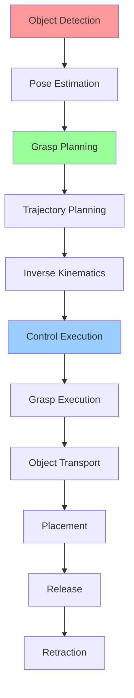

# Week 8 - Manipulation and Grasping

## Learning Objectives

By the end of this week, you will be able to:
- Understand kinematics and dynamics of robotic manipulators
- Implement inverse kinematics for arm control
- Design grasping strategies for various objects
- Integrate vision systems for object recognition and pose estimation
- Plan collision-free trajectories for manipulation tasks
- Implement compliant control for safe interaction

## Manipulation Fundamentals

Robotic manipulation involves the precise control of robotic arms and grippers to grasp, move, and manipulate objects. Key components include:

- **Forward Kinematics**: Calculating end-effector position from joint angles
- **Inverse Kinematics**: Calculating joint angles to reach desired end-effector position
- **Grasp Planning**: Determining optimal grasp points and configurations
- **Trajectory Planning**: Generating smooth, collision-free paths
- **Force Control**: Managing contact forces for safe interaction

## Code Snippets

### Forward and Inverse Kinematics

```python
import numpy as np
from scipy.spatial.transform import Rotation as R
import math

class ManipulatorKinematics:
    def __init__(self, dh_parameters):
        """
        Initialize manipulator with Denavit-Hartenberg parameters
        dh_parameters: list of [a, alpha, d, theta_offset] for each joint
        """
        self.dh_params = dh_parameters
        self.num_joints = len(dh_params)

    def dh_matrix(self, a, alpha, d, theta):
        """Calculate Denavit-Hartenberg transformation matrix"""
        return np.array([
            [math.cos(theta), -math.sin(theta)*math.cos(alpha), math.sin(theta)*math.sin(alpha), a*math.cos(theta)],
            [math.sin(theta), math.cos(theta)*math.cos(alpha), -math.cos(theta)*math.sin(alpha), a*math.sin(theta)],
            [0, math.sin(alpha), math.cos(alpha), d],
            [0, 0, 0, 1]
        ])

    def forward_kinematics(self, joint_angles):
        """Calculate end-effector pose given joint angles"""
        T = np.eye(4)  # Identity matrix

        for i in range(self.num_joints):
            a, alpha, d, theta_offset = self.dh_params[i]
            theta = joint_angles[i] + theta_offset
            T_i = self.dh_matrix(a, alpha, d, theta)
            T = T @ T_i

        # Extract position and orientation
        position = T[:3, 3]
        rotation_matrix = T[:3, :3]

        # Convert rotation matrix to Euler angles (ZYX)
        euler_angles = R.from_matrix(rotation_matrix).as_euler('xyz')

        return position, euler_angles, T

    def jacobian(self, joint_angles):
        """Calculate geometric Jacobian matrix"""
        # Get transformation matrices for all joints
        transforms = []
        T_cumulative = np.eye(4)

        for i in range(self.num_joints):
            a, alpha, d, theta_offset = self.dh_params[i]
            theta = joint_angles[i] + theta_offset
            T_i = self.dh_matrix(a, alpha, d, theta)
            T_cumulative = T_cumulative @ T_i
            transforms.append(T_cumulative.copy())

        # Get end-effector position
        end_effector_pos = transforms[-1][:3, 3]

        # Initialize Jacobian
        J = np.zeros((6, self.num_joints))

        # Calculate Jacobian columns
        for i in range(self.num_joints):
            # Z-axis of joint i in world coordinates
            z_i = transforms[i][:3, 2]

            # Position of joint i in world coordinates
            p_i = transforms[i][:3, 3]

            # Calculate position difference
            diff = end_effector_pos - p_i

            # Linear velocity contribution
            J[:3, i] = np.cross(z_i, diff)

            # Angular velocity contribution
            J[3:, i] = z_i

        return J

    def inverse_kinematics(self, target_pose, initial_joints=None, max_iterations=100, tolerance=1e-4):
        """Solve inverse kinematics using Jacobian transpose method"""
        if initial_joints is None:
            current_joints = np.zeros(self.num_joints)
        else:
            current_joints = np.array(initial_joints)

        target_pos = target_pose[:3]
        target_rot = R.from_euler('xyz', target_pose[3:]).as_matrix()

        for iteration in range(max_iterations):
            # Calculate current end-effector pose
            current_pos, current_rot_angles, current_transform = self.forward_kinematics(current_joints)
            current_rot = R.from_euler('xyz', current_rot_angles).as_matrix()

            # Calculate position and orientation errors
            pos_error = target_pos - current_pos
            rot_error = target_rot.T @ current_rot - current_rot.T @ target_rot
            # Simplified orientation error (skew-symmetric matrix)
            angle_error = 0.5 * np.array([rot_error[2, 1], rot_error[0, 2], rot_error[1, 0]])

            # Combined error
            error = np.concatenate([pos_error, angle_error])

            if np.linalg.norm(error) < tolerance:
                break

            # Calculate Jacobian
            J = self.jacobian(current_joints)

            # Update joint angles using pseudo-inverse of Jacobian
            delta_theta = np.linalg.pinv(J) @ error * 0.1  # Step size factor
            current_joints += delta_theta

            # Apply joint limits (example limits)
            joint_limits = np.array([[-np.pi, np.pi]] * self.num_joints)
            current_joints = np.clip(current_joints, joint_limits[:, 0], joint_limits[:, 1])

        return current_joints

# Example usage for a 6-DOF manipulator
def example_manipulator():
    # DH parameters for a 6-DOF manipulator [a, alpha, d, theta_offset]
    dh_params = [
        [0, -np.pi/2, 0.1, 0],      # Joint 1
        [0.4, 0, 0, 0],             # Joint 2
        [0, np.pi/2, 0.05, 0],      # Joint 3
        [0, -np.pi/2, 0.4, 0],      # Joint 4
        [0, np.pi/2, 0, 0],         # Joint 5
        [0, 0, 0.1, 0]              # Joint 6
    ]

    manipulator = ManipulatorKinematics(dh_params)

    # Example: Calculate forward kinematics
    joint_angles = [0.1, 0.2, 0.3, 0.4, 0.5, 0.6]
    pos, rot, transform = manipulator.forward_kinematics(joint_angles)
    print(f"End-effector position: {pos}")
    print(f"End-effector orientation: {rot}")

    # Example: Calculate inverse kinematics
    target_pose = np.array([0.3, 0.2, 0.5, 0.1, 0.1, 0.1])  # [x, y, z, rx, ry, rz]
    solution = manipulator.inverse_kinematics(target_pose)
    print(f"Inverse kinematics solution: {solution}")
```

### Grasp Planning and Execution

```python
import numpy as np
from scipy.spatial.distance import cdist
from scipy.optimize import minimize
import open3d as o3d

class GraspPlanner:
    def __init__(self, gripper_width=0.08, finger_length=0.05):
        self.gripper_width = gripper_width
        self.finger_length = finger_length
        self.min_grasp_quality = 0.3

    def estimate_surface_normals(self, points):
        """Estimate surface normals for point cloud"""
        pcd = o3d.geometry.PointCloud()
        pcd.points = o3d.utility.Vector3dVector(points)

        # Estimate normals
        pcd.estimate_normals(search_param=o3d.geometry.KDTreeSearchParamHybrid(
            radius=0.1, max_nn=30))

        return np.asarray(pcd.normals)

    def find_grasp_candidates(self, object_points, normals=None):
        """Find potential grasp points on object surface"""
        if normals is None:
            normals = self.estimate_surface_normals(object_points)

        candidates = []

        for i, (point, normal) in enumerate(zip(object_points, normals)):
            # Skip points with invalid normals
            if np.linalg.norm(normal) < 0.1:
                continue

            # Generate multiple grasp orientations around the normal
            for angle in np.linspace(0, 2*np.pi, 8):
                # Create rotation matrix for grasp orientation
                grasp_orientation = self.align_with_normal(normal, angle)

                # Calculate grasp quality
                quality = self.evaluate_grasp_quality(point, grasp_orientation, object_points)

                if quality > self.min_grasp_quality:
                    candidate = {
                        'position': point,
                        'orientation': grasp_orientation,
                        'quality': quality,
                        'normal': normal
                    }
                    candidates.append(candidate)

        return candidates

    def align_with_normal(self, normal, angle):
        """Align grasp orientation with surface normal"""
        # Normalize the normal vector
        normal = normal / np.linalg.norm(normal)

        # Create a rotation matrix where z-axis aligns with normal
        z_axis = normal
        x_axis = np.array([1, 0, 0])

        # If normal is parallel to x-axis, use different vector
        if abs(np.dot(z_axis, x_axis)) > 0.99:
            x_axis = np.array([0, 1, 0])

        # Create orthogonal vectors
        y_axis = np.cross(z_axis, x_axis)
        y_axis = y_axis / np.linalg.norm(y_axis)
        x_axis = np.cross(y_axis, z_axis)
        x_axis = x_axis / np.linalg.norm(x_axis)

        # Apply rotation around z-axis
        cos_a, sin_a = np.cos(angle), np.sin(angle)
        x_rot = cos_a * x_axis + sin_a * y_axis
        y_rot = -sin_a * x_axis + cos_a * y_axis

        return np.column_stack([x_rot, y_rot, z_axis])

    def evaluate_grasp_quality(self, position, orientation, object_points):
        """Evaluate the quality of a grasp pose"""
        # Check if grasp region has sufficient contact points
        grasp_region = self.get_grasp_region(position, orientation)

        # Calculate distances from grasp center to object points
        distances = cdist([position], object_points)[0]

        # Count points within grasp region
        in_region = distances < (self.gripper_width / 2)
        contact_points = np.sum(in_region)

        # Calculate grasp stability based on contact distribution
        if contact_points < 3:
            return 0.0

        # Calculate grasp wrench space (simplified)
        # A good grasp should have contacts on opposite sides
        region_points = object_points[in_region]
        if len(region_points) < 2:
            return 0.0

        # Calculate spread of contact points
        centroid = np.mean(region_points, axis=0)
        spread = np.std(region_points - centroid, axis=0)
        spread_metric = np.mean(spread)

        # Quality based on spread and number of contacts
        quality = min(1.0, (contact_points * spread_metric) / 10.0)

        return quality

    def get_grasp_region(self, position, orientation):
        """Define the region where a grasp would make contact"""
        # Create a box representing the gripper jaw area
        half_width = self.gripper_width / 2
        half_length = self.finger_length / 2

        # Define corners of the grasp region
        corners = np.array([
            [-half_width, -half_length, 0],
            [half_width, -half_length, 0],
            [half_width, half_length, 0],
            [-half_width, half_length, 0]
        ])

        # Transform to world coordinates
        transformed_corners = np.dot(corners, orientation.T) + position

        return transformed_corners

    def select_best_grasps(self, candidates, num_grasps=5):
        """Select the best grasp candidates"""
        if len(candidates) == 0:
            return []

        # Sort candidates by quality
        sorted_candidates = sorted(candidates, key=lambda x: x['quality'], reverse=True)

        # Select top candidates
        best_grasps = sorted_candidates[:num_grasps]

        return best_grasps

class ManipulationController:
    def __init__(self, kinematics_solver):
        self.kinematics = kinematics_solver
        self.grasp_planner = GraspPlanner()
        self.approach_distance = 0.1  # 10cm approach distance

    def plan_grasp_trajectory(self, grasp_pose, object_pose):
        """Plan trajectory from approach to grasp position"""
        # Calculate approach pose (above the grasp point)
        approach_pose = grasp_pose.copy()
        approach_pose[2] += self.approach_distance  # Move up by approach distance

        # Plan path from current to approach
        current_joints = self.get_current_joints()
        approach_joints = self.kinematics.inverse_kinematics(approach_pose, current_joints)

        # Plan path from approach to grasp
        grasp_joints = self.kinematics.inverse_kinematics(grasp_pose, approach_joints)

        # Plan path from grasp back to approach
        retract_joints = approach_joints  # Same as approach for simplicity

        return {
            'approach': approach_joints,
            'grasp': grasp_joints,
            'retract': retract_joints
        }

    def execute_grasp(self, grasp_joints):
        """Execute the grasp motion"""
        # Move to approach position
        self.move_to_joints(grasp_joints['approach'])

        # Move to grasp position
        self.move_to_joints(grasp_joints['grasp'])

        # Close gripper
        self.close_gripper()

        # Move to retract position
        self.move_to_joints(grasp_joints['retract'])

    def get_current_joints(self):
        """Get current joint positions from robot"""
        # This would interface with the actual robot
        return np.zeros(self.kinematics.num_joints)

    def move_to_joints(self, target_joints):
        """Move robot to target joint positions"""
        # This would send commands to the robot
        print(f"Moving to joints: {target_joints}")

    def close_gripper(self):
        """Close the gripper"""
        print("Closing gripper")

# Example usage
def example_grasp_planning():
    # Create a simple object point cloud (cube)
    object_points = []
    for x in np.linspace(-0.05, 0.05, 10):
        for y in np.linspace(-0.05, 0.05, 10):
            for z in [0.05]:  # Top surface of cube
                object_points.append([x, y, z])

    object_points = np.array(object_points)

    # Plan grasps
    planner = GraspPlanner()
    candidates = planner.find_grasp_candidates(object_points)
    best_grasps = planner.select_best_grasps(candidates, 3)

    print(f"Found {len(candidates)} grasp candidates")
    print(f"Selected {len(best_grasps)} best grasps")

    for i, grasp in enumerate(best_grasps):
        print(f"Grasp {i+1}: Quality={grasp['quality']:.3f}, "
              f"Position=({grasp['position'][0]:.3f}, {grasp['position'][1]:.3f}, {grasp['position'][2]:.3f})")
```

### Vision-Based Object Recognition and Pose Estimation

```python
import cv2
import numpy as np
from scipy.spatial.transform import Rotation as R

class ObjectPoseEstimator:
    def __init__(self):
        # Initialize SIFT detector for feature matching
        self.detector = cv2.SIFT_create()
        self.matcher = cv2.BFMatcher()

        # Object models (in a real system, these would be loaded from files)
        self.object_models = {}
        self.camera_matrix = np.array([[525.0, 0.0, 319.5],
                                      [0.0, 525.0, 239.5],
                                      [0.0, 0.0, 1.0]])

    def register_object_model(self, name, image, points_3d):
        """Register a 3D object model with its 2D image features"""
        # Detect features in the model image
        kp, desc = self.detector.detectAndCompute(image, None)

        self.object_models[name] = {
            'keypoints': kp,
            'descriptors': desc,
            'points_3d': points_3d
        }

    def estimate_pose(self, image, object_name):
        """Estimate 6D pose of known object in image"""
        if object_name not in self.object_models:
            return None, None

        model = self.object_models[object_name]

        # Detect features in current image
        kp_scene, desc_scene = self.detector.detectAndCompute(image, None)

        if desc_scene is None:
            return None, None

        # Match features between model and scene
        matches = self.matcher.knnMatch(model['descriptors'], desc_scene, k=2)

        # Apply Lowe's ratio test
        good_matches = []
        for m, n in matches:
            if m.distance < 0.75 * n.distance:
                good_matches.append(m)

        # Require minimum number of matches
        if len(good_matches) < 10:
            return None, None

        # Extract matched points
        src_pts = np.float32([model['keypoints'][m.queryIdx].pt for m in good_matches]).reshape(-1, 1, 2)
        dst_pts = np.float32([kp_scene[m.trainIdx].pt for m in good_matches]).reshape(-1, 1, 2)

        # Get 3D points corresponding to matched 2D points
        obj_pts = np.float32([model['points_3d'][m.queryIdx] for m in good_matches]).reshape(-1, 1, 3)

        # Solve Perspective-n-Point problem
        success, rvec, tvec = cv2.solvePnP(obj_pts, dst_pts, self.camera_matrix, None)

        if success:
            # Convert rotation vector to matrix
            rotation_matrix, _ = cv2.Rodrigues(rvec)

            # Convert to position and Euler angles
            position = tvec.flatten()
            rotation = R.from_matrix(rotation_matrix).as_euler('xyz')

            return position, rotation
        else:
            return None, None

class ManipulationPipeline:
    def __init__(self):
        self.pose_estimator = ObjectPoseEstimator()
        self.grasp_planner = GraspPlanner()
        self.controller = None  # Will be set later

    def register_object_models(self):
        """Register known object models"""
        # Example: Register a simple cube model
        # In practice, this would load from files
        cube_points = []
        for x in [-0.05, 0.05]:
            for y in [-0.05, 0.05]:
                for z in [-0.05, 0.05]:
                    cube_points.append([x, y, z])

        cube_image = np.zeros((200, 200, 3), dtype=np.uint8)  # Dummy image
        # Draw cube projection on image (simplified)
        cv2.rectangle(cube_image, (50, 50), (150, 150), (255, 255, 255), 2)

        self.pose_estimator.register_object_model('cube', cube_image, np.array(cube_points))

    def execute_pick_and_place(self, target_object, place_position):
        """Execute pick and place operation"""
        # Capture image
        image = self.capture_image()  # This would interface with camera

        # Estimate object pose
        obj_pos, obj_rot = self.pose_estimator.estimate_pose(image, target_object)

        if obj_pos is None:
            print(f"Could not find {target_object}")
            return False

        print(f"Found {target_object} at position: {obj_pos}")

        # Plan grasp on the object
        # This is a simplified approach - in reality, you'd use 3D point cloud
        grasp_pose = obj_pos.copy()
        grasp_pose[2] += 0.05  # Lift slightly above object center

        # Plan and execute grasp
        grasp_joints = self.controller.plan_grasp_trajectory(
            np.concatenate([grasp_pose, obj_rot]),
            np.concatenate([obj_pos, obj_rot])
        )

        self.controller.execute_grasp(grasp_joints)

        # Move to place position
        place_pose = np.concatenate([place_position, [0, 0, 0]])  # Zero rotation for placement
        place_joints = self.controller.kinematics.inverse_kinematics(place_pose)

        self.controller.move_to_joints(place_joints)

        # Release object
        self.open_gripper()

        return True

    def capture_image(self):
        """Capture image from camera"""
        # This would interface with actual camera
        return np.zeros((480, 640, 3), dtype=np.uint8)

    def open_gripper(self):
        """Open the gripper"""
        print("Opening gripper")
```

## URDF Examples

### Manipulator Robot with Gripper

```xml
<?xml version="1.0"?>
<robot name="manipulator_robot">
  <!-- Base Link -->
  <link name="base_link">
    <visual>
      <geometry>
        <cylinder radius="0.2" length="0.1"/>
      </geometry>
      <material name="dark_gray">
        <color rgba="0.3 0.3 0.3 1.0"/>
      </material>
    </visual>
    <collision>
      <geometry>
        <cylinder radius="0.2" length="0.1"/>
      </geometry>
    </collision>
    <inertial>
      <mass value="5.0"/>
      <inertia ixx="0.1" ixy="0.0" ixz="0.0" iyy="0.1" iyz="0.0" izz="0.05"/>
    </inertial>
  </link>

  <!-- Shoulder Joint -->
  <joint name="shoulder_pan_joint" type="revolute">
    <parent link="base_link"/>
    <child link="shoulder_link"/>
    <origin xyz="0 0 0.05" rpy="0 0 0"/>
    <axis xyz="0 0 1"/>
    <limit lower="-2.618" upper="2.618" effort="100" velocity="1.0"/>
    <dynamics damping="1.0" friction="0.1"/>
  </joint>

  <link name="shoulder_link">
    <visual>
      <geometry>
        <cylinder radius="0.08" length="0.1"/>
      </geometry>
      <material name="silver">
        <color rgba="0.7 0.7 0.7 1.0"/>
      </material>
    </visual>
    <collision>
      <geometry>
        <cylinder radius="0.08" length="0.1"/>
      </geometry>
    </collision>
    <inertial>
      <mass value="2.0"/>
      <inertia ixx="0.01" ixy="0.0" ixz="0.0" iyy="0.01" iyz="0.0" izz="0.005"/>
    </inertial>
  </link>

  <!-- Upper Arm -->
  <joint name="shoulder_lift_joint" type="revolute">
    <parent link="shoulder_link"/>
    <child link="upper_arm_link"/>
    <origin xyz="0 0 0.1" rpy="0 0 0"/>
    <axis xyz="0 1 0"/>
    <limit lower="-1.57" upper="1.57" effort="100" velocity="1.0"/>
    <dynamics damping="1.0" friction="0.1"/>
  </joint>

  <link name="upper_arm_link">
    <visual>
      <geometry>
        <cylinder radius="0.06" length="0.3"/>
      </geometry>
      <material name="steel">
        <color rgba="0.5 0.5 0.5 1.0"/>
      </material>
    </visual>
    <collision>
      <geometry>
        <cylinder radius="0.06" length="0.3"/>
      </geometry>
    </collision>
    <inertial>
      <mass value="3.0"/>
      <inertia ixx="0.05" ixy="0.0" ixz="0.0" iyy="0.05" iyz="0.0" izz="0.002"/>
    </inertial>
  </link>

  <!-- Elbow Joint -->
  <joint name="elbow_joint" type="revolute">
    <parent link="upper_arm_link"/>
    <child link="forearm_link"/>
    <origin xyz="0 0 0.3" rpy="0 0 0"/>
    <axis xyz="0 1 0"/>
    <limit lower="-2.094" upper="2.094" effort="100" velocity="1.0"/>
    <dynamics damping="1.0" friction="0.1"/>
  </joint>

  <link name="forearm_link">
    <visual>
      <geometry>
        <cylinder radius="0.05" length="0.25"/>
      </geometry>
      <material name="steel">
        <color rgba="0.5 0.5 0.5 1.0"/>
      </material>
    </visual>
    <collision>
      <geometry>
        <cylinder radius="0.05" length="0.25"/>
      </geometry>
    </collision>
    <inertial>
      <mass value="2.0"/>
      <inertia ixx="0.03" ixy="0.0" ixz="0.0" iyy="0.03" iyz="0.0" izz="0.001"/>
    </inertial>
  </link>

  <!-- Wrist Joints -->
  <joint name="wrist_1_joint" type="revolute">
    <parent link="forearm_link"/>
    <child link="wrist_1_link"/>
    <origin xyz="0 0 0.25" rpy="0 0 0"/>
    <axis xyz="0 1 0"/>
    <limit lower="-2.618" upper="2.618" effort="50" velocity="1.5"/>
    <dynamics damping="0.5" friction="0.05"/>
  </joint>

  <link name="wrist_1_link">
    <visual>
      <geometry>
        <cylinder radius="0.04" length="0.08"/>
      </geometry>
      <material name="aluminum">
        <color rgba="0.8 0.8 0.8 1.0"/>
      </material>
    </visual>
    <collision>
      <geometry>
        <cylinder radius="0.04" length="0.08"/>
      </geometry>
    </collision>
    <inertial>
      <mass value="0.5"/>
      <inertia ixx="0.001" ixy="0.0" ixz="0.0" iyy="0.001" iyz="0.0" izz="0.0005"/>
    </inertial>
  </link>

  <joint name="wrist_2_joint" type="revolute">
    <parent link="wrist_1_link"/>
    <child link="wrist_2_link"/>
    <origin xyz="0 0 0.04" rpy="0 0 0"/>
    <axis xyz="0 0 1"/>
    <limit lower="-2.618" upper="2.618" effort="50" velocity="1.5"/>
    <dynamics damping="0.5" friction="0.05"/>
  </joint>

  <link name="wrist_2_link">
    <visual>
      <geometry>
        <cylinder radius="0.04" length="0.04"/>
      </geometry>
      <material name="aluminum">
        <color rgba="0.8 0.8 0.8 1.0"/>
      </material>
    </visual>
    <collision>
      <geometry>
        <cylinder radius="0.04" length="0.04"/>
      </geometry>
    </collision>
    <inertial>
      <mass value="0.3"/>
      <inertia ixx="0.0005" ixy="0.0" ixz="0.0" iyy="0.0005" iyz="0.0" izz="0.0003"/>
    </inertial>
  </link>

  <!-- End Effector -->
  <joint name="wrist_3_joint" type="revolute">
    <parent link="wrist_2_link"/>
    <child link="ee_link"/>
    <origin xyz="0 0 0.02" rpy="0 0 0"/>
    <axis xyz="1 0 0"/>
    <limit lower="-2.618" upper="2.618" effort="30" velocity="2.0"/>
    <dynamics damping="0.2" friction="0.02"/>
  </joint>

  <link name="ee_link">
    <visual>
      <geometry>
        <box size="0.02 0.04 0.04"/>
      </geometry>
      <material name="red">
        <color rgba="1.0 0.0 0.0 1.0"/>
      </material>
    </visual>
    <collision>
      <geometry>
        <box size="0.02 0.04 0.04"/>
      </geometry>
    </collision>
    <inertial>
      <mass value="0.2"/>
      <inertia ixx="0.0002" ixy="0.0" ixz="0.0" iyy="0.0003" iyz="0.0" izz="0.0003"/>
    </inertial>
  </link>

  <!-- Parallel Jaw Gripper -->
  <joint name="gripper_joint" type="prismatic">
    <parent link="ee_link"/>
    <child link="gripper_body"/>
    <origin xyz="0.01 0 0" rpy="0 0 0"/>
    <axis xyz="1 0 0"/>
    <limit lower="0.0" upper="0.08" effort="20" velocity="0.5"/>
    <dynamics damping="2.0"/>
  </joint>

  <link name="gripper_body">
    <visual>
      <geometry>
        <box size="0.08 0.02 0.02"/>
      </geometry>
      <material name="black">
        <color rgba="0.1 0.1 0.1 1.0"/>
      </material>
    </visual>
    <collision>
      <geometry>
        <box size="0.08 0.02 0.02"/>
      </geometry>
    </collision>
    <inertial>
      <mass value="0.1"/>
      <inertia ixx="0.0001" ixy="0.0" ixz="0.0" iyy="0.00005" iyz="0.0" izz="0.00005"/>
    </inertial>
  </link>

  <!-- Left Finger -->
  <joint name="left_finger_joint" type="prismatic">
    <parent link="gripper_body"/>
    <child link="left_finger"/>
    <origin xyz="0.04 0 0" rpy="0 0 0"/>
    <axis xyz="0 1 0"/>
    <limit lower="0.0" upper="0.03" effort="10" velocity="0.2"/>
    <mimic joint="gripper_joint" multiplier="0.5" offset="0"/>
  </joint>

  <link name="left_finger">
    <visual>
      <geometry>
        <box size="0.01 0.06 0.02"/>
      </geometry>
      <material name="blue">
        <color rgba="0.0 0.0 1.0 1.0"/>
      </material>
    </visual>
    <collision>
      <geometry>
        <box size="0.01 0.06 0.02"/>
      </geometry>
    </collision>
    <inertial>
      <mass value="0.05"/>
      <inertia ixx="0.00005" ixy="0.0" ixz="0.0" iyy="0.00001" iyz="0.0" izz="0.00005"/>
    </inertial>
  </link>

  <!-- Right Finger -->
  <joint name="right_finger_joint" type="prismatic">
    <parent link="gripper_body"/>
    <child link="right_finger"/>
    <origin xyz="0.04 0 0" rpy="0 0 0"/>
    <axis xyz="0 -1 0"/>
    <limit lower="0.0" upper="0.03" effort="10" velocity="0.2"/>
    <mimic joint="gripper_joint" multiplier="0.5" offset="0"/>
  </joint>

  <link name="right_finger">
    <visual>
      <geometry>
        <box size="0.01 0.06 0.02"/>
      </geometry>
      <material name="blue">
        <color rgba="0.0 0.0 1.0 1.0"/>
      </material>
    </visual>
    <collision>
      <geometry>
        <box size="0.01 0.06 0.02"/>
      </geometry>
    </collision>
    <inertial>
      <mass value="0.05"/>
      <inertia ixx="0.00005" ixy="0.0" ixz="0.0" iyy="0.00001" iyz="0.0" izz="0.00005"/>
    </inertial>
  </link>

  <!-- Camera for vision -->
  <joint name="camera_joint" type="fixed">
    <parent link="ee_link"/>
    <child link="camera_link"/>
    <origin xyz="0.05 0 0" rpy="0 0 0"/>
  </joint>

  <link name="camera_link">
    <visual>
      <geometry>
        <box size="0.02 0.02 0.01"/>
      </geometry>
    </visual>
  </link>

  <!-- Gazebo plugins -->
  <gazebo reference="base_link">
    <material>Gazebo/Gray</material>
  </gazebo>

  <gazebo reference="camera_link">
    <sensor name="camera" type="camera">
      <always_on>true</always_on>
      <update_rate>30</update_rate>
      <camera>
        <horizontal_fov>1.047</horizontal_fov>
        <image>
          <width>640</width>
          <height>480</height>
        </image>
        <clip>
          <near>0.1</near>
          <far>10</far>
        </clip>
      </camera>
      <plugin name="camera_controller" filename="libgazebo_ros_camera.so">
        <frame_name>camera_link</frame_name>
        <topic_name>camera/image_raw</topic_name>
      </plugin>
    </sensor>
  </gazebo>

  <!-- Position controllers for joints -->
  <gazebo>
    <plugin name="joint_state_publisher" filename="libgazebo_ros_joint_state_publisher.so">
      <joint_name>shoulder_pan_joint, shoulder_lift_joint, elbow_joint, wrist_1_joint, wrist_2_joint, wrist_3_joint, gripper_joint</joint_name>
    </plugin>
  </gazebo>

  <!-- Joint position controllers -->
  <gazebo>
    <plugin name="ros_control" filename="libgazebo_ros_control.so">
      <robotNamespace>/manipulator</robotNamespace>
    </plugin>
  </gazebo>

  <!-- Transmission for ROS Control -->
  <transmission name="shoulder_pan_trans">
    <type>transmission_interface/SimpleTransmission</type>
    <joint name="shoulder_pan_joint">
      <hardwareInterface>position_controllers/JointPositionInterface</hardwareInterface>
    </joint>
    <actuator name="shoulder_pan_motor">
      <mechanicalReduction>1</mechanicalReduction>
    </actuator>
  </transmission>

  <transmission name="shoulder_lift_trans">
    <type>transmission_interface/SimpleTransmission</type>
    <joint name="shoulder_lift_joint">
      <hardwareInterface>position_controllers/JointPositionInterface</hardwareInterface>
    </joint>
    <actuator name="shoulder_lift_motor">
      <mechanicalReduction>1</mechanicalReduction>
    </actuator>
  </transmission>

  <transmission name="elbow_trans">
    <type>transmission_interface/SimpleTransmission</type>
    <joint name="elbow_joint">
      <hardwareInterface>position_controllers/JointPositionInterface</hardwareInterface>
    </joint>
    <actuator name="elbow_motor">
      <mechanicalReduction>1</mechanicalReduction>
    </actuator>
  </transmission>

  <transmission name="wrist_1_trans">
    <type>transmission_interface/SimpleTransmission</type>
    <joint name="wrist_1_joint">
      <hardwareInterface>position_controllers/JointPositionInterface</hardwareInterface>
    </joint>
    <actuator name="wrist_1_motor">
      <mechanicalReduction>1</mechanicalReduction>
    </actuator>
  </transmission>

  <transmission name="wrist_2_trans">
    <type>transmission_interface/SimpleTransmission</type>
    <joint name="wrist_2_joint">
      <hardwareInterface>position_controllers/JointPositionInterface</hardwareInterface>
    </joint>
    <actuator name="wrist_2_motor">
      <mechanicalReduction>1</mechanicalReduction>
    </actuator>
  </transmission>

  <transmission name="wrist_3_trans">
    <type>transmission_interface/SimpleTransmission</type>
    <joint name="wrist_3_joint">
      <hardwareInterface>position_controllers/JointPositionInterface</hardwareInterface>
    </joint>
    <actuator name="wrist_3_motor">
      <mechanicalReduction>1</mechanicalReduction>
    </actuator>
  </transmission>

  <transmission name="gripper_trans">
    <type>transmission_interface/SimpleTransmission</type>
    <joint name="gripper_joint">
      <hardwareInterface>position_controllers/JointPositionInterface</hardwareInterface>
    </joint>
    <actuator name="gripper_motor">
      <mechanicalReduction>1</mechanicalReduction>
    </actuator>
  </transmission>
</robot>
```

## Manipulation Pipeline Diagram



## Manipulation Strategies Comparison

| Strategy | Advantages | Disadvantages | Best For |
|----------|------------|---------------|----------|
| Top Grasp | Stable, reliable | Limited to top surfaces | Cuboidal objects |
| Side Grasp | Access to sides | Less stable | Cylindrical objects |
| Pinch Grasp | Precise, delicate | Lower payload | Small objects |
| Wrap Grasp | High payload | Complex planning | Irregular shapes |
| Suction | No physical contact | Only works on smooth surfaces | Flat objects |
| Clamp | High force | Requires specific geometry | Rod-like objects |

## Key Terms

- **DH Parameters**: Denavit-Hartenberg parameters for kinematic modeling
- **Jacobian**: Matrix relating joint velocities to end-effector velocities
- **Grasp Stability**: Measure of how securely an object is held
- **Wrench Space**: Set of forces and torques a grasp can resist
- **Anti-Podal Grasp**: Grasp where contact forces oppose each other
- **Friction Cone**: Range of directions for which friction prevents slip
- **Manipulability**: Measure of how well a manipulator can move in different directions
- **Workspace**: Reachable space of the manipulator's end-effector

## Learning Checkpoints

### Quiz Questions
1. What are the main differences between forward and inverse kinematics?
2. Explain the concept of a friction cone in grasp analysis.
3. What factors determine the quality of a robotic grasp?

### Practical Exercise
Implement a simple inverse kinematics solver for a 3-DOF planar manipulator and visualize the workspace.

## Hands-On Exercise

Create a complete manipulation pipeline that integrates vision-based object detection, grasp planning, and trajectory execution using your robot model.

## Personalization

<div className="personalization-options">
  <h3>Adjust Learning Path:</h3>
  <button onClick={() => setDifficulty('beginner')}>Beginner</button>
  <button onClick={() => setDifficulty('intermediate')}>Intermediate</button>
  <button onClick={() => setDifficulty('advanced')}>Advanced</button>
</div>

## Translation

<div className="translation-controls">
  <button onClick={() => translateToUrdu()}>اردو میں ترجمہ کریں</button>
</div>