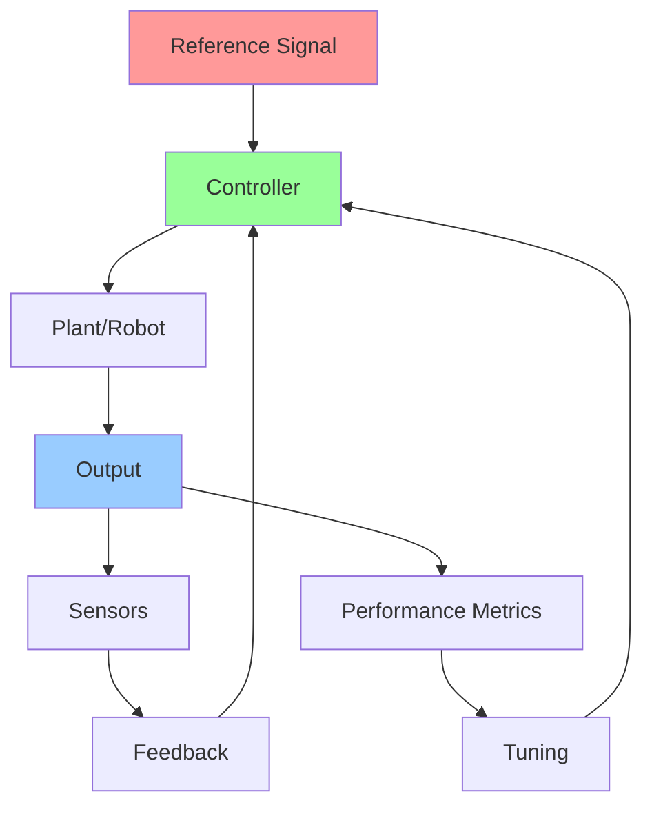

# Week 9 - Control Systems for Robotics

## Learning Objectives

By the end of this week, you will be able to:
- Implement PID controllers for robot motion control
- Design feedback control systems for stability and accuracy
- Apply modern control theory to robotic systems
- Implement adaptive and robust control strategies
- Integrate control systems with sensor feedback
- Tune control parameters for optimal performance

## Control Systems in Robotics

Control systems are essential for enabling robots to perform precise and stable movements. They use feedback from sensors to adjust actuator commands and achieve desired behaviors. Key control concepts include:

- **Feedback Control**: Using sensor measurements to adjust control commands
- **Stability**: Ensuring the system remains bounded and converges to desired states
- **Accuracy**: Achieving desired positions, velocities, or forces
- **Robustness**: Maintaining performance despite disturbances and uncertainties
- **Adaptability**: Adjusting to changing conditions or parameters

## Code Snippets

### PID Controller Implementation

```python
import numpy as np
import time
from typing import Tuple, Optional

class PIDController:
    def __init__(self, kp: float, ki: float, kd: float, dt: float = 0.01):
        """
        Initialize PID controller

        Args:
            kp: Proportional gain
            ki: Integral gain
            kd: Derivative gain
            dt: Time step for integration
        """
        self.kp = kp
        self.ki = ki
        self.kd = kd
        self.dt = dt

        # Internal state
        self.prev_error = 0.0
        self.integral = 0.0
        self.setpoint = 0.0
        self.last_time = time.time()

    def update(self, current_value: float, setpoint: float = None) -> float:
        """
        Update PID controller and return control output

        Args:
            current_value: Current measured value
            setpoint: Desired value (optional, can be set separately)

        Returns:
            Control output
        """
        if setpoint is not None:
            self.setpoint = setpoint

        current_time = time.time()
        dt = current_time - self.last_time

        # If dt is too small, use the configured dt
        if dt < 1e-6:
            dt = self.dt

        # Calculate error
        error = self.setpoint - current_value

        # Proportional term
        proportional = self.kp * error

        # Integral term (accumulate error over time)
        self.integral += error * dt
        integral = self.ki * self.integral

        # Derivative term (rate of change of error)
        derivative = self.kd * (error - self.prev_error) / dt

        # Calculate output
        output = proportional + integral + derivative

        # Store values for next iteration
        self.prev_error = error
        self.last_time = current_time

        return output

    def reset(self):
        """Reset internal state"""
        self.prev_error = 0.0
        self.integral = 0.0
        self.setpoint = 0.0
        self.last_time = time.time()

    def set_tunings(self, kp: float, ki: float, kd: float):
        """Update PID tunings"""
        self.kp = kp
        self.ki = ki
        self.kd = kd

class RobotMotionController:
    def __init__(self):
        # PID controllers for linear and angular motion
        self.linear_pid = PIDController(kp=1.0, ki=0.1, kd=0.05, dt=0.01)
        self.angular_pid = PIDController(kp=2.0, ki=0.2, kd=0.1, dt=0.01)

        # Robot parameters
        self.max_linear_vel = 1.0  # m/s
        self.max_angular_vel = 1.0  # rad/s
        self.wheel_separation = 0.5  # meters

    def control_to_pose(self, current_pose, target_pose, dt=0.01):
        """
        Calculate control commands to move robot to target pose

        Args:
            current_pose: [x, y, theta] current robot pose
            target_pose: [x, y, theta] target robot pose
            dt: Time step

        Returns:
            [linear_vel, angular_vel] control commands
        """
        x_curr, y_curr, theta_curr = current_pose
        x_target, y_target, theta_target = target_pose

        # Calculate distance and angle to target
        dx = x_target - x_curr
        dy = y_target - y_curr
        distance = np.sqrt(dx**2 + dy**2)

        # Calculate angle to target
        angle_to_target = np.arctan2(dy, dx)
        angle_error = angle_to_target - theta_curr

        # Normalize angle error to [-pi, pi]
        while angle_error > np.pi:
            angle_error -= 2 * np.pi
        while angle_error < -np.pi:
            angle_error += 2 * np.pi

        # Setpoint for angular velocity (rotate to face target)
        angular_setpoint = angle_error

        # Calculate linear velocity based on distance
        linear_setpoint = min(distance, self.max_linear_vel)

        # Update PID controllers
        angular_cmd = self.angular_pid.update(0.0, angular_setpoint)
        linear_cmd = self.linear_pid.update(0.0, linear_setpoint)

        # Apply limits
        angular_cmd = np.clip(angular_cmd, -self.max_angular_vel, self.max_angular_vel)
        linear_cmd = np.clip(linear_cmd, -self.max_linear_vel, self.max_linear_vel)

        return linear_cmd, angular_cmd

# Example usage
def example_pid_control():
    controller = RobotMotionController()

    # Simulate robot moving to target
    current_pose = [0.0, 0.0, 0.0]  # Start at origin facing x-axis
    target_pose = [2.0, 1.0, 0.0]   # Target at (2,1), facing x-axis

    print("Time\tX\tY\tTheta\tLinear_Vel\tAngular_Vel")

    for t in np.arange(0, 10, 0.1):  # 10 seconds of simulation
        linear_vel, angular_vel = controller.control_to_pose(current_pose, target_pose)

        # Simple kinematic model update
        dt = 0.1
        x, y, theta = current_pose
        x += linear_vel * np.cos(theta) * dt
        y += linear_vel * np.sin(theta) * dt
        theta += angular_vel * dt

        current_pose = [x, y, theta]

        print(f"{t:.1f}\t{x:.2f}\t{y:.2f}\t{theta:.2f}\t{linear_vel:.2f}\t{angular_vel:.2f}")

        # Check if close enough to target
        dist_to_target = np.sqrt((x - target_pose[0])**2 + (y - target_pose[1])**2)
        if dist_to_target < 0.1:  # Within 10cm of target
            print(f"Reached target at time {t:.1f}s")
            break
```

### Advanced Control Strategies

```python
import numpy as np
from scipy.linalg import solve_continuous_are
from scipy.signal import lti, step

class LinearQuadraticRegulator:
    """
    Linear Quadratic Regulator (LQR) for optimal control
    """
    def __init__(self, A, B, Q, R):
        """
        Initialize LQR controller

        Args:
            A: State matrix (nxn)
            B: Input matrix (nxm)
            Q: State cost matrix (nxn)
            R: Input cost matrix (mxm)
        """
        self.A = np.array(A)
        self.B = np.array(B)
        self.Q = np.array(Q)
        self.R = np.array(R)
        self.n = A.shape[0]  # State dimension
        self.m = B.shape[1]  # Input dimension

        # Solve Riccati equation to find optimal gain
        self.P = solve_continuous_are(self.A, self.B, self.Q, self.R)

        # Calculate optimal feedback gain: u = -K*x
        self.K = np.linalg.inv(self.R) @ self.B.T @ self.P

    def control(self, state):
        """Calculate control input for given state"""
        return -self.K @ state

    def get_gain(self):
        """Return the feedback gain matrix"""
        return self.K

class AdaptiveController:
    """
    Adaptive controller that adjusts parameters based on system behavior
    """
    def __init__(self, initial_params, learning_rate=0.01):
        self.params = np.array(initial_params)
        self.learning_rate = learning_rate
        self.error_history = []

    def update_params(self, state, error, dt=0.01):
        """
        Update controller parameters based on error
        """
        # Store error for adaptation
        self.error_history.append(error)

        # Keep only recent errors (last 100)
        if len(self.error_history) > 100:
            self.error_history.pop(0)

        # Simple parameter adaptation based on accumulated error
        if len(self.error_history) > 10:
            # Calculate average error magnitude
            avg_error = np.mean(np.abs(self.error_history[-10:]))

            # Adjust parameters based on error trend
            if avg_error > 0.1:  # If error is too large
                # Increase gains slightly
                self.params *= (1 + self.learning_rate * avg_error)
            elif avg_error < 0.01:  # If error is very small
                # Decrease gains to avoid oscillation
                self.params *= (1 - self.learning_rate * 0.5)

    def control(self, state, error):
        """Calculate control based on adapted parameters"""
        # Simple example: scaled error-based control
        return self.params * error

class ModelPredictiveController:
    """
    Simplified Model Predictive Controller
    """
    def __init__(self, A, B, Q, R, horizon=10):
        """
        Initialize MPC controller

        Args:
            A, B: System matrices (state-space model)
            Q, R: Cost matrices
            horizon: Prediction horizon
        """
        self.A = np.array(A)
        self.B = np.array(B)
        self.Q = np.array(Q)
        self.R = np.array(R)
        self.horizon = horizon
        self.n = A.shape[0]  # State dimension
        self.m = B.shape[1]  # Input dimension

    def predict_trajectory(self, initial_state, control_sequence):
        """
        Predict state trajectory given control sequence
        """
        states = [initial_state]
        current_state = initial_state.copy()

        for u in control_sequence:
            # x_{k+1} = A*x_k + B*u_k
            next_state = self.A @ current_state + self.B @ u
            states.append(next_state)
            current_state = next_state

        return np.array(states)

    def calculate_cost(self, state_trajectory, control_trajectory):
        """
        Calculate total cost of trajectory
        """
        total_cost = 0

        # State cost
        for state in state_trajectory[:-1]:  # Exclude final state
            total_cost += state.T @ self.Q @ state

        # Control cost
        for control in control_trajectory:
            total_cost += control.T @ self.R @ control

        return total_cost

    def control(self, current_state):
        """
        Calculate optimal control input using simplified optimization
        """
        # For simplicity, use gradient descent approach
        # In practice, this would use more sophisticated optimization

        # Initial guess for control sequence
        control_seq = np.zeros((self.horizon, self.m))

        # Simplified approach: use LQR solution as approximation
        # Solve Riccati equation for LQR gain
        P = solve_continuous_are(self.A, self.B, self.Q, self.R)
        K = np.linalg.inv(self.R) @ self.B.T @ P

        # Return LQR control as approximation
        return -K @ current_state

# Example: Controlling a simple robot with different controllers
def example_advanced_control():
    # System matrices for a simple 2nd-order system (position, velocity)
    A = np.array([[0, 1],
                   [0, -1]])  # Damped system: m*ẍ + c*ẋ = u
    B = np.array([[0],
                  [1]])      # Input affects acceleration
    Q = np.array([[1, 0],    # Penalize position error
                  [0, 0.1]]) # Penalize velocity error
    R = np.array([[0.01]])   # Penalize control effort

    # Initialize controllers
    lqr = LinearQuadraticRegulator(A, B, Q, R)
    mpc = ModelPredictiveController(A, B, Q, R, horizon=5)
    adaptive = AdaptiveController([1.0, 1.0])

    # Simulate system response
    dt = 0.01
    time_steps = 1000
    state = np.array([1.0, 0.0])  # Start with position=1, velocity=0
    target = np.array([0.0, 0.0])  # Want to reach origin

    print("Time\tPosition\tVelocity\tLQR_Control")

    for i in range(time_steps):
        t = i * dt

        # Calculate control using LQR
        control = lqr.control(state)

        # Update system: ẋ = Ax + Bu
        state_dot = A @ state + B @ control[0]  # Extract scalar from 1x1 array
        state = state + state_dot * dt

        if i % 100 == 0:  # Print every 100 steps
            print(f"{t:.2f}\t{state[0]:.3f}\t\t{state[1]:.3f}\t\t{control[0]:.3f}")

        # Update adaptive controller
        error = target - state
        adaptive.update_params(state, np.linalg.norm(error), dt)
```

### Trajectory Following Controller

```python
import numpy as np
from scipy.interpolate import interp1d

class TrajectoryFollower:
    """
    Controller that follows a predefined trajectory with feedback
    """
    def __init__(self, kp_pos=2.0, kp_vel=1.0, ki_pos=0.01, dt=0.01):
        self.kp_pos = kp_pos  # Position proportional gain
        self.kp_vel = kp_vel  # Velocity proportional gain
        self.ki_pos = ki_pos  # Position integral gain
        self.dt = dt

        # Trajectory tracking state
        self.pos_integral = 0.0
        self.trajectory = None
        self.traj_time = 0.0

    def set_trajectory(self, times, positions, velocities=None):
        """
        Set the trajectory to follow

        Args:
            times: Array of time points
            positions: Array of position values
            velocities: Array of velocity values (optional, will be computed if not provided)
        """
        self.traj_times = np.array(times)
        self.traj_positions = np.array(positions)

        if velocities is None:
            # Compute velocities from position derivatives
            dt_vals = np.diff(times)
            dx_vals = np.diff(positions)
            velocities = np.append(dx_vals / dt_vals, dx_vals[-1] / dt_vals[-1])  # Extrapolate last velocity

        self.traj_velocities = np.array(velocities)

        # Create interpolation functions
        self.pos_interp = interp1d(times, positions, kind='cubic', fill_value='extrapolate')
        self.vel_interp = interp1d(times, velocities, kind='cubic', fill_value='extrapolate')

        self.traj_time = 0.0
        self.pos_integral = 0.0

    def update(self, current_pos, current_vel, dt=None):
        """
        Update controller and return control command

        Args:
            current_pos: Current position
            current_vel: Current velocity
            dt: Time step (uses default if not provided)

        Returns:
            Control command
        """
        if dt is None:
            dt = self.dt

        # Get desired state at current time
        desired_pos = float(self.pos_interp(self.traj_time))
        desired_vel = float(self.vel_interp(self.traj_time))

        # Calculate errors
        pos_error = desired_pos - current_pos
        vel_error = desired_vel - current_vel

        # Update position integral
        self.pos_integral += pos_error * dt

        # Calculate control using PD + I control
        control = (self.kp_pos * pos_error +
                  self.kp_vel * vel_error +
                  self.ki_pos * self.pos_integral)

        # Update trajectory time
        self.traj_time += dt

        return control

class CartesianImpedanceController:
    """
    Impedance controller for Cartesian space control
    """
    def __init__(self, stiffness=1000, damping_ratio=1.0, dt=0.01):
        """
        Initialize impedance controller

        Args:
            stiffness: Spring constant (N/m)
            damping_ratio: Damping ratio (1.0 = critically damped)
            dt: Time step
        """
        self.stiffness = stiffness
        self.damping_ratio = damping_ratio
        self.dt = dt

        # Calculate damping coefficient for critical damping
        self.damping = 2 * damping_ratio * np.sqrt(stiffness)

        # State tracking
        self.prev_force = np.zeros(3)
        self.prev_error = np.zeros(3)

    def control(self, current_pose, desired_pose, current_vel=None, desired_vel=None):
        """
        Calculate control force based on Cartesian position error

        Args:
            current_pose: Current position [x, y, z]
            desired_pose: Desired position [x, y, z]
            current_vel: Current velocity (optional)
            desired_vel: Desired velocity (optional)

        Returns:
            Force command [fx, fy, fz]
        """
        current_pose = np.array(current_pose)
        desired_pose = np.array(desired_pose)

        if current_vel is None:
            current_vel = np.zeros(3)
        if desired_vel is None:
            desired_vel = np.zeros(3)

        # Calculate position and velocity errors
        pos_error = desired_pose - current_pose
        vel_error = desired_vel - current_vel

        # Calculate impedance force: F = K * error + D * velocity_error
        force = self.stiffness * pos_error + self.damping * vel_error

        return force

# Example usage
def example_trajectory_control():
    # Create a circular trajectory
    times = np.linspace(0, 10, 1000)
    radius = 1.0
    omega = 0.5  # rad/s

    # Circular motion: x = r*cos(ωt), y = r*sin(ωt)
    x_traj = radius * np.cos(omega * times)
    y_traj = radius * np.sin(omega * times)

    # Velocities (derivatives)
    vx_traj = -radius * omega * np.sin(omega * times)
    vy_traj = radius * omega * omega * np.cos(omega * times)

    # Combine into 2D trajectories
    pos_traj = np.column_stack([x_traj, y_traj])
    vel_traj = np.column_stack([vx_traj, vy_traj])

    # Initialize trajectory follower
    follower = TrajectoryFollower(kp_pos=5.0, kp_vel=2.0, ki_pos=0.1)

    # Set the trajectory (using x-component as example)
    follower.set_trajectory(times, x_traj, vx_traj)

    # Simulate following the trajectory
    current_pos = 0.0
    current_vel = 0.0
    mass = 1.0  # kg

    print("Time\tDes_Pos\tCur_Pos\tError\tControl")

    for i, t in enumerate(times):
        if i > 0 and i % 100 == 0:  # Print every 100 steps
            desired_pos = float(follower.pos_interp(follower.traj_time))
            pos_error = desired_pos - current_pos
            print(f"{t:.2f}\t{desired_pos:.3f}\t{current_pos:.3f}\t{pos_error:.3f}\t{control:.3f}")

        # Calculate control
        control = follower.update(current_pos, current_vel)

        # Apply control (simple mass model: ẍ = F/m)
        acceleration = control / mass

        # Update state
        current_vel += acceleration * follower.dt
        current_pos += current_vel * follower.dt
```

## URDF Examples

### Robot with Control Systems

```xml
<?xml version="1.0"?>
<robot name="controlled_robot">
  <!-- Base Link -->
  <link name="base_link">
    <visual>
      <geometry>
        <cylinder radius="0.2" length="0.1"/>
      </geometry>
      <material name="dark_gray">
        <color rgba="0.3 0.3 0.3 1.0"/>
      </material>
    </visual>
    <collision>
      <geometry>
        <cylinder radius="0.2" length="0.1"/>
      </geometry>
    </collision>
    <inertial>
      <mass value="5.0"/>
      <inertia ixx="0.1" ixy="0.0" ixz="0.0" iyy="0.1" iyz="0.0" izz="0.05"/>
    </inertial>
  </link>

  <!-- Wheel Links -->
  <link name="wheel_left">
    <visual>
      <geometry>
        <cylinder radius="0.1" length="0.05"/>
      </geometry>
      <material name="black">
        <color rgba="0.0 0.0 0.0 1.0"/>
      </material>
    </visual>
    <collision>
      <geometry>
        <cylinder radius="0.1" length="0.05"/>
      </geometry>
    </collision>
    <inertial>
      <mass value="1.0"/>
      <inertia ixx="0.005" ixy="0.0" ixz="0.0" iyy="0.005" iyz="0.0" izz="0.01"/>
    </inertial>
  </link>

  <link name="wheel_right">
    <visual>
      <geometry>
        <cylinder radius="0.1" length="0.05"/>
      </geometry>
      <material name="black">
        <color rgba="0.0 0.0 0.0 1.0"/>
      </material>
    </visual>
    <collision>
      <geometry>
        <cylinder radius="0.1" length="0.05"/>
      </geometry>
    </collision>
    <inertial>
      <mass value="1.0"/>
      <inertia ixx="0.005" ixy="0.0" ixz="0.0" iyy="0.005" iyz="0.0" izz="0.01"/>
    </inertial>
  </link>

  <!-- Wheel Joints -->
  <joint name="wheel_left_joint" type="continuous">
    <parent link="base_link"/>
    <child link="wheel_left"/>
    <origin xyz="0 0.2 -0.05" rpy="0 0 0"/>
    <axis xyz="0 0 1"/>
    <dynamics damping="0.1" friction="0.0"/>
  </joint>

  <joint name="wheel_right_joint" type="continuous">
    <parent link="base_link"/>
    <child link="wheel_right"/>
    <origin xyz="0 -0.2 -0.05" rpy="0 0 0"/>
    <axis xyz="0 0 1"/>
    <dynamics damping="0.1" friction="0.0"/>
  </joint>

  <!-- Manipulator Arm Base -->
  <joint name="arm_base_joint" type="fixed">
    <parent link="base_link"/>
    <child link="arm_base"/>
    <origin xyz="0.1 0 0.1" rpy="0 0 0"/>
  </joint>

  <link name="arm_base">
    <visual>
      <geometry>
        <cylinder radius="0.05" length="0.1"/>
      </geometry>
      <material name="silver">
        <color rgba="0.7 0.7 0.7 1.0"/>
      </material>
    </visual>
  </link>

  <!-- Arm Joints and Links -->
  <joint name="shoulder_joint" type="revolute">
    <parent link="arm_base"/>
    <child link="upper_arm"/>
    <origin xyz="0 0 0.05" rpy="0 0 0"/>
    <axis xyz="0 1 0"/>
    <limit lower="-1.57" upper="1.57" effort="100" velocity="1.0"/>
    <dynamics damping="1.0" friction="0.1"/>
  </joint>

  <link name="upper_arm">
    <visual>
      <geometry>
        <cylinder radius="0.04" length="0.3"/>
      </geometry>
      <material name="steel">
        <color rgba="0.5 0.5 0.5 1.0"/>
      </material>
    </visual>
    <inertial>
      <mass value="2.0"/>
      <inertia ixx="0.02" ixy="0.0" ixz="0.0" iyy="0.02" iyz="0.0" izz="0.001"/>
    </inertial>
  </link>

  <joint name="elbow_joint" type="revolute">
    <parent link="upper_arm"/>
    <child link="forearm"/>
    <origin xyz="0 0 0.3" rpy="0 0 0"/>
    <axis xyz="0 1 0"/>
    <limit lower="-1.57" upper="1.57" effort="100" velocity="1.0"/>
    <dynamics damping="1.0" friction="0.1"/>
  </joint>

  <link name="forearm">
    <visual>
      <geometry>
        <cylinder radius="0.03" length="0.25"/>
      </geometry>
      <material name="steel">
        <color rgba="0.5 0.5 0.5 1.0"/>
      </material>
    </visual>
    <inertial>
      <mass value="1.5"/>
      <inertia ixx="0.01" ixy="0.0" ixz="0.0" iyy="0.01" iyz="0.0" izz="0.0008"/>
    </inertial>
  </link>

  <!-- Gripper -->
  <joint name="wrist_joint" type="revolute">
    <parent link="forearm"/>
    <child link="wrist"/>
    <origin xyz="0 0 0.25" rpy="0 0 0"/>
    <axis xyz="1 0 0"/>
    <limit lower="-3.14" upper="3.14" effort="50" velocity="2.0"/>
    <dynamics damping="0.5" friction="0.05"/>
  </joint>

  <link name="wrist">
    <visual>
      <geometry>
        <sphere radius="0.03"/>
      </geometry>
      <material name="aluminum">
        <color rgba="0.8 0.8 0.8 1.0"/>
      </material>
    </visual>
  </link>

  <!-- Gazebo Controllers -->
  <gazebo>
    <plugin name="diff_drive" filename="libgazebo_ros_diff_drive.so">
      <left_joint>wheel_left_joint</left_joint>
      <right_joint>wheel_right_joint</right_joint>
      <wheel_separation>0.4</wheel_separation>
      <wheel_diameter>0.2</wheel_diameter>
      <command_topic>cmd_vel</command_topic>
      <odometry_topic>odom</odometry_topic>
      <odometry_frame>odom</odometry_frame>
      <robot_base_frame>base_link</robot_base_frame>
      <publish_odom>true</publish_odom>
      <publish_odom_tf>true</publish_odom_tf>
      <publish_wheel_tf>true</publish_wheel_tf>
    </plugin>
  </gazebo>

  <!-- Arm Controller -->
  <gazebo>
    <plugin name="arm_controller" filename="libgazebo_ros_control.so">
      <robotNamespace>/arm</robotNamespace>
    </plugin>
  </gazebo>

  <!-- Joint State Publisher -->
  <gazebo>
    <plugin name="joint_state_publisher" filename="libgazebo_ros_joint_state_publisher.so">
      <joint_name>shoulder_joint, elbow_joint, wrist_joint</joint_name>
    </plugin>
  </gazebo>

  <!-- PID Controllers for Joints -->
  <gazebo reference="shoulder_joint">
    <implicitSpringDamper>1</implicitSpringDamper>
  </gazebo>

  <gazebo reference="elbow_joint">
    <implicitSpringDamper>1</implicitSpringDamper>
  </gazebo>

  <gazebo reference="wrist_joint">
    <implicitSpringDamper>1</implicitSpringDamper>
  </gazebo>

  <!-- Control Transmissions -->
  <transmission name="shoulder_trans">
    <type>transmission_interface/SimpleTransmission</type>
    <joint name="shoulder_joint">
      <hardwareInterface>hardware_interface/PositionJointInterface</hardwareInterface>
    </joint>
    <actuator name="shoulder_motor">
      <hardwareInterface>hardware_interface/PositionJointInterface</hardwareInterface>
      <mechanicalReduction>1</mechanicalReduction>
    </actuator>
  </transmission>

  <transmission name="elbow_trans">
    <type>transmission_interface/SimpleTransmission</type>
    <joint name="elbow_joint">
      <hardwareInterface>hardware_interface/PositionJointInterface</hardwareInterface>
    </joint>
    <actuator name="elbow_motor">
      <hardwareInterface>hardware_interface/PositionJointInterface</hardwareInterface>
      <mechanicalReduction>1</mechanicalReduction>
    </actuator>
  </transmission>

  <transmission name="wrist_trans">
    <type>transmission_interface/SimpleTransmission</type>
    <joint name="wrist_joint">
      <hardwareInterface>hardware_interface/PositionJointInterface</hardwareInterface>
    </joint>
    <actuator name="wrist_motor">
      <hardwareInterface>hardware_interface/PositionJointInterface</hardwareInterface>
      <mechanicalReduction>1</mechanicalReduction>
    </actuator>
  </transmission>
</robot>
```

## Control Systems Pipeline Diagram



## Control Strategies Comparison

| Strategy | Response Speed | Stability | Robustness | Complexity | Best For |
|----------|----------------|-----------|------------|------------|----------|
| PID | Fast | Good | Moderate | Low | Basic positioning |
| LQR | Optimal | Excellent | Good | Medium | Linear systems |
| MPC | Good | Excellent | Excellent | High | Constrained systems |
| Adaptive | Variable | Good | Excellent | High | Changing conditions |
| Sliding Mode | Fast | Excellent | Excellent | Medium | Disturbances |
| Fuzzy Logic | Variable | Good | Good | Medium | Uncertain systems |

## Key Terms

- **PID Controller**: Proportional-Integral-Derivative controller for feedback control
- **Stability**: Property ensuring system remains bounded and converges to equilibrium
- **Gain**: Parameter that determines controller sensitivity
- **Feedback**: Using system output to adjust control input
- **Feedforward**: Using reference signal directly in control calculation
- **Riccati Equation**: Mathematical equation used in LQR design
- **Lyapunov Stability**: Mathematical framework for proving stability
- **Bode Plot**: Frequency response analysis tool

## Learning Checkpoints

### Quiz Questions
1. What are the three components of a PID controller and their functions?
2. How does increasing the proportional gain affect system response?
3. What is the purpose of the integral term in PID control?

### Practical Exercise
Implement a PID controller for a simulated robot and tune the parameters to achieve stable motion with minimal overshoot.

## Hands-On Exercise

Create a ROS 2 node that implements a trajectory-following controller and test it with different reference trajectories (step, ramp, sinusoidal).

## Personalization

<div className="personalization-options">
  <h3>Adjust Learning Path:</h3>
  <button onClick={() => setDifficulty('beginner')}>Beginner</button>
  <button onClick={() => setDifficulty('intermediate')}>Intermediate</button>
  <button onClick={() => setDifficulty('advanced')}>Advanced</button>
</div>

## Translation

<div className="translation-controls">
  <button onClick={() => translateToUrdu()}>اردو میں ترجمہ کریں</button>
</div>